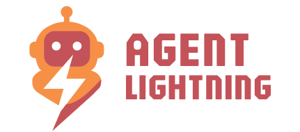
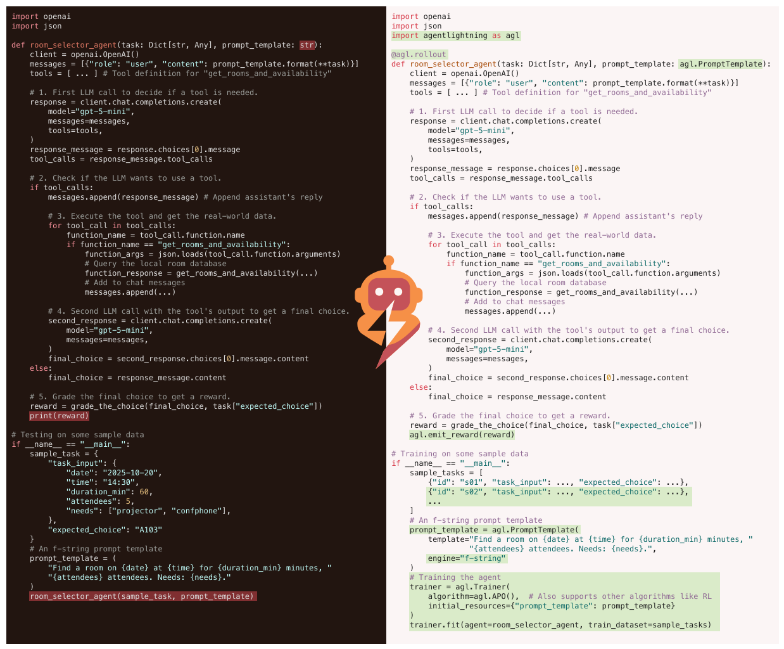

<p align="center">
  
</p>

# Agent Lightning ⚡

[](https://github.com/microsoft/agent-lightning/actions/workflows/badge-unit.yml)
[](https://microsoft.github.io/agent-lightning/)
[](https://badge.fury.io/py/agentlightning)
[](LICENSE)
[](https://deepwiki.com/microsoft/agent-lightning)
[](https://discord.gg/RYk7CdvDR7)

**The ultimate training framework to supercharge AI agents.**

Join our [Discord community](https://discord.gg/RYk7CdvDR7) to connect with users, researchers, and contributors.

---

## ⚡ Core Features

- Turn your agent into an optimizable system with **almost ZERO code changes** 💤
- Works with **ANY** agent framework (LangChain, OpenAI Agent SDK, AutoGen, CrewAI, Microsoft Agent Framework), or even **without** a framework (pure Python + OpenAI) 🤖
- **Selectively** optimize one or more agents in a multi-agent system 🎯
- Supports **algorithms** such as Reinforcement Learning, Automatic Prompt Optimization, Supervised Fine-Tuning, and more 🤗

Learn more on the official [documentation website](https://microsoft.github.io/agent-lightning/).

<p align="center">
  
</p>

---

## ⚡ Installation

Install the stable release from PyPI:

```bash
pip install agentlightning
