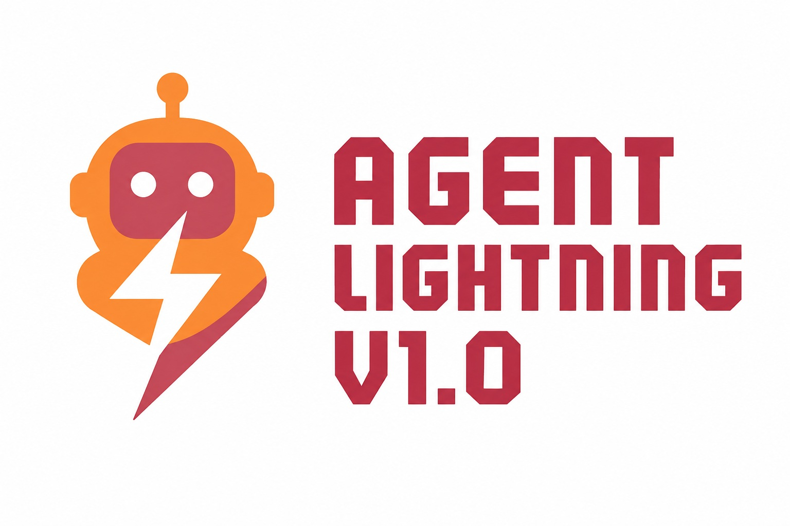
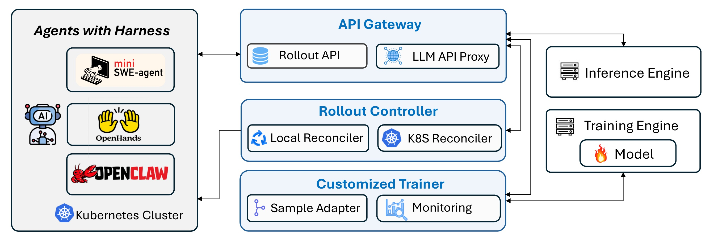
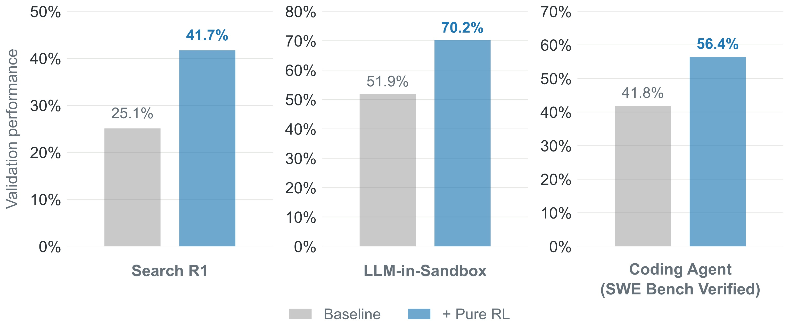

<p align="center">
  
</p>

<p align="center"><em>3,500-Line Lightweight Agentic RL Framework for Training Agents with Real Harnesses!</em></p>

<p align="center">
  <a href="docs/">Documentation</a> &nbsp;·&nbsp; Technical Report (Coming Soon) &nbsp;·&nbsp; <a href="LICENSE">MIT License</a>
</p>

## ⚡ Key Features

- 🪶 **~3,500 lines of core Python:** We treat simplicity as the first principle.
- 🧩 **Train with real agent harnesses:** Agents interact with the model through the Agent Lightning v1.0 proxy with **ZERO changes**, while keeping tools, context, control flow, and environments in the loop.
- ☸️ **Native Kubernetes support:** Run agents directly as Kubernetes Jobs without relying on external sandbox services.
- 💻 **Full coding agent training example:** Using only **6K training samples**, an end-to-end Qwen3.5-9B workflow improves SWE-bench Verified from **41.8% to 56.4%**, a gain of **14.6 percentage points**. We release the full pipeline, including data cleaning, reward-hacking prevention, and training scripts.

## ⚡ Installation

The following is an example installation on a CUDA 13.0 machine:

```bash
cd <this-repo>
uv sync
bash scripts/setup_verl.sh 0.8.0 cu130
```

See the [Installation Guide](docs/1-installation.md) for details.


## ⚡ Architecture

<p align="center">
  
</p>

Agent Lightning v1.0 keeps the training architecture simple with three lightweight components:

- **Trainer:** Runs VERL and vLLM, builds training samples, and updates the policy.
- **API Gateway:** Proxies model requests and captures training data.
- **Rollout Controller:** Runs agents locally or as Kubernetes Jobs.

The Trainer creates rollouts, the Controller launches agents, and the Gateway turns interactions into training data, while agents continue to run with their real harnesses.

## ⚡ Results

We evaluate Agent Lightning v1.0 across several practical training domains, including Search R1, LLM-in-Sandbox, and Coding Agent. Pure RL delivers substantial improvements across all three domains, as shown below.

<p align="center">
  
</p>

## ⚡ Documentation

| Section | Content |
|---------|---------|
| [Installation](docs/1-installation.md) | Base environment and VERL GPU stack |
| [Quick Start](docs/2-quick-start.md) | Local first run and end-to-end flow |
| [Basics](docs/3-basics.md) | Components, rollouts, events, and trajectories |
| [Trainer Configuration](docs/4-trainer-configuration.md) | VERL integration and trace aggregation |
| [Server Configuration](docs/5-server-configuration.md) | Gateway and model proxy settings |
| [Controller Configuration](docs/6-controller-configuration.md) | Local and Kubernetes runners |
| [Asynchronous Training](docs/7-asynchronous-training.md) | Collocated async collection and pause/drain |

## ⚡ Examples

| Example | Description |
|---|---|
| [Calc-X](docs/8-example-calc-x.md) | POC math reasoning example with AutoGen and MCP calculator tools, requiring only one GPU. |
| [GSM8K](docs/9-example-gsm8k.md) | POC grade-school math reasoning example. |
| [ScienceWorld](docs/10-example-science-world.md) | Interactive science tasks in a text-based environment. |
| [Search-R1](docs/11-example-search-r1.md) | Multi-turn retrieval and reasoning agent. |
| [LLM-in-Sandbox](docs/12-example-llm-in-sandbox.md) | General agent with computer and code execution tools. |
| [Coding Agent](docs/13-example-coding-agent.md) | Coding agent trained with repository tests. |

## ⚡ License

Agent Lightning v1.0 is released under the [MIT License](LICENSE).
