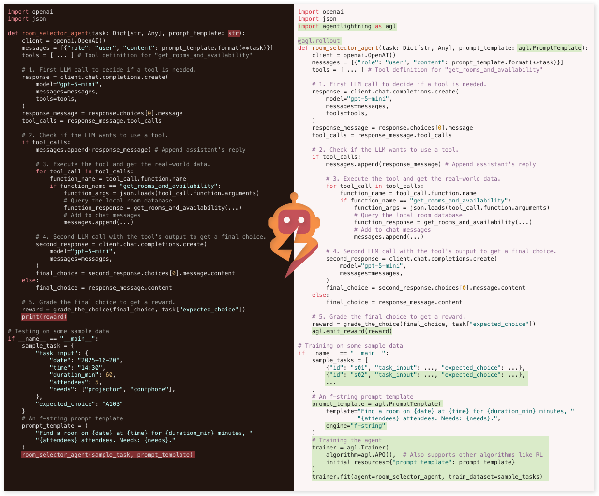

<p align="center">
  
</p>

# Agent Lightning⚡

[](https://github.com/YanbiaoLab/agent-lightning/actions/workflows/tests.yml)
[](https://yanbiaolab.github.io/agent-lightning/)
[](https://badge.fury.io/py/agentlightning)
[](LICENSE)
[](https://deepwiki.com/YanbiaoLab/agent-lightning)
[](https://discord.gg/RYk7CdvDR7)

**The absolute trainer to light up AI agents.**

> [!IMPORTANT]
> This repository is an independently maintained fork of
> [microsoft/agent-lightning](https://github.com/microsoft/agent-lightning). It is not maintained or endorsed by
> Microsoft. Existing copyright, license, authorship, and citation information is preserved from the upstream project.

The upstream project hosts a [Discord community](https://discord.gg/RYk7CdvDR7) for Agent Lightning users and contributors.

## ⚡ Core Features

- Turn your agent into an optimizable beast with **ZERO CODE CHANGE** (almost)! 💤
- Build with **ANY** agent framework (LangChain, OpenAI Agent SDK, AutoGen, CrewAI, Microsoft Agent Framework...); or even WITHOUT agent framework (Python OpenAI). You name it! 🤖
- **Selectively** optimize one or more agents in a multi-agent system. 🎯
- Embraces **Algorithms** like Reinforcement Learning, Automatic Prompt Optimization, Supervised Fine-tuning and more. 🤗

Read more on the [documentation website](https://yanbiaolab.github.io/agent-lightning/).

<p align="center">
  
</p>

## ⚡ Installation

Install this fork directly from GitHub:

```bash
pip install "agentlightning @ git+https://github.com/YanbiaoLab/agent-lightning.git@main"
```

The `agentlightning` package on PyPI is published by the upstream project and may not include changes from this fork:

```bash
pip install agentlightning
```

Upstream nightly builds are available from Test PyPI:

```bash
pip install --upgrade --index-url https://test.pypi.org/simple/ --extra-index-url https://pypi.org/simple/ --pre agentlightning
```

Please refer to the [installation guide](https://yanbiaolab.github.io/agent-lightning/stable/tutorials/installation/) for more details.

To start using Agent-lightning, check out the [documentation](https://yanbiaolab.github.io/agent-lightning/) and [examples](./examples).

## ⚡ Articles

- 12/17/2025 [Adopting the Trajectory Level Aggregation for Faster Training](https://agent-lightning.github.io/posts/trajectory_level_aggregation/) Agent-lightning blog.
- 11/4/2025 [Tuning ANY AI agent with Tinker ✕ Agent-lightning](https://medium.com/@yugez/tuning-any-ai-agent-with-tinker-agent-lightning-part-1-1d8c9a397f0e) Medium. See also [Part 2](https://medium.com/@yugez/tuning-any-ai-agent-with-tinker-agent-lightning-part-2-332c5437f0dc).
- 10/22/2025 [No More Retokenization Drift: Returning Token IDs via the OpenAI Compatible API Matters in Agent RL](https://blog.vllm.ai/2025/10/22/agent-lightning.html) vLLM blog. See also [Zhihu writeup](https://zhuanlan.zhihu.com/p/1965067274642785725).
- 8/11/2025 [Training AI Agents to Write and Self-correct SQL with Reinforcement Learning](https://medium.com/@yugez/training-ai-agents-to-write-and-self-correct-sql-with-reinforcement-learning-571ed31281ad) Medium.
- 8/5/2025 [Agent Lightning: Train ANY AI Agents with Reinforcement Learning](https://arxiv.org/abs/2508.03680) arXiv paper.
- 7/26/2025 [We discovered an approach to train any AI agent with RL, with (almost) zero code changes.](https://www.reddit.com/r/LocalLLaMA/comments/1m9m670/we_discovered_an_approach_to_train_any_ai_agent/) Reddit.
- 6/6/2025 [Agent Lightning - Microsoft Research](https://www.microsoft.com/en-us/research/project/agent-lightning/) Project page.

## ⚡ Community Projects

- [DeepWerewolf](https://github.com/af-74413592/DeepWerewolf) — A case study of agent RL training for the Chinese Werewolf game built with AgentScope and Agent Lightning.
- [AgentFlow](https://agentflow.stanford.edu/) — A modular multi-agent framework that combines planner, executor, verifier, and generator agents with the Flow-GRPO algorithm to tackle long-horizon, sparse-reward tasks.
- [Youtu-Agent](https://github.com/TencentCloudADP/Youtu-agent) — Youtu-Agent lets you build and train your agent with ease. Built with [a modified branch](https://github.com/microsoft/agent-lightning/tree/contrib/youtu-agent-lightning) of Agent Lightning, Youtu-Agent has verified up to 128 GPUs RL training on maths/code and search capabilities with steady convergence. Also check [the recipe](https://github.com/TencentCloudADP/youtu-agent/tree/rl/agl) and their blog [*Stop Wrestling with Your Agent RL: How Youtu-Agent Achieved Stable, 128-GPU Scaling Without Breaking a Sweat*](https://spotted-coconut-df8.notion.site/Stop-Wrestling-with-Your-Agent-RL-How-Youtu-Agent-Achieved-Stable-128-GPU-Scaling-Without-Breaking-2ca5e8f089ba80539a98c582b65e0233).

## ⚡ Architecture

Agent Lightning keeps the moving parts to a minimum so you can focus on your idea, not the plumbing. Your agent continues to run as usual; you can still use any agent framework you like; you drop in the lightweight `agl.emit_xxx()` helper, or let the tracer collect every prompt, tool call, and reward. Those events become structured spans that flow into the LightningStore, a central hub that keeps tasks, resources, and traces in sync.

On the other side of the store sits the algorithm you choose, or write yourself. The algorithm reads spans, learns from them, and posts updated resources such as refined prompt templates or new policy weights. The Trainer ties it all together: it streams datasets to runners, ferries resources between the store and the algorithm, and updates the inference engine when improvements land. You can either stop there, or simply let the same loop keep turning.

No rewrites, no lock-in, just a clear path from first rollout to steady improvement.

<p align="center">
  
</p>

## ⚡ Citation

If you find Agent Lightning useful in your research or projects, please cite our paper:

```bibtex
@misc{luo2025agentlightningtrainai,
      title={Agent Lightning: Train ANY AI Agents with Reinforcement Learning},
      author={Xufang Luo and Yuge Zhang and Zhiyuan He and Zilong Wang and Siyun Zhao and Dongsheng Li and Luna K. Qiu and Yuqing Yang},
      year={2025},
      eprint={2508.03680},
      archivePrefix={arXiv},
      primaryClass={cs.AI},
      url={https://arxiv.org/abs/2508.03680},
}
```

## ⚡ Contributing

This project welcomes contributions and suggestions. Start by reading the [Contributing Guide](docs/community/contributing.md) for recommended contribution points, environment setup, branching conventions, and pull request expectations. By contributing, you confirm that you have the right to submit your changes under the repository's MIT License.

## ⚡ Trademarks

This project may contain trademarks or logos for projects, products, or services. Authorized use of Microsoft trademarks or logos is subject to and must follow [Microsoft's Trademark & Brand Guidelines](https://www.microsoft.com/en-us/legal/intellectualproperty/trademarks/usage/general). Use of Microsoft trademarks or logos in modified versions of this project must not cause confusion or imply Microsoft sponsorship. Any use of third-party trademarks or logos are subject to those third-party's policies.

## ⚡ Responsible AI

The upstream project reports evaluation against the Microsoft Responsible AI Standard. That statement applies to the upstream project and does not constitute certification or endorsement of this independently maintained fork. Please report security, safety, or harmful-behavior concerns through this repository's [issue tracker](https://github.com/YanbiaoLab/agent-lightning/issues).

## ⚡ License

This project is licensed under the MIT License. See the [LICENSE](LICENSE) file for details.
