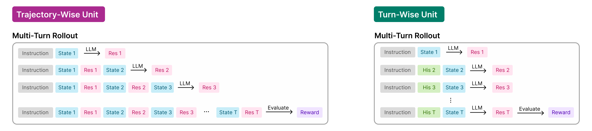

# Simulation Example

## Overview

This example implements agents across various simulation environments within Agent Lightning.
The example is designed to run on a single node with 8 GPUs, each having at least 40 GB of memory.

This example depends on the simulation environments (e.g., ALFWorld, ScienceWorld) provided in the [agl-envs repository](https://github.com/agent-lightning/agl-envs).
For more information about the supported simulation environments, please refer to the [simulation README](https://github.com/agent-lightning/agl-envs/simulation/README.md).

---

&nbsp;

## Included Files

| File/Directory | Description |
|----------------|-------------|
| `config_env/` | Configuration for environment settings. For more information, please refer to the "Configure Your Environment Settings" section. |
| `config_verl/` | Configuration for RL training with VerL |
| `add_instruction.py` | Adding instructions to the agent’s input prompt to guide the format of the response |
| `prompt_builder.py` | Managing conversation history and generating input prompts in multi-turn scenarios |
| `train_simulation_agent.py` | RL training script |

---

&nbsp;

## Install Simulation Environments

Run the following script once to install simulation enviornment and related AGL dependency:

```bash
git clone agl-envs
mv agl-envs agl_envs

# Install alfworld dependency
bash agl_envs/simulation/setup/setup_alfworld.sh
conda activate alfworld

# Install scienceworld dependency
bash agl_envs/simulation/setup/setup_sciworld.sh
conda activate sciworld

# Install AGL dependency
bash contrib/recipes/simulation/install_agl.sh
```

> If you plan to use WandB for experiment tracking, log in to WandB before training.

---

&nbsp;

## Configure Your Environment Settings
### Captioner type (cot or naive)
- cot: guide the agent to output its reasoning first, then take an action
- naive: guide the agent to take an action directly, without outputting any reasoning

### Prompt type (chat or single)

When performing multi-turn rollouts, the unit of the input prompt can be defined in two different ways.

(1) **Trajectory-wise unit**:
All interaction history up to the current step is accumulated in a chat format and directly used to construct the next input prompt.

(2) **Turn-wise unit**:
Only a subset of the interaction history is included for each turn. The prompt is reconstructed by combining the current turn’s state with selected past information, rather than using the full trajectory.




You can use the `trajectory-wise unit` by setting `prompt_type` to `chat`, and the `turn-wise unit` by setting `prompt_type` to `single`. Currently, for ALFWorld, we only support the `single` mode, while for ScienceWorld, both `chat` and `single` modes are supported.

We follow the single-mode prompt for ALFWorld from [verl-agent](https://github.com/langfengQ/verl-agent) and the single-mode prompt for ScienceWorld from [RLVMR](https://github.com/Tencent/digitalhuman/tree/main/RLVMR). Thank you to the authors of VERL-Agent and RLVMR for their valuable work.

---

&nbsp;

## Run RL Training (GRPO)

```bash
# Run alfworld 
python3 contrib/recipes/simulation/train_simulation_agent.py --algorithm grpo --env alfworld

# Run scienceworld single task task_num 0
python3 contrib/recipes/simulation/train_simulation_agent.py --algorithm grpo --env scienceworld --task_num 0

# Run scienceworld multi-task
python3 contrib/recipes/simulation/train_simulation_agent.py --algorithm grpo --env scienceworld --task_num -1
```