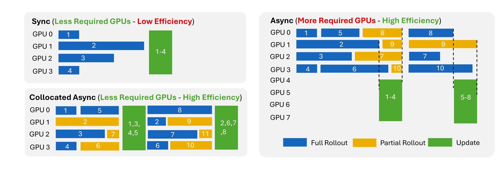

# Asynchronous Training

Long-running agents can have very different rollout durations. In synchronous training, one slow rollout can delay the whole update step. Agent Lightning v1.0 supports **collocated asynchronous training**, where rollout generation and model updates share the same GPU pool while unfinished rollout groups carry over to later steps.



## Enable asynchronous training

Enable Agent Lightning asynchronous collection with `agentlightning.async_rollout.enabled`:

```yaml
agentlightning:
  async_rollout:
    enabled: true
    async_train_batch_size: 64
```

You must also set `async_train_batch_size`. It is the number of prompt groups kept active for rollout collection and must be strictly greater than `data.train_batch_size`, which is the number of completed groups consumed by one update:

```yaml
data:
  train_batch_size: 32

agentlightning:
  async_rollout:
    enabled: true
    async_train_batch_size: 64
```

A useful starting point is:

$$B_{async} = 2 B_{train}.$$

Increase `async_train_batch_size` when rollout durations vary significantly and the resource for running agents has enough capacity. Reduce it when active processes or Kubernetes Jobs consume too many CPU or memory resources.

## How it works

The asynchronous collection process is:

1. The trainer keeps up to `async_train_batch_size` prompt groups active.
2. The Controller starts their Agent executions in local processes or Kubernetes Jobs.
3. When `data.train_batch_size` complete groups are available, the trainer selects them for the next update instead of waiting for every active group.
4. Unfinished groups remain active and carry over to the next collection step.
5. Before updating model weights, the Gateway pauses new model requests and waits for requests already in flight to finish.
6. The shared GPUs perform the model update, then inference resumes for the next rollout phase.

Each prompt group remains intact. For example, when `actor_rollout_ref.rollout.n` is `4`, all four sibling rollouts must finish before that group can be used by the optimizer. This preserves GRPO/RLOO group statistics.

Agents should use a retrying OpenAI or HTTP client. A request arriving while the Gateway is paused receives a retryable response and can continue after inference resumes.

## Monitoring

The trainer reports asynchronous collection metrics to W&B:

| Metric | Interpretation |
|---|---|
| `training/async/n_prev_carry_over_rollouts` | Rollouts inherited from the previous step. |
| `training/async/n_completed_rollouts` | Rollouts consumed by the current step. |
| `training/async/n_new_carry_over_rollouts` | Unfinished rollouts carried into the next step. |
| `training/async/new_carry_over_age_max_steps` | Oldest carry-over age in optimizer steps. |
| `training/async/proxy_inflight_at_pause` | Requests still running when the Gateway pause begins. |
| `training/async/proxy_drain_seconds` | Time spent waiting for in-flight requests to finish. |

## Handle staleness

Asynchronous rollouts may be generated by an older model version and become stale before they are used for training. To correct this policy mismatch, enable verl's [rollout correction](https://verl.readthedocs.io/en/latest/algo/rollout_corr.html). We recommend token-level importance sampling (TIS) with a clipping threshold of `2`:

```yaml
algorithm:
  rollout_correction:
    rollout_is: token
    rollout_is_threshold: 2
```
