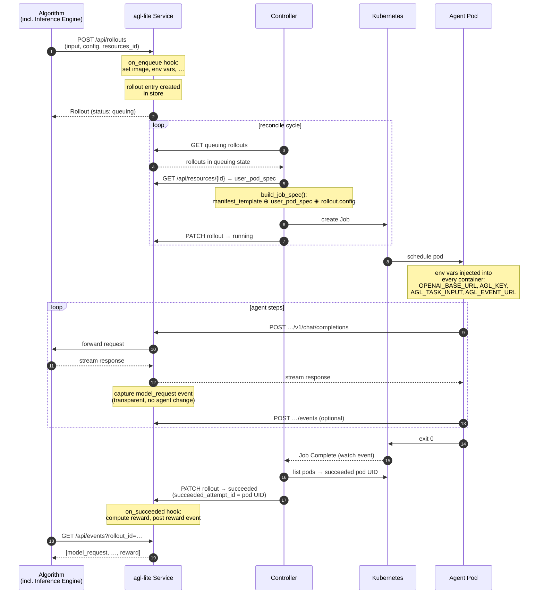

# Task Lifecycle

This page traces a single task — one row from a dataset — from the moment the algorithm submits it to the moment the trajectory is ready to train on. It is the end-to-end narrative that ties together the [Store](store.md), [Controller](controller.md), [Gateway](gateway.md), and [Agent Contract](agent-contract.md).

## Overview



---

## Stage 1 — Enqueue

The algorithm submits one rollout per dataset item:

```python
client.enqueue_rollouts([
    EnqueueRolloutRequest(
        input={"question": "...", "answer": "42"},   # raw dataset row
        resources_id="res-abc",                       # pinned resource snapshot
        config=RolloutConfig(image="agent:v1"),        # optional per-sample overrides
    )
])
```

Three fields carry different concerns:

| Field | Granularity | Typical content |
|---|---|---|
| `input` | per-sample | Raw task data — question, reference answer, problem statement. Delivered to the container as `AGL_TASK_INPUT`. |
| `resources_id` | per-dataset | Links to an immutable resource snapshot that holds the `job_template` (pod spec) and any other shared config (prompts, eval scripts). All rollouts in one experiment batch share the same `resources_id`. |
| `config` | per-sample | Optional K8s overrides: image, command, extra env vars, volume mounts, timeout, retries. Rarely set directly — usually left to the hook. |

### The `on_enqueue` hook

Before the rollout is persisted, the `on_enqueue` hook on the server gets to transform the request. This is where task-specific logic lives — outside the algorithm, inside the server process:

```python
class MyHooks(RolloutHooks):
    def on_enqueue(self, request: EnqueueRolloutRequest) -> EnqueueRolloutRequest:
        # Derive image from dataset field
        request.config.image = f"eval/{request.input['repo']}:latest"
        # Surface task data as env var for the container
        request.config.environment_variables["AGL_TASK_INPUT"] = (
            request.input["problem_statement"]
        )
        return request
```

After `on_enqueue` returns, the rollout enters the store with `status: queuing`.

---

## Stage 2 — Job Construction

The controller picks up queuing rollouts and builds a K8s Job manifest by merging **three independent layers**. Each layer represents a different granularity of configuration and a different owner:

```
manifest_template (Jinja2, per-infra)
        ↕  rendered → Job scaffold + PodPatcher env vars
user_pod_spec (dict, per-dataset, from resources["job_template"])
        ↕  containers, volumes, nodeSelector, tolerations
rollout.config (per-sample, set by algorithm / on_enqueue hook)
        ↕  image override, command, extra env vars, mounts
        ▼
    K8s Job manifest
```

| Layer | Source | Owner | What it contributes |
|---|---|---|---|
| `manifest_template` | Jinja2 file, mounted as ConfigMap, path from `--job-manifest-template` | Infra operator | Job scaffold (apiVersion, labels, ttl, restartPolicy), PodPatcher env vars (gateway URLs, API key refs) injected into **all** containers<br/>example: [deploy/controller/job-template.yaml.j2](deploy/controller/job-template.yaml.j2) |
| `user_pod_spec` | `resources["job_template"]`, fetched from store | Algorithm / dataset author | Container specs (image, resources, volumeMounts), volumes, pod-level fields (nodeSelector, tolerations, serviceAccountName)<br/>example: [examples/swe_bench/job-template.yaml](examples/swe_bench/job-template.yaml) |
| `rollout.config` | `on_enqueue` hook, code | Algorithm (per sample) | Per-sample overrides: image, command, extra env vars, mounts, timeout, max retries<br/>example: [examples/swe_bench/hooks.py](examples/swe_bench/hooks.py) |

### Merge precedence

Later layers win on conflict. Within the env var list, **the container's own value always beats the PodPatcher default** — so a container that sets `OPENAI_BASE_URL` itself keeps its value.

```
PodPatcher env  ←  overridden by  →  container's own env  ←  overridden by  →  rollout.config env vars
```

### What the PodPatcher injects

The `manifest_template` defines a PodPatcher (second YAML document, after `---`) whose env vars are prepended to **every container** in the pod — agent and any sidecars:

```yaml
env:
  - name: AGL_POD_UID          # K8s Downward API — becomes the attempt_id
    valueFrom: {fieldRef: {fieldPath: metadata.uid}}
  - name: OPENAI_BASE_URL
    value: "{base_url}/rollout/{rollout_id}/attempt/$(AGL_POD_UID)/v1"
  - name: AGL_KEY              # from K8s Secret
    valueFrom: {secretKeyRef: …}
  - name: AGL_EVENT_URL
    value: "{base_url}/rollout/{rollout_id}/attempt/$(AGL_POD_UID)/events"
  - name: AGL_ROLLOUT_ID
    value: "{rollout_id}"
  …
```

---

## Stage 3 — Pod Startup

When K8s schedules the pod, every container receives the injected env vars. The `OPENAI_BASE_URL` encodes both the rollout and the pod identity:

```
http://agl-lite:8080/rollout/{rollout_id}/attempt/{pod_uid}/v1
```

This URL is constructed at **Job build time** using `$(AGL_POD_UID)` — a K8s env var reference that resolves at pod start via the Downward API. The result is that:

- Every pod gets a unique URL even when K8s retries the same rollout (new pod → new UID → new URL → new attempt partition in the store).
- The gateway extracts `rollout_id` and `attempt_id` directly from the URL path on every request — no header, no SDK, no coordination.

---

## Stage 4 — Execution and Capture

The agent runs as a plain process. It reads its task from `AGL_TASK_INPUT` and calls the LLM endpoint using a standard OpenAI SDK:

```python
task = json.loads(os.environ["AGL_TASK_INPUT"])
client = openai.OpenAI()   # picks up OPENAI_BASE_URL automatically

response = client.chat.completions.create(
    model="gpt-4.1",
    messages=[{"role": "user", "content": task["prompt"]}],
)
```

The request reaches the gateway, which:

1. Validates the rollout ID exists in the store
2. Routes the request to the correct inference server (model name lookup in gateway config)
3. Streams the response back to the agent in real time
4. On stream completion, writes a `model_request` event — request body, full response, server metadata, latency — as a single in-process dict append (~100 ns)

The agent is unaware any of this is happening.

### Optional: custom events

Agents can post structured events directly if they want to enrich the trajectory:

```python
httpx.post(
    os.environ["AGL_EVENT_URL"],
    headers={"Authorization": f"Bearer {os.environ['AGL_KEY']}"},
    json={"event_type": "agent_output", "data": {"answer": "42"}},
)
```

---

## Stage 5 — Completion

When the agent process exits with code 0, K8s marks the pod `Succeeded` and the Job `Complete`. The controller detects this via its Job watch loop:

1. **Detect**: Job watch fires on `Complete` condition
2. **Resolve attempt**: list pods for the Job by label, find the `Succeeded` pod, read its `metadata.uid`
3. **Transition**: `PATCH rollout → succeeded`, `succeeded_attempt_id = pod_uid`
4. **Hook**: `on_succeeded` runs synchronously inside the store transition — the algorithm's hook reads the events, scores the output, and posts a `reward` event

```python
def on_succeeded(self, rollout: Rollout, events: dict[str, list], store: InMemoryStore) -> None:
    attempt_events = events.get(rollout.succeeded_attempt_id, [])
    answer = extract_answer(attempt_events)
    reward = score(answer, rollout.input["reference_answer"])
    store.add_event(rollout.rollout_id, rollout.succeeded_attempt_id,
                    Event(event_type="reward", data={"value": reward}))
```

If the pod exits non-zero and the Job's `backoffLimit` is exhausted, the Job enters `Failed` and the controller transitions the rollout to `terminal_failed` instead.

---

## Stage 6 — Reading the Trajectory

The algorithm reads back the complete trajectory for each rollout:

```python
events = await client.get_events(rollout_id=rollout.rollout_id)
# → [model_request, model_request, …, agent_output, reward]
```

`GET /api/events` without an `attempt_id` defaults to `succeeded_attempt_id` — the algorithm always gets the winning attempt's data without specifying it explicitly.

The trajectory is a flat ordered list of events. For RL training, the VERL integration extracts `(prompt, response, reward)` triplets from `model_request` events:

```
model_request.data.request.messages  →  prompt tokens
model_request.data.response.choices  →  response tokens + log-probs
reward event                         →  scalar reward signal
```

---

## Summary

| Stage | Where | Key output |
|---|---|---|
| Enqueue | Store / `on_enqueue` hook | Rollout record (`queuing`) |
| Job construction | Controller / `build_job_spec` | K8s Job manifest |
| Pod startup | Kubernetes | Running containers with injected env vars |
| Execution | Agent Pod ↔ Gateway | `model_request` events in store |
| Completion | Controller / `on_succeeded` hook | Rollout (`succeeded`) + `reward` event |
| Read back | Algorithm | Complete trajectory for training |
