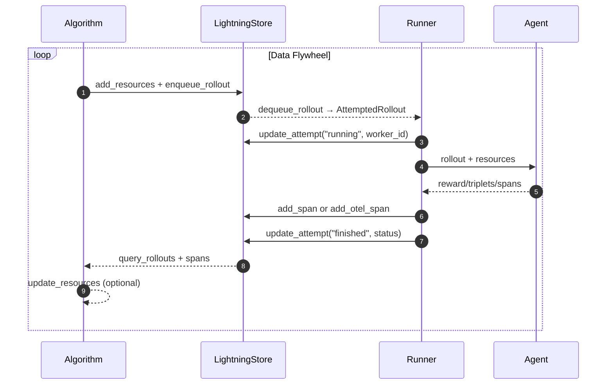

# The Bird's Eye View of Agent Lightning

This article summarizes how agent-lightning (as of v0.2) wires algorithms, runners, and stores together and shows where auxiliary components (tracer, adapters, proxies) plug into the loop. Each section provides a diagram for a different perspective of the system.

## Algorithm ↔ Runner ↔ Store data flow

At the very high level, Agent-lightning bundles the configured algorithm and runner and asks the "execution strategy" (details below) to execute them against the same `LightningStore` instance. The algorithm (in an automatic-interactive setting) typically enqueues work (new rollouts and resource updates) while the runner dequeues and executes those tasks, streaming traces and status updates back into the store. Once rollouts finish, the algorithm can query the completed data and apply adapters to convert the data for learning signals. The diagram below highlights the steady-state flow. We consider a very simple setup without any optional components and parallelism.

### Key Terms on the Arrows

We define the following terms which may be helpful for understanding the diagram above.

- **Resources:** A collection of assets to be tuned or trained. Agents perform rollouts against resources and collect span data. Algorithms use those data to update the resources. In case of RL training, the resources are the tunable model. In case of prompt tuning, the resources are the prompt templates.
- **Rollout:** A unit of work that an agent performs against a resource. A rollout (noun) can be incomplete, in which case it's also known as "task" or "job". The agent executes its own defined workflow against the rollout -- this process is also called "rollout" (verb). After running is complete, the rollout (noun) is completed.
- **Attempt:** A single execution of a rollout. One rollout can have multiple attempts in case of failures or timeouts.
- **Span:** During the rollout, the agent can generate multiple spans (also known as "traces" or "events"). The recorded spans are collected in the store, which serves as the crucial part for understanding the agents' behavior and optimizing the agents.
- **Reward:** Reward is a special span that is semantically defined as a number judging the quality of the rollout for a period of time during the rollout.

## Supporting Components in the Loop

Although the diagram above is simple and clear, it doesn't show many supporting components that Agent-lightning offers to make writing agents, runners, and algorithms easier. Here we introduce the key components and how they fit into the loop.

### Tracer

Tracer is a component that supports runners to record spans during the agents' rollout and send it to the store.
