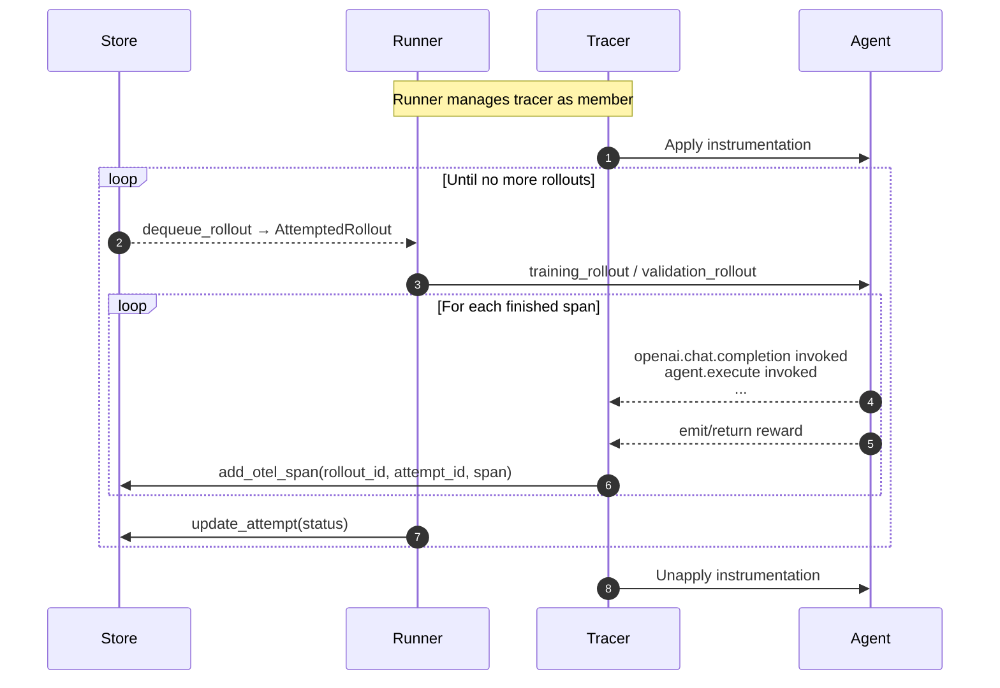

# The Bird's Eye View of Agent Lightning

This article summarizes how agent-lightning (as of v0.2) wires algorithms, runners, and stores together and shows where auxiliary components (tracer, adapters, proxies) plug into the loop. Each section provides a diagram for a different perspective of the system.

## Algorithm ↔ Runner ↔ Store data flow

At the very high level, Agent-lightning bundles the configured algorithm and runner and asks the "execution strategy" (details below) to execute them against the same `LightningStore` instance. The algorithm (in an automatic-interactive setting) typically enqueues work (new rollouts and resource updates) while the runner dequeues and executes those tasks, streaming traces and status updates back into the store. Once rollouts finish, the algorithm can query the completed data and apply adapters to convert the data for learning signals. The diagram below highlights the steady-state flow. We consider a very simple setup without any optional components and parallelism.

### Key Terms on the Arrows

We define the following terms which may be helpful for understanding the diagram above.

- **Resources:** A collection of assets to be tuned or trained. Agents perform rollouts against resources and collect span data. Algorithms use those data to update the resources. In case of RL training, the resources are the tunable model. In case of prompt tuning, the resources are the prompt templates.
- **Rollout:** A unit of work that an agent performs against a resource. A rollout (noun) can be incomplete, in which case it's also known as **"task"**, **"sample"** or **"job"** (these terms are used interchangeably). The agent executes its own defined workflow against the rollout -- this process is also called "rollout" (verb). After running is complete, the rollout (noun) is completed.
- **Attempt:** A single execution of a rollout. One rollout can have multiple attempts in case of failures or timeouts.
- **Span:** During the rollout, the agent can generate multiple spans (also known as "traces" or "events"). The recorded spans are collected in the store, which serves as the crucial part for understanding the agents' behavior and optimizing the agents.
- **Reward:** Reward is a special span that is semantically defined as a number judging the quality of the rollout for a period of time during the rollout.
- **Dataset:** A collection of incomplete rollouts (i.e., tasks) for the agent to play with. The three datasets (i.e., train, val, dev) serve as the initial input for the algorithm to enqueue the first batch of rollouts.

## Supporting Components in the Loop

Although the diagram above is simple and clear, it doesn't show many supporting components that Agent-lightning offers to make writing agents, runners, and algorithms easier. Here we introduce the key components and how they fit into the loop.

### Tracer

Tracer is a component that serves as a member variable of runners to record spans during the agents' rollout and send it to the store.

The above diagram shows the overall data flow between store, tracer and agent. The implementation is slightly different from the ideal diagram. The spans are not actually emitted actively by the agent, instead they are "caught" by the tracer by hooking and instrumenting key methods used in the agents. The tracers use a special callback (exporter) to monitor those events and logs to the store. Before the rollout starts, the runner enters a tracing context before invoking the agent, which wires the store identifiers into the tracer. Every span completion then streams back to the store through `LightningSpanProcessor.on_end`, so the agent's instrumentation lands in `add_otel_span`. If the agent's rollout method returns a numeric reward, the runner emits one more OpenTelemetry span before finalizing the attempt.

### Adapter

TODO: relationship between adapter, store, algorithm.

### LLM Proxy

TODO: relationship between llm_proxy, store, algorithm.

state the functionality of LLM Proxy.

### Trainer

Lifecycle of all components. All components above can live as long as the trainer. Some member variables relationships are injected into the components by the trainer.

TODO: a diagram showing the lifecycle of all components.

## Inside an RL Algorithm (VERL Example)

TODO: talk about LLM inference engine (and the proxy shield), resource (LLM endpoint), triplets (adapter output).

## Execution Strategies and Parallelism

TODO: talk about bundles: algorithm bundle and runner bundle. Runner can be forked and parallelized. Bundles communicate with each other through the store.

### Shared-memory Strategy

TODO: sharing the same memory between all bundles. The store needs to be thread safe. Figure.

### Client-server Strategy

TODO: the store is splitted into a server handle and a client handle. The algorithm bundle holds the source of truth of the store (i.e., the server). The runner bundle uses the client handle to communicate with the server. Inside the algorithm bundle, if there are multiple processes (e.g., llm proxy needs a standalone process), the subprocesses also hold the client bundle.

## Online/Continuous Learning

TODO: using an continuous `algorithm.run` with continuous `runner.step()`. Explain where resources and samples come from.
