# The Bird's Eye View of Agent Lightning

This article summarizes how agent-lightning (as of v0.2) wires algorithms, runners, and stores together and shows where auxiliary components (tracer, adapters, proxies) plug into the loop. Each section provides a diagram for a different perspective of the system.

## Algorithm ↔ Runner ↔ Store data flow

At the very high level, Agent-lightning bundles the configured algorithm and runner and asks the "execution strategy" (details below) to execute them against the same `LightningStore` instance. The algorithm (in an automatic-interactive setting) typically enqueues work (new rollouts and resource updates) while the runner dequeues and executes those tasks, streaming traces and status updates back into the store. Once rollouts finish, the algorithm can query the completed data and apply adapters to convert the data for learning signals. The diagram below highlights the steady-state flow. We consider a very simple setup without any optional components and parallelism.

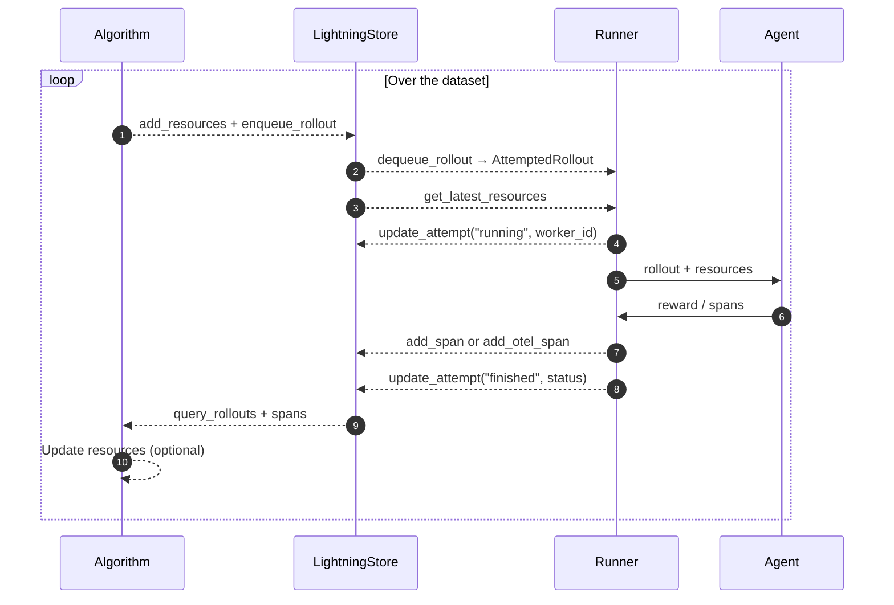

*Solid lines are instantaneous calls, dashed lines are async / long-running.*

### Key Terms on the Arrows

We define the following terms which may be helpful for understanding the diagram above.

- **Resources:** A collection of assets to be tuned or trained. Agents perform rollouts against resources and collect span data. Algorithms use those data to update the resources. In case of RL training, the resources are the tunable model. In case of prompt tuning, the resources are the prompt templates.
- **Rollout:** A unit of work that an agent performs against a resource. A rollout (noun) can be incomplete, in which case it's also known as **"task"**, **"sample"** or **"job"** (these terms are used interchangeably). The agent executes its own defined workflow against the rollout -- this process is also called "rollout" (verb). After running is complete, the rollout (noun) is completed.
- **Attempt:** A single execution of a rollout. One rollout can have multiple attempts in case of failures or timeouts.
- **Span:** During the rollout, the agent can generate multiple spans (also known as "traces" or "events"). The recorded spans are collected in the store, which serves as the crucial part for understanding the agents' behavior and optimizing the agents.
- **Reward:** Reward is a special span that is semantically defined as a number judging the quality of the rollout for a period of time during the rollout.
- **Dataset:** A collection of incomplete rollouts (i.e., tasks) for the agent to play with. The three datasets (i.e., train, val, dev) serve as the initial input for the algorithm to enqueue the first batch of rollouts.

## Store

The store is the central hub for all data in agent-lightning. It serves as the source of truth for resources, rollouts, attempts, and spans. The store exposes a set of APIs for algorithms and runners to interact with the data, and the most important ones are:

```python
from agentlightning.types import AttemptedRollout, ResourcesUpdate, Span, TaskInput

class LightningStore:

    async def enqueue_rollout(self, input: TaskInput, ...) -> Rollout: ...

    async def dequeue_rollout(self) -> AttemptedRollout | None: ...

    async def add_span(self, span: Span) -> Span: ...

    async def get_latest_resources(self) -> Optional[ResourcesUpdate]: ...

    async def wait_for_rollouts(self, rollout_ids: List[str], ...): ...

    async def query_spans(self, rollout_id: str, ...): ...

    async def update_attempt(self, rollout_id: str, attempt_id: str, status: str, ...): ...
```

As you can see from the APIs, the essential capability of the store is to provide a queue for rollouts, and a storage for resources, spans, and attempts. The store should be carefully implemented to ensure the data integrity and consistency, especially when there are multiple runners working in parallel in multiple attempts.

The store is designed to be extensible. Users can implement their own store by inheriting from `LightningStore` and overriding the methods. Agent-lightning provides a few reference implementations, such as `InMemoryLightningStore` (default), and `SqliteLightningStore` (under construction). When parallelized, the store can also need special wrappers to ensure thread/process safety, or delegates the computing to a store in another process or on another machine.

## Supporting Components in the Loop

Although the diagram above is simple and clear, it doesn't show many supporting components that Agent-lightning offers to make writing agents, runners, and algorithms easier. Here we introduce the key components and how they fit into the loop.

### Tracer

Tracer is a component that serves as a member variable of runners to record spans during the agents' rollout and send it to the store.

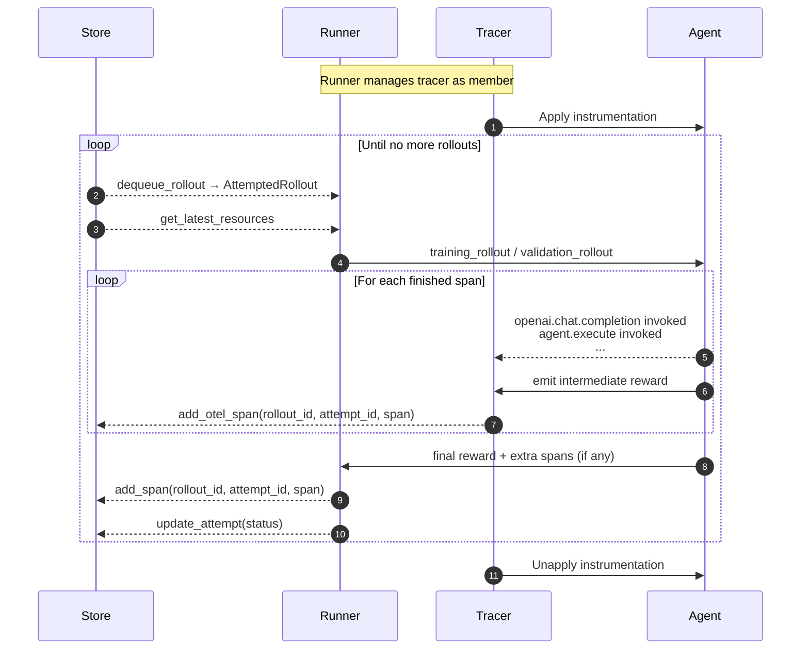

The above diagram shows the overall data flow between store, tracer and agent. In realistic, it's a bit more complicated than that. The spans are not actually emitted actively by the agent, instead they are "caught" by the tracer by hooking and instrumenting key methods used in the agents. The tracers use a special callback (exporter) to monitor those events and logs to the store. Before the rollout starts, the runner enters a `trace_context` before invoking the agent, which wires the store identifiers into the tracer (illustrated in the following figure). Every span completion then streams back to the store through `LightningSpanProcessor.on_end`, so the agent's instrumentation lands in `add_otel_span`. If the agent's rollout method returns a numeric reward, the runner emits one more OpenTelemetry span before finalizing the attempt.

### Hooks

Hooks are user-defined callbacks to augment an existing runner's behavior. Currently, hooks live within the runner and can be called at the beginning and the end of trace and rollout.

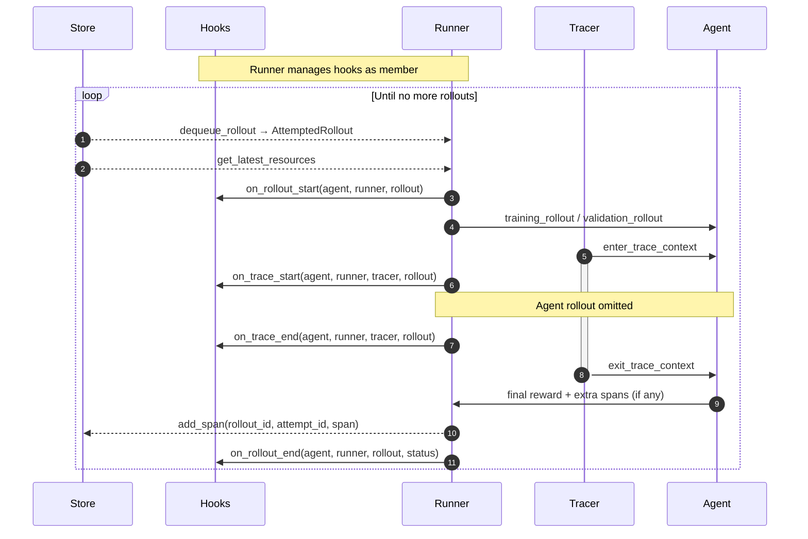

This diagram shows the 4 hooks that Agent-lightning currently supports. Users should pay special attention to the difference between `on_trace_end` and `on_rollout_end`. The former is called right before the tracer exits the trace context, while the latter is called after the runner finalizes the attempt in the store.

### Adapter

The adapter is the algorithm's bridge between raw traces and learning signals. Users can configure an adapter in the algorithm before `algorithm.run` starts, so that the algorithm instance can later call `adapter.adapt(...)` on spans fetched from the store to conveniently converts the spans into a format suitable for learning.

The runner streams spans into the store as it executes rollouts, and algorithms query those spans to construct data needed for learning. For example, the VERL algorithm collects spans for each completed rollout, converts them with `TraceTripletAdapter` (by default), which implements `adapt` by traversing OpenTelemetry spans, aligning prompts, responses, and reward spans into `Triplet` records (details below) that downstream RL fine-tuning code can consume. The figure below summarizes the relationship.

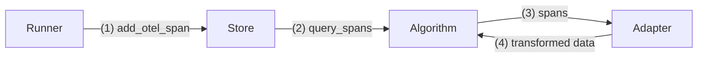

### LLM Proxy

The LLM proxy is an optional bridge between the runner's LLM calls and the algorithm's resource management. `LLMProxy` is associated with a store and it's handed over to the algorithm. LLM Proxy is added as a special resource that redirects to LLM endpoint. This endpoint can be:

1. **Endpoint served by the algorithm:** If the algorithm is internally updating the LLM weights (e.g., RL), it can launch an LLM inference engine (i.e., a model server) and register the endpoint URL with the proxy. The proxy then forwards all LLM calls to that endpoint.
2. **Third-party LLM endpoint:** If the algorithm is not updating the LLM weights (e.g., prompt tuning), it can register a third-party LLM endpoint into the proxy.

During rollouts, the runner invokes the proxy's HTTP endpoint instead of calling a model backend directly. The proxy augments each request with rollout/attempt metadata, tracks which rollout is initiating the current request, and then records OpenTelemetry spans via `LightningSpanExporter`. **LLM Proxy serves as an effective complement to the tracer.** The tracer instruments the agent's code, while the proxy instruments the LLM calls, which is crucial when instrumenting agent's code is difficult. Together they form a complete picture of the agent's behavior.

Functionally, the proxy acts as a "shield" in front of LLM calls. It's also a convenient way to integrate diverse LLM backends (e.g., OpenAI, Azure, Anthropic, local models) without changing the agent code. It can also be used to support diverse LLM clients (e.g., Anthropic API), add retry logic, rate limiting and caching.

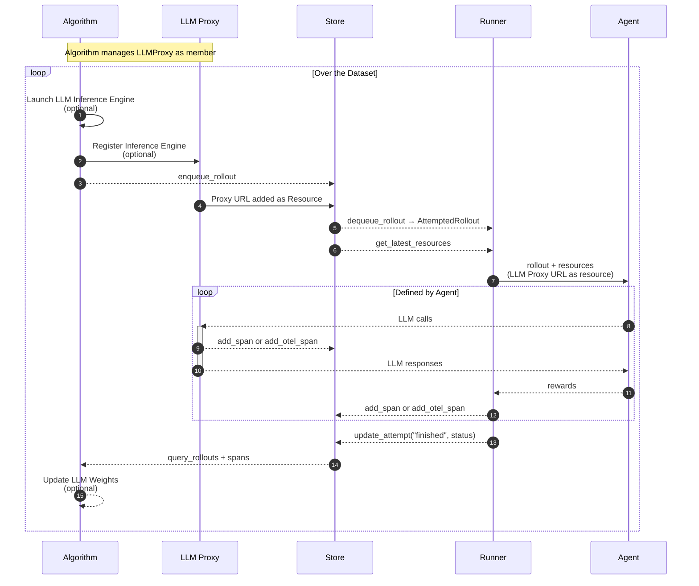

In this diagram, the store receives spans from both the proxy and the runner. We will see a problem later with parallelism where the proxy and runner are in different machines, and spans need to obtain a special counter from the store to ensure the ordering of spans.

### Trainer

The Trainer is the high-level orchestrator that initializes and connects all major components—algorithm, runner, store, tracer, adapter, LLM proxy, and hooks. The components can have a lifecycle as long as the trainer. The trainer defines their lifecycles and injects shared dependencies so that execution, tracing, and learning operate within a consistent environment.

**Roles and Relationships:**

1. **Owns:** components that the trainer constructs and manages directly (e.g., runner, tracer).
2. **Injects:** components passed into others as dependencies.
3. **References:** weak links for coordination without ownership.
4. **Uses:** components that are temporarily interacted with.

For example, the store is injected into the algorithm and runner. The tracer and agent are injected into the runner. The adapter and LLM proxy are injected into the algorithm. The store is further injected into the tracer, adapter and LLM proxy by the runner and algorithm respectively.

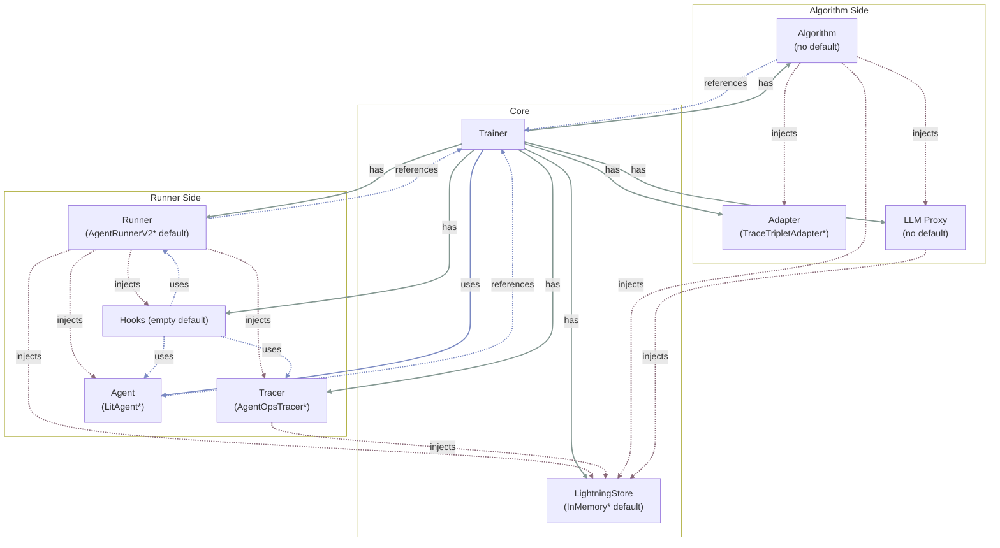

## Inside an RL Algorithm (VERL Example)

VERL's integration demonstrates how the algorithm consumes the shared infrastructure. Currently the code lives within `agentlightning.algorithm.verl` and `agentlightning.verl` for historical reasons. `agentlightning.verl` is the legacy code, which contains many overlapping and misleading terms (such as the overusing of `Trainer`). `agentlightning.algorithm.verl` is a simpler wrapper to comply with the new algorithm interface.

As readers may know, the basic problem formulation of Reinforcement Learning is to learn a policy that performs actions upon some states to maximize the expected cumulative reward in an environment. In the context of agents, the policy is typically represented by a language model that generates text (action) based on input prompts (state). To make the language model learnable, there is another need for numeric rewards to judge the quality of the generated text. The (state, action, reward) **triplet** is the fundamental data structure for RL algorithms to learn from.

In Agent-lightning's setup, the environment is implicit in the agent's code, which is a simple workflow that orchestrates one or many LLM calls, and agents judge itself by some rules or another LLM calls. The agents emit many spans during the rollout, which essentially contains all the data needed for RL training. The algorithm's job are several parts:

1. Providing a language model deployment that is currently learning and improving for the agent to interact with;
2. Preparing the tasks that the agents will perform;
3. Querying the spans generated, extracting triplets, and converting them into a format that the underlying RL library can consume;
4. Updating the language model based on the learning signals.

The VERL integration in Agent-lightning covers all these parts. The language model deployment (i.e., chat completion endpoint) is created by the algorithm using `vLLM` and wrapped with `FSDP` for distributed training, both managed by VERL. The tasks are enqueued by the algorithm from the dataset. The spans are queried by the algorithm after rollouts finish, and converted into triplets by `TraceTripletAdapter`. Finally, the triplets are fed into VERL's native training loop to update the language model weights.

The following diagram is a comprehensive sequence diagram that shows how VERL's integration works in Agent-lightning. It's probably the most complicated diagram in this article -- it includes multiple components introduced above, such as the LLM proxy, store and adapter. It's a good knowledge check for readers to see if they can identify the components and their roles in the diagram.

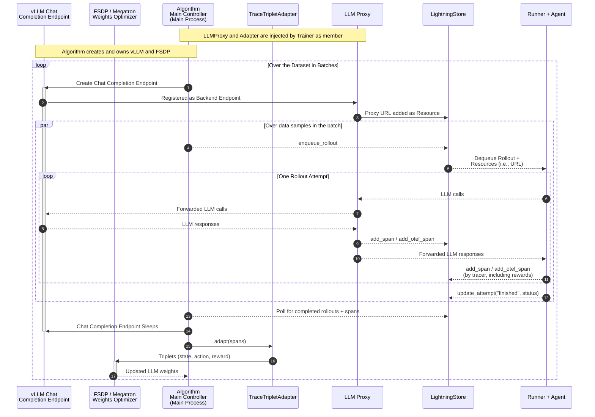

**Note:** There are interactions between different components injected into or owned by algorithms in the diagram, such as the output of the adapter feeding into the FSDP optimizer. This is for simplicity of illustration and slightly different from the actual implementation, where it's the algorithm main controller that orchestrates the data flow between components.

Also note that the VERL's native setup is a bit different. VERL uses a more classic RLHF setup where each action is formulated as one single token instead of a chunk of text. The state is the entire conversation history (including system, user and assistant messages) before the current token. The reward only is given at the end of the conversation. To integrate Agent-lightning with VERL, when updating the language model, we need to convert each (state, action, reward) triplet into one VERL trajectory, which is a `DataProto` containing keys like `input_ids`, `position_ids`, `attention_mask`, and `token_level_scores`. This part comes after the triplets are generated by the adapter, and is not depicted in the diagram above.

## Execution Strategies and Parallelism

Up to this point, you might have observed from the diagram above that there is absolutely no communication between (1) runner and agents and (2) algorithm. The only overlap of them is the trainer and store. This observation is very clear with the diagram within the trainer section, and it's by design. This design allows us to flexibly scale the runner and algorithm independently, which is crucial for large-scale training.

Agent-lightning creates two bundles (i.e., executable procedures) to separate the runner side and algorithm side. The runner bundle contains the runner, tracer, hooks, and agent. The algorithm bundle contains the algorithm, adapter, and LLM proxy. The store is shared between the two bundles. The trainer is a lightweight component that initializes and connects the two bundles.

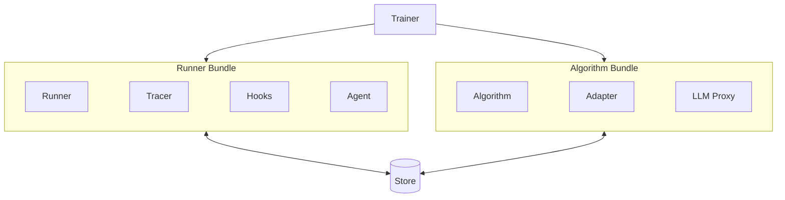

Execution strategies, created and owned by trainer, serves mainly 4 purposes. Firstly, they dictate the placements of the two bundles -- whether they reside in the same thread, the same process, the same machine, or different machines. Secondly, the execution strategy also wraps the store and implements how the store is shared between the two bundles.

Furthermore, the execution strategy is capable of replicating the runner bundle to multiple threads, multiple processes, or even multiple machines, to scale out the runner side. The algorithm side however is much more complex to parallelize, and since there have been many mature libraries to scale out model training (e.g., DeepSpeed, Megatron), we leave the algorithm side as a single process for now, and scaling should happen within the algorithm implementation itself.

Aborting is another core feature of execution strategies. Aborting can come from multiple reasons, in case of normal exiting, algorithm failures, runner failures, or user interrupts. The creator of the bundles (i.e., trainer) should make the bundles abortable by exposing a way to signal cancellation. In case of normal exiting, when the algorithm bundle exits, the strategy sets the signal to the runner bundle to abort. However, if the runner bundle exits, the strategy does **NOT** signal the algorithm bundle to abort, because the algorithm bundle can still be running and processing the completed rollouts. Failure and user interrupts are another case. For both cases, the strategy should signal both bundles to abort. If the any bundles fails to abort, the strategy should force kill the bundle at its best effort.

Agent-lightning currently supports two strategies: shared-memory and client-server, detailed below.

### Shared-memory Strategy

When `SharedMemoryExecutionStrategy` is used, the algorithm and runner bundles run as threads in one single process. The strategy wraps the store with a `LightningStoreThreaded` facade that guards every store call with a lock so concurrent access is safe.

This approach is ideal for lightweight debugging because all components share the same Python heap and do not require serialization (such as prompt tuning with small agents). Not applicable for RL training or agents that need heavy computing.

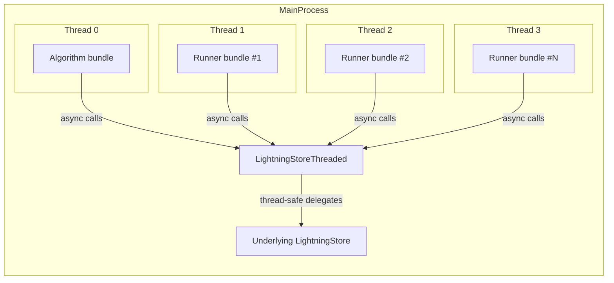

The strategy has a configurable main thread. If the main thread is configured to be the algorithm thread, the main thread runs the algorithm bundle, and spawns multiple threads for the runner bundle. If the main thread is configured to be a runner thread, `n_runners` must be set to 1, and the runner bundle lives in the main thread.

### Client-server Strategy

`ClientServerExecutionStrategy` separates concerns across processes. The algorithm bundle starts a `LightningStoreServer` (HTTP API) that wraps the original store and communicates with the server wrapper directly. Runner bundles connect through `LightningStoreClient` objects that mirror the store interface over REST. One tricky part is that `LightingStoreServer` also has integrated one client inside, which is designed to make algorithms which launch additional subprocesses (for example, a dedicated LLM proxy worker) convenient. Those subprocesses communicates using the client with the algorithms' main process. Currently this design introduces an extra wrapper that helps debugging and improves fault tolerance. We might revisit this design in the future and enforce the client to be the only way to communicate with the store.

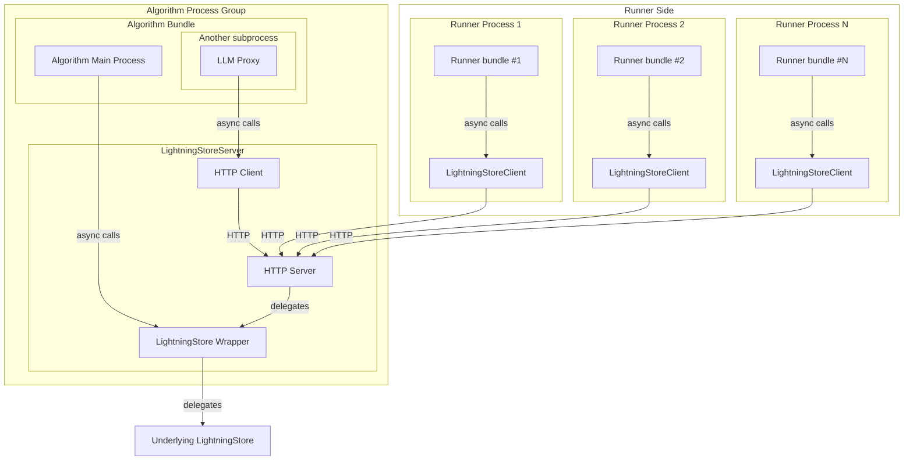

## Online/Continuous Learning

Continuous learning setups keep the algorithm loop running alongside opportunistic and spontaneous runner iterations. Here are the key differences from the batch setup:

1. The algorithm does not `enqueue_rollout` from a fixed dataset. Instead, the rollout tasks and spans are all reported spontaneously by the runners.
2. The algorithm can `wait_for_rollouts`, but there will be no more expected `rollout_ids`. Instead, the algorithm needs to periodically poll the store for new rollouts and spans or wait for a particular number of new rollouts to arrive.
3. The runner does not use `iter()` to exhaust rollouts from the store queue. Instead, the runner uses `step(task)` to process one rollout initiated by the user or by a "bigger loop". It also notifies the store that "I'm starting a rollout" before invoking the agent, so that the store can have it recorded.
4. User or the bigger loop has more control of the store --- what resources the next `step` should use, whether to when to retry, etc.

All other components like spans, adapters and LLM proxies still work in the same way. The diagram below illustrates the continuous learning setup.

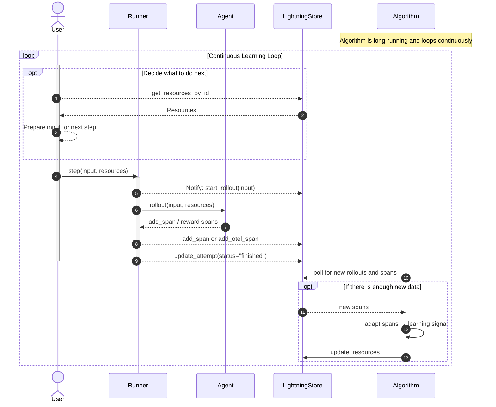
