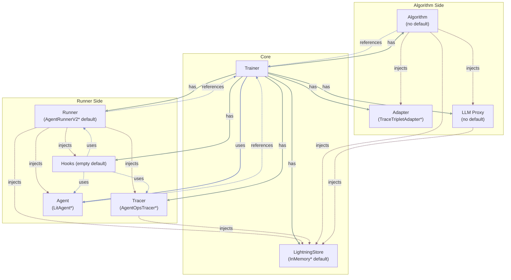

# The Bird's Eye View of Agent Lightning

This article summarizes how agent-lightning (as of v0.2) wires algorithms, runners, and stores together and shows where auxiliary components (tracer, adapters, proxies) plug into the loop. Each section provides a diagram for a different perspective of the system.

## Algorithm ↔ Runner ↔ Store data flow

At the very high level, Agent-lightning bundles the configured algorithm and runner and asks the "execution strategy" (details below) to execute them against the same `LightningStore` instance. The algorithm (in an automatic-interactive setting) typically enqueues work (new rollouts and resource updates) while the runner dequeues and executes those tasks, streaming traces and status updates back into the store. Once rollouts finish, the algorithm can query the completed data and apply adapters to convert the data for learning signals. The diagram below highlights the steady-state flow. We consider a very simple setup without any optional components and parallelism.

*Solid lines are instantaneous calls, dashed lines are async / long-running.*

### Key Terms on the Arrows

We define the following terms which may be helpful for understanding the diagram above.

- **Resources:** A collection of assets to be tuned or trained. Agents perform rollouts against resources and collect span data. Algorithms use those data to update the resources. In case of RL training, the resources are the tunable model. In case of prompt tuning, the resources are the prompt templates.
- **Rollout:** A unit of work that an agent performs against a resource. A rollout (noun) can be incomplete, in which case it's also known as **"task"**, **"sample"** or **"job"** (these terms are used interchangeably). The agent executes its own defined workflow against the rollout -- this process is also called "rollout" (verb). After running is complete, the rollout (noun) is completed.
- **Attempt:** A single execution of a rollout. One rollout can have multiple attempts in case of failures or timeouts.
- **Span:** During the rollout, the agent can generate multiple spans (also known as "traces" or "events"). The recorded spans are collected in the store, which serves as the crucial part for understanding the agents' behavior and optimizing the agents.
- **Reward:** Reward is a special span that is semantically defined as a number judging the quality of the rollout for a period of time during the rollout.
- **Dataset:** A collection of incomplete rollouts (i.e., tasks) for the agent to play with. The three datasets (i.e., train, val, dev) serve as the initial input for the algorithm to enqueue the first batch of rollouts.

## Supporting Components in the Loop

Although the diagram above is simple and clear, it doesn't show many supporting components that Agent-lightning offers to make writing agents, runners, and algorithms easier. Here we introduce the key components and how they fit into the loop.

### Tracer

Tracer is a component that serves as a member variable of runners to record spans during the agents' rollout and send it to the store.

The above diagram shows the overall data flow between store, tracer and agent. In realistic, it's a bit more complicated than that. The spans are not actually emitted actively by the agent, instead they are "caught" by the tracer by hooking and instrumenting key methods used in the agents. The tracers use a special callback (exporter) to monitor those events and logs to the store. Before the rollout starts, the runner enters a `trace_context` before invoking the agent, which wires the store identifiers into the tracer (illustrated in the following figure). Every span completion then streams back to the store through `LightningSpanProcessor.on_end`, so the agent's instrumentation lands in `add_otel_span`. If the agent's rollout method returns a numeric reward, the runner emits one more OpenTelemetry span before finalizing the attempt.

### Hooks

Hooks are user-defined callbacks to augment an existing runner's behavior. Currently, hooks live within the runner and can be called at the beginning and the end of trace and rollout.

This diagram shows the 4 hooks that Agent-lightning currently supports. Users should pay special attention to the difference between `on_trace_end` and `on_rollout_end`. The former is called right before the tracer exits the trace context, while the latter is called after the runner finalizes the attempt in the store.

### Adapter

The adapter is the algorithm's bridge between raw traces and learning signals. Users can configure an adapter in the algorithm before `algorithm.run` starts, so that the algorithm instance can later call `adapter.adapt(...)` on spans fetched from the store to conveniently converts the spans into a format suitable for learning.

The runner streams spans into the store as it executes rollouts, and algorithms query those spans to construct data needed for learning. For example, the VERL algorithm collects spans for each completed rollout, converts them with `TraceTripletAdapter` (by default), which implements `adapt` by traversing OpenTelemetry spans, aligning prompts, responses, and reward spans into `Triplet` records (details below) that downstream RL fine-tuning code can consume. The figure below summarizes the relationship.

### LLM Proxy

The LLM proxy is an optional bridge between the runner's LLM calls and the algorithm's resource management. `LLMProxy` is associated with a store and it's handed over to the algorithm. LLM Proxy is added as a special resource that redirects to LLM endpoint. This endpoint can be:

1. **Endpoint served by the algorithm:** If the algorithm is internally updating the LLM weights (e.g., RL), it can launch an LLM inference engine (i.e., a model server) and register the endpoint URL with the proxy. The proxy then forwards all LLM calls to that endpoint.
2. **Third-party LLM endpoint:** If the algorithm is not updating the LLM weights (e.g., prompt tuning), it can register a third-party LLM endpoint into the proxy.

During rollouts, the runner invokes the proxy's HTTP endpoint instead of calling a model backend directly. The proxy augments each request with rollout/attempt metadata, tracks which rollout is initiating the current request, and then records OpenTelemetry spans via `LightningSpanExporter`. **LLM Proxy serves as an effective complement to the tracer.** The tracer instruments the agent's code, while the proxy instruments the LLM calls, which is crucial when instrumenting agent's code is difficult. Together they form a complete picture of the agent's behavior.

Functionally, the proxy acts as a "shield" in front of LLM calls. It's also a convenient way to integrate diverse LLM backends (e.g., OpenAI, Azure, Anthropic, local models) without changing the agent code. It can also be used to support diverse LLM clients (e.g., Anthropic API), add retry logic, rate limiting and caching.

In this diagram, the store receives spans from both the proxy and the runner. We will see a problem later with parallelism where the proxy and runner are in different machines, and spans need to obtain a special counter from the store to ensure the ordering of spans.

### Trainer

The Trainer is the high-level orchestrator that initializes and connects all major components—algorithm, runner, store, tracer, adapter, LLM proxy, and hooks. The components can have a lifecycle as long as the trainer. The trainer defines their lifecycles and injects shared dependencies so that execution, tracing, and learning operate within a consistent environment.

**Roles and Relationships:**

1. **Owns:** components that the trainer constructs and manages directly (e.g., runner, tracer).
2. **Injects:** components passed into others as dependencies.
3. **References:** weak links for coordination without ownership.
4. **Uses:** components that are temporarily interacted with.

For example, the store is injected into the algorithm and runner. The tracer and agent are injected into the runner. The adapter and LLM proxy are injected into the algorithm. The store is further injected into the tracer, adapter and LLM proxy by the runner and algorithm respectively.

## Inside an RL Algorithm (VERL Example)

VERL's integration demonstrates how the algorithm consumes the shared infrastructure. Currently the code lives within `agentlightning.algorithm.verl` and `agentlightning.verl` for historical reasons. `agentlightning.verl` is the legacy code, which contains many overlapping and misleading terms (such as the overusing of `Trainer`). `agentlightning.algorithm.verl` is a simpler wrapper to comply with the new algorithm interface.

As readers may know, the basic problem formulation of Reinforcement Learning is to learn a policy that performs actions upon some states to maximize the expected cumulative reward in an environment. In the context of agents, the policy is typically represented by a language model that generates text (action) based on input prompts (state). To make the language model learnable, there is another need for numeric rewards to judge the quality of the generated text. The (state, action, reward) **triplet** is the fundamental data structure for RL algorithms to learn from.

In Agent-lightning's setup, the environment is implicit in the agent's code, which is a simple workflow that orchestrates one or many LLM calls, and agents judge itself by some rules or another LLM calls. The agents emit many spans during the rollout, which essentially contains all the data needed for RL training. The algorithm's job are several parts:

1. Providing a language model deployment that is currently learning and improving for the agent to interact with;
2. Preparing the tasks that the agents will perform;
3. Querying the spans generated, extracting triplets, and converting them into a format that the underlying RL library can consume;
4. Updating the language model based on the learning signals.

The VERL integration in Agent-lightning covers all these parts. The language model deployment (i.e., chat completion endpoint) is created by the algorithm using `vLLM` and wrapped with `FSDP` for distributed training, both managed by VERL. The tasks are enqueued by the algorithm from the dataset. The spans are queried by the algorithm after rollouts finish, and converted into triplets by `TraceTripletAdapter`. Finally, the triplets are fed into VERL's native training loop to update the language model weights.

The following diagram is a comprehensive sequence diagram that shows how VERL's integration works in Agent-lightning. It includes multiple components introduced above, such as the LLM proxy, store and adapter. It's a good knowledge check for readers to see if they can identify the components and their roles in the diagram.

**Note:** There are interactions between different components injected into or owned by algorithms in the diagram, such as the output of the adapter feeding into the FSDP optimizer. This is for simplicity of illustration and slightly different from the actual implementation, where it's the algorithm main controller that orchestrates the data flow between components.

Also note that the VERL's native setup is a bit different. VERL uses a more classic RLHF setup where each action is formulated as one single token instead of a chunk of text. The state is the entire conversation history (including system, user and assistant messages) before the current token. The reward only is given at the end of the conversation. To integrate Agent-lightning with VERL, when updating the language model, we need to convert each (state, action, reward) triplet into one VERL trajectory, which is a `DataProto` containing keys like `input_ids`, `position_ids`, `attention_mask`, and `token_level_scores`. This part comes after the triplets are generated by the adapter, and is not depicted in the diagram above.

1. **LLM inference engine via proxy shield:** `AgentModeDaemon` calls
   `LLMProxy.as_resource()` to materialize a named resource describing how to
   contact the inference backend (model name, sampling parameters, etc.). The
   resource identifier is stored in the `LightningStore` so every rollout uses a
   consistent logical model while the proxy handles request rewriting and
   telemetry capture.
2. **Resources as algorithm state:** Before enqueueing rollouts, the daemon (on
   behalf of the algorithm) uploads the current resource snapshot to the store.
   When runners dequeue work, they fetch the same resource version, guaranteeing
   they evaluate the policy corresponding to the current PPO iteration.
3. **Triplets derived from adapter output:** After runners finish, the daemon
   queries spans for each rollout and feeds them through the injected
   `TraceTripletAdapter`. The resulting `(prompt, response, reward)` triplets are
   converted into VERL’s `DataProto` batches, powering downstream advantage and
   gradient computations.

Because all three concerns—model routing, resource versioning, and trace
interpretation—flow through the store boundary, VERL can scale across processes
without bespoke communication channels.

## Execution Strategies and Parallelism

A key observation from the diagram above is that there is absolutely no communication between (1) runner and agents and (2) algorithm. The only overlap of them is the store.

TODO: talk about bundles: algorithm bundle and runner bundle. Runner can be forked and parallelized. Bundles communicate with each other through the store.

### Shared-memory Strategy

TODO: sharing the same memory between all bundles. The store needs to be thread safe. Figure.

### Client-server Strategy

TODO: the store is splitted into a server handle and a client handle. The algorithm bundle holds the source of truth of the store (i.e., the server). The runner bundle uses the client handle to communicate with the server. Inside the algorithm bundle, if there are multiple processes (e.g., llm proxy needs a standalone process), the subprocesses also hold the client bundle.

## Online/Continuous Learning

TODO: using an continuous `algorithm.run` with continuous `runner.step()`. Explain where resources and samples come from.
