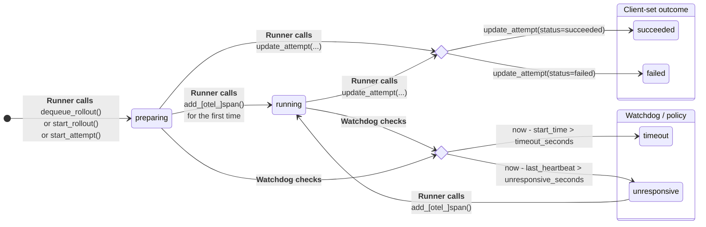

# Understanding Store

The **LightningStore** is the central coordination point for Agent-lightning. It holds the task queue, rollouts, attempts, spans, and versioned resources, and exposes a small API both Runners and Algorithms use to communicate. This document explains what’s in the store, how statuses transition, how spans are recorded, and the concurrency model (threads & processes).

## What’s in the Store?

{ .center }

At a high level:

* **Task Queue** – [`enqueue_rollout`][agentlightning.LightningStore.enqueue_rollout] adds work; workers poll with [`dequeue_rollout`][agentlightning.LightningStore.dequeue_rollout]. When a rollout is dequeued, it automatically creates a new attempt associated with itself.
* **Rollouts** – A rollout is one unit of work. It has input, metadata, links to resources, and a lifecycle (`queuing → preparing → running → ...`). Valid rollout statuses are **`queuing`**, `preparing`, `running`, `succeeded`, `failed`, **`requeuing`**, **`cancelled`**. For algorithms and runners, the rollout can be seen as a whole, without worrying about the internal attempts.
* **Attempts** – Each rollout can have multiple executions (retries). Attempts track `status`, `start_time`, `end_time`, `last_heartbeat_time` and link to spans. Valid attempt statuses are `preparing`, `running`, `succeeded`, `failed`, `requeuing`, `cancelled`.
* **Spans** – Structured trace events produced by the Tracer during an attempt. Spans are ordered by a **monotonic sequence id** per `(rollout_id, attempt_id)`.
* **Resources** – Versioned, named bundles (e.g., prompt templates) referenced by rollouts.

Rollout and Task share the same surface in practice: [`Rollout.input`][agentlightning.types.Rollout] is the task input. The queue stores rollouts that are not yet running; [Runners][agentlightning.Runner] dequeue them and update the same rollout’s status as work progresses.

## Attempt Status Transitions

The status model is intentionally small and operationally clear.



Each attempt begins in **preparing**, created either when a rollout is dequeued or explicitly started. It transitions to **running** the first time a span is recorded. From there, a few clear rules govern how it can change:

- When the runner explicitly marks completion, the attempt becomes **succeeded** or **failed** (when the runner catches exception thrown out by the agent).
- When the watchdog detects that the total elapsed time since start exceeds the configured limit, it marks the attempt as **timeout**.
- If heartbeats stop arriving for too long, the watchdog marks it **unresponsive**.
- A new span from the runner can immediately revive an **unresponsive** attempt back to **running**.

This simple model allows the system to distinguish between normal termination, abnormal stalling, and recoverable interruption without additional state flags.

!!! tip

    [`add_span`][agentlightning.LightningStore.add_span] or [`add_otel_span`][agentlightning.LightningStore.add_otel_span] both appends a span *and* acts as a heartbeat that can revive `unresponsive` → `running`.


## Rollout Transition Map

Rollout status is an **aggregated view** of its latest attempt’s status, with additional transitions for queueing and explicit cancellation.


TBD: add tutorials on RolloutConfig and how to config the retry policy.

| Latest attempt status                 | Rollout transition                        | Notes / guards                                                                                    |
| ------------------------------------- | ----------------------------------------- | ------------------------------------------------------------------------------------------------- |
| N/A                                   | `queueing`                                | Created by `enqueue_rollout()`.                                                                   |
| `preparing`                           | `queuing/requeuing` → `preparing`         | Typically `dequeue_rollout()` or `start_rollout()`/`start_attempt()` creates a new attempt.       |
| `running`                             | `preparing/queuing/requeuing` → `running` | First `add_[otel_]span()` flips the attempt to `running`; rollout follows via `propagate_status`. |
| `succeeded`                           | `*` → `succeeded`                         | Terminal. Rollout `end_time` set.                                                                 |
| `failed` / `timeout` / `unresponsive` | `*` → `requeuing`                         | **Only if** `status ∈ retry_condition ∧ sequence_id < max_attempts`.                              |
| `failed` / `timeout` / `unresponsive` | `*` → `failed`                            | Otherwise (no retries left or retries disabled).                                                  |
| `*`                                   | `*` → `cancelled`                         | Explicitly set by `update_rollout(status=cancelled)`.                                             |

!!! note "Why aggregation?"

    In code, we use `propagate_status()` which actively updates the rollout based on the latest attempt. Reading the table above is usually easier than reverse-engineering the propagation logic in the code: think of the rollout’s transitions as *callbacks* on attempt state changes, plus queue/cancel paths.

## Spans

Spans are the time-ordered trace records for an attempt.

* **Identity & Ordering**: Spans are keyed by `(rollout_id, attempt_id, sequence_id)`. The server guarantees **monotonic** `sequence_id` per attempt:

  * Runners call `get_next_span_sequence_id(rollout_id, attempt_id)` to fetch the next id.
  * Then they call `add_span(span)` (or `add_otel_span(...)`, which composes the two).
* **Heartbeat**: Any `add_span` (including `add_otel_span`) updates `last_heartbeat_time`. This is what lets the watchdog mark/unmark `unresponsive`.
* **OpenTelemetry**: `add_otel_span(rollout_id, attempt_id, readable_span, sequence_id=None)` converts a `ReadableSpan` to a Store span. If `sequence_id` is omitted, the client fetches it first.
* **Querying**: `query_spans(rollout_id, attempt_id=None|"latest")` returns all spans for a rollout, optionally scoped to one attempt.

Common patterns:

* First span for an attempt is treated as **activation** (sets `running`).
* A dedicated “reward” span (e.g., `name="reward"`, numeric value in attributes) is a simple way to record the final score used by algorithms.

## Thread and Multiprocessing Safety

There are two related but distinct concerns: *thread safety* and *process isolation*.

### Thread safety

Use **`LightningStoreThreaded`** to make a store instance safe for multi-threaded callers. It wraps every state-mutating call in a mutex:

* Methods like `start_rollout`, `enqueue_rollout`, `update_attempt`, `add_span`, etc. are guarded by a lock.
* Non-mutating, potentially blocking calls remain pass-through by design (e.g., `wait_for_rollouts`), as they don’t modify shared state and should not hold the lock for long periods.

```python
thread_safe_store = LightningStoreThreaded(real_store)
# Safe to share across threads creating attempts, adding spans, etc.
```

### Process boundaries & the HTTP server

**`LightningStoreServer`** runs a FastAPI app and delegates to an underlying store. Important details:

* **Owner-process guard**: The server tracks the **creator PID**. In the owner process it delegates directly to the in-memory store; in other processes it lazily constructs a **`LightningStoreClient`** to talk to the HTTP API. This prevents accidental cross-process mutation of the wrong memory image.
* **Pickling behavior**: When the server is pickled (e.g., via `multiprocessing`), only the minimal fields are serialized—**not** the FastAPI/uvicorn objects. Subprocesses won’t accidentally carry live server state.
* **Health checks & retries** (client): `LightningStoreClient` retries network/5xx failures using a small backoff, and probes `/health` between attempts. Application exceptions inside the server are wrapped as **HTTP 400** with a traceback—these are **not retried**.
* **Event-loop-aware sessions**: The client maintains a **per-event-loop** `aiohttp.ClientSession` map so that tracer callbacks (often on separate loops/threads) don’t hang by reusing a session from another loop.

Minimal lifecycle:

```python
# Server (owner process)
server = LightningStoreServer(store=in_memory_store, host="0.0.0.0", port=4747)
await server.start()      # starts uvicorn in a daemon thread and waits for /health
await server.run_forever()  # or keep your own event loop and stop via await server.stop()

# Client (same or different process)
client = LightningStoreClient("http://localhost:4747")
```

> Note: `LightningStoreClient.wait_for_rollouts` intentionally enforces a tiny timeout (≤ 0.1s) to avoid blocking event loops. Poll with short timeouts or compose with `asyncio.wait_for` at a higher layer.

## API Reference by Role

**Algorithm** typically calls:

* `add_resources(resources)` → `ResourcesUpdate` (versioned id)
* `enqueue_rollout(input, resources_id=...)` → `Rollout`
* `wait_for_rollouts([rollout_id], timeout=...)` → [Rollout]
* `query_rollouts(status=..., rollout_ids=...)` → [Rollout]
* `query_spans(rollout_id, attempt_id="latest")` → [Span]

**Runner** typically calls:

* `dequeue_rollout()` → `AttemptedRollout | None`
* `start_attempt(rollout_id)` (if creating an attempt out-of-band)
* `get_next_span_sequence_id(rollout_id, attempt_id)` → int
* `add_span(span)` / `add_otel_span(rollout_id, attempt_id, readable_span, sequence_id=None)` → Span
* `update_attempt(..., status=...)` → Attempt

**Admin / control plane** can call:

* `update_rollout(..., status="cancelled")` to cancel explicitly.
* `update_resources(...)`, `get_latest_resources()`, etc.

## Example: From Status Changes to Rollout Transitions

When a Runner posts the first span for a new attempt:

1. `add_otel_span(...)` updates the attempt’s `last_heartbeat_time` and implicitly flips attempt to **running** (first activation).
2. `propagate_status()` updates the rollout from `preparing/queuing` to **running**.
3. If the Runner later sets `update_attempt(status="failed")` and the rollout config says to retry, the rollout moves to **requeuing** and a new attempt is created. Otherwise, it becomes **failed**.

If the watchdog tick observes `now - last_heartbeat > unresponsive_seconds`, it flips the attempt to **unresponsive**. Any subsequent `add_[otel_]span()` from the Runner brings it back to **running**.
