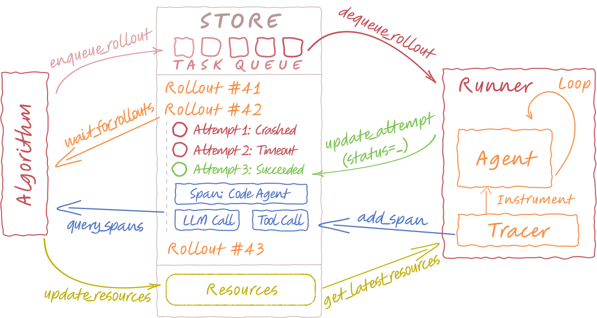

# Understanding Store

TBD: introduction

## What's in the Store?

{ .center }

## Attempt Status Transitions

TBD: explanation

## Rollout Transition Map

Rollout status is actually an **aggregated view** of its attempt status.

| Latest attempt status | Rollout transition | Notes / guards |
| --------------------- | ------------------ | -------------- |
| N/A | `queueing` | Triggered by `enqueue_rollout()`. |
| `preparing` | `queuing/requeuing` → `preparing` | Usually triggerd by `dequeue_rollout()` → new attempt is created. |
| `running` | `preparing/queuing/requeuing` → `running` | Usually triggerd by `add_[otel_]span()` → attempt becomes `running`, then rollout follows. |
| `succeeded` | `*` → `succeeded` | Final (rollout `end_time` set). |
| `failed` / `timeout` / `unresponsive` | `*` → `requeuing` | Only if `status ∈ retry_condition` **and** `sequence_id < max_attempts`. |
| `failed` / `timeout` / `unresponsive` | `*` → `failed` | Otherwise (no retries left or not configured to retry). |
| `*` | `*` → `cancelled` | Explicitly cancelled by `update_rollout(status=cancelled)`. |

If you look at the source code of [agentlightning.InMemoryLightningStore][], you will find that the rollout status is usually updated via a `propagate_status()` method, which means propagating the status of the latest attempt to the rollout. It's a bit difficult to understand when and how the rollout status is updated from that source code. I found it's easier to approach it from the transition map above where the rollout transition can be seen as "callbacks" of the attempt status transitions.

If you must approach from the source code, the following public operations will influence the rollout status:

* [`enqueue_rollout()`][agentlightning.LightningStore.enqueue_rollout] → `queuing`
* [`dequeue_rollout()`][agentlightning.LightningStore.dequeue_rollout] → `preparing` and creates a new attempt
* [`start_rollout()`][agentlightning.LightningStore.start_rollout] / [`start_attempt()`][agentlightning.LightningStore.start_attempt] → create attempt in `preparing` and optionally a rollout, without affecting the queue (rollout may remain where it is until `propagate_status(...)`)
* [`add_span()`][agentlightning.LightningStore.add_span] / [`add_otel_span()`][agentlightning.LightningStore.add_otel_span] → typically moves the **attempt** to `running` and updates heartbeat; rollout then follows via `propagate_status(running)`
* [`update_attempt(status=...)`][agentlightning.LightningStore.update_attempt] → sets the **attempt** status; rollout follows via `propagate_status(...)`
* [`update_rollout(status=cancelled)`][agentlightning.LightningStore.update_rollout] → explicit cancel path (no private helpers involved)

TBD: refine the part above. Be critical.

## Thread and Multiprocessing Safety

TBD: threading safe store and client server impl
