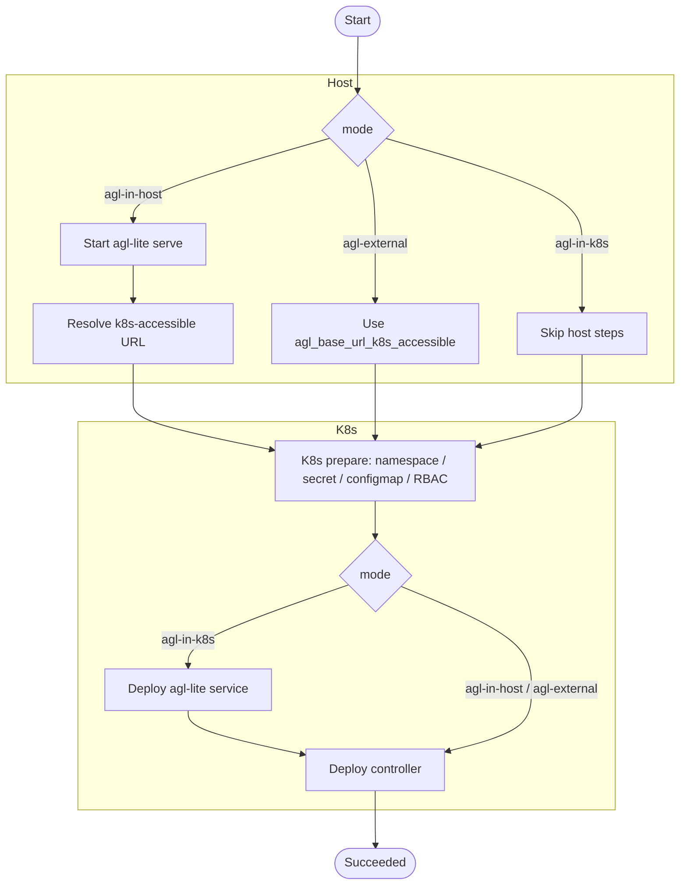

# Deploy agl-lite

This guide describes the `.env`-driven deploy command:

```bash
export AGL_KEY=$(openssl rand -hex 32)
agl-lite deploy --env-file deploy/agl-lite.env

# cleanup (delete namespace + stop managed host server if any)
agl-lite deploy --env-file deploy/agl-lite.env --cleanup
```

> `scripts/deploy.sh` is a thin wrapper around the same command.

---

## Deploy Process Overview

agl-lite supports three deployment modes. In all modes, the controller runs in Kubernetes.

| Mode | agl-lite server (gateway + store) location | Required vars |
|---|---|---|
| `agl-in-k8s` | In Kubernetes (`deploy/agl-lite/k8s.yaml`) | none |
| `agl-in-host` | On deploy host (`agl-lite serve`) | `AGL_HOST_IP_BIND`, `AGL_HOST_PORT`; `AGL_BASE_URL_K8S_ACCESSIBLE` required on non-minikube |
| `agl-external` | External service (not managed by deploy) | `AGL_BASE_URL_K8S_ACCESSIBLE` |

The deploy flow:



---

## URL Model: pod-facing vs host-facing

Two URLs are used after deploy:

- **Pod-facing URL**: used by Kubernetes workloads (controller, and URLs injected into agent pods).
- **Host-facing URL**: used by host-side scripts/algorithms.

Deploy writes both to `${local_state_dir}/agl-lite.env` (default `.local/agl-lite.env`):

- `AGL_BASE_URL` = host-facing URL
- `AGL_BASE_URL_POD` = pod-facing URL

Mode behavior:

For all modes, the pod-facing URL is stored as `AGL_BASE_URL` in the ConfigMap used by the controller. The controller then uses this URL (and derived URLs such as `OPENAI_BASE_URL` and `ANTHROPIC_BASE_URL`) when creating agent pods.

***Note that in `agl-in-host` mode with non-minikube clusters, users must provide a pod-reachable `agl_base_url_k8s_accessible` and ensure it routes to the host server at `http://<agl_host_ip_bind>:<agl_host_port>`. This routing must be guaranteed outside of the deploy command, e.g. via ingress/load balancer, tunnel, or custom networking setup.***
In minikube, deploy will attempt to auto-resolve a pod-reachable URL using `host.minikube.internal`.

| Mode | Pod-facing URL (`AGL_BASE_URL` in K8s ConfigMap) | Host-facing URL (`AGL_BASE_URL` in `.local/agl-lite.env`) |
|---|---|---|
| `agl-in-k8s` | Auto: `http://agl-lite.<namespace>.svc:8080` | `http://127.0.0.1:<agl_host_port>` (requires manual `kubectl port-forward`) |
| `agl-in-host` | `agl_base_url_k8s_accessible`, or auto `http://host.minikube.internal:<agl_host_port>` on minikube | `http://127.0.0.1:<agl_host_port>` |
| `agl-external` | `agl_base_url_k8s_accessible` | `agl_base_url_k8s_accessible` |

Example for `agl-in-k8s` host access:

```bash
kubectl -n <namespace> port-forward svc/agl-lite 8080:8080
# then host-side AGL_BASE_URL can use http://127.0.0.1:8080
```

---

## Config

Start from `deploy/agl-lite.env.example`.

```bash
AGL_NAMESPACE=agl
AGL_MODE=agl-in-k8s

# required for agl-external; required for agl-in-host on non-minikube
# AGL_BASE_URL_K8S_ACCESSIBLE=http://my-agl-lite.example:8080

AGL_HOST_IP_BIND=0.0.0.0
AGL_HOST_PORT=8080

# optional: custom Jinja2 job manifest template for the controller
# AGL_JOB_MANIFEST_TEMPLATE=/path/to/job-template.yaml.j2

AGL_MAX_PODS_PER_WINDOW=100
AGL_RATE_LIMIT_WINDOW_SECONDS=10

# AGL_GATEWAY_CONFIG=
# AGL_HOOKS=
# AGL_ARTIFACT_DIR=

AGL_WAIT_READY_TIMEOUT_SECONDS=120
AGL_LOCAL_STATE_DIR=.local
```

The `.env` file is also the **single project config** — add hook config, model
endpoints, and experiment params here. Extra variables are silently ignored by
the deploy command and consumed by other components via `os.environ`.

Field summary:

| Env var | Default | Description |
|---|---:|---|
| `AGL_NAMESPACE` | — | Kubernetes namespace to deploy into |
| `AGL_MODE` | — | `agl-in-k8s` / `agl-in-host` / `agl-external` |
| `AGL_BASE_URL_K8S_ACCESSIBLE` | — | URL reachable from pods |
| `AGL_HOST_IP_BIND` | `0.0.0.0` | bind IP for host `agl-lite serve` (host mode) |
| `AGL_HOST_PORT` | `8080` | host serve port and local host-facing URL port |
| `AGL_JOB_MANIFEST_TEMPLATE` | — | path to custom Jinja2 job manifest template; defaults to `deploy/controller/job-template.yaml.j2` |
| `AGL_MAX_PODS_PER_WINDOW` | `100` | max agent Jobs the controller creates per rate-limit window |
| `AGL_RATE_LIMIT_WINDOW_SECONDS` | `10` | sliding window size for controller Pod creation rate limiting |
| `AGL_GATEWAY_CONFIG` | — | optional gateway config path |
| `AGL_HOOKS` | — | optional hooks module path |
| `AGL_ARTIFACT_DIR` | — | optional artifact directory |
| `AGL_WAIT_READY_TIMEOUT_SECONDS` | `120` | readiness wait timeout |
| `AGL_LOCAL_STATE_DIR` | `.local` | location of generated env/pid/log files |

Validation rules:

- `mode=agl-in-k8s`:
  - `AGL_BASE_URL_K8S_ACCESSIBLE` must be unset.
- `mode=agl-in-host`:
  - starts host `agl-lite serve`.
  - on non-minikube, `AGL_BASE_URL_K8S_ACCESSIBLE` is required.
  - on minikube, pod URL defaults to `http://host.minikube.internal:<AGL_HOST_PORT>`.
- `mode=agl-external`:
  - `AGL_BASE_URL_K8S_ACCESSIBLE` is required and used for both pod + host URLs.

---

## Outputs

After successful deploy:

- Kubernetes resources are applied in `<namespace>`.
- `.local/agl-lite.env` (or `${local_state_dir}/agl-lite.env`) is generated.
- In `agl-in-host`, host server PID/log are written under `${local_state_dir}`:
  - `agl-lite-serve.pid`
  - `agl-lite-serve.log`
