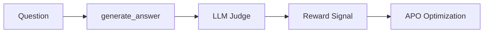

# Evaluate Agents with LLM-as-Judge and APO

This recipe shows how to evaluate AI agents using LLM-as-Judge with Agent Lightning's APO (Automatic Prompt Optimization). You'll learn to design effective judges, avoid common pitfalls like reward hacking, and optimize prompts automatically.

**What you'll build**: A question-answering agent that uses GPT-4 as a judge to evaluate answer quality across multiple criteria (accuracy, completeness, clarity), then optimizes its prompts via APO.

**Why LLM-as-Judge**: Many real-world tasks (summarization, creative writing, complex reasoning) don't have exact answers. LLM judges provide flexible, nuanced evaluation that captures quality dimensions exact matching can't.

## Prerequisites

- Python 3.10+
- OpenAI API key
- Agent Lightning installed: `pip install agent-lightning`
- Basic understanding of [Training Your First Agent](train-first-agent.md)

## QA Agent with Judge Architecture

Our QA agent has a simple two-step workflow:



**Key components**:

1. **Executor Agent** (`generate_answer`): Lightweight model (GPT-4.1-nano) generates answers based on optimizable prompt template
2. **Judge** (`llm_judge`): Heavy model (GPT-4-mini) evaluates answer quality against rubric
3. **APO Loop**: Uses judge feedback as textual gradients to improve executor's prompt

**Cost optimization insight**: This light executor + heavy judge pattern is economical. With 1000 training examples:
- Executor cost: 1000 calls × $0.0001 = $0.10
- Judge cost: 1000 calls × $0.002 = $2.00
- Total: $2.10 vs $30+ if using GPT-4 for both

Here's a minimal code sketch:

```python
import agentlightning as agl
from openai import OpenAI

@agl.rollout
async def qa_agent(task: QATask, prompt_template: agl.PromptTemplate) -> float:
    client = OpenAI()

    # Step 1: Generate answer with light model
    user_prompt = prompt_template.format(question=task["question"])
    response = await client.chat.completions.create(
        model="gpt-4.1-nano",
        messages=[
            {"role": "system", "content": "You are a helpful assistant."},
            {"role": "user", "content": user_prompt}
        ],
        temperature=0.7
    )
    answer = response.choices[0].message.content

    # Step 2: Judge evaluates answer quality
    reward = await llm_judge(task["question"], answer, task["reference"])

    return reward
```

**What APO optimizes**: The `prompt_template` parameter. APO will generate variations like:
- Baseline: "Answer this question: {question}"
- Iteration 1: "Answer this question concisely with supporting evidence: {question}"
- Iteration 2: "Provide a clear, fact-based answer to: {question}. Structure your response with main point first."

The judge's critiques (textual gradients) guide these improvements automatically.

## Integrating Judge with Agent Lightning

Agent Lightning treats judges as regular Python functions returning `float` rewards. No special APIs needed - the framework automatically captures reward signals via the `@rollout` decorator.

### Judge Response Structure

Use Pydantic models for structured judge outputs:

```python
from pydantic import BaseModel, Field

class JudgeResponse(BaseModel):
    accuracy: float = Field(description="Factual correctness (0-1)")
    completeness: float = Field(description="Covers all aspects (0-1)")
    clarity: float = Field(description="Easy to understand (0-1)")
    reasoning: str = Field(description="Justification for scores")
    overall_score: float = Field(description="Weighted average (0-1)")
```

**Why structured outputs**:
- **Consistency**: Enforces 0-1 scale, prevents parsing errors
- **Multi-criteria**: Breaks down quality into interpretable dimensions
- **Debugging**: `reasoning` field helps diagnose judge behavior
- **Metadata**: Can log sub-scores via `agl.log_reward(metadata={...})`

### Judge Function Pattern

```python
async def llm_judge(
    question: str,
    answer: str,
    reference: str
) -> float:
    client = OpenAI()

    judge_prompt = f"""Evaluate this answer on three criteria:
1. Accuracy: Does it match the reference answer's facts?
2. Completeness: Does it cover all key points?
3. Clarity: Is it well-structured and understandable?

Question: {question}
Student Answer: {answer}
Reference Answer: {reference}

Return scores 0-1 for each criterion and explain your reasoning."""

    response = await client.beta.chat.completions.parse(
        model="gpt-4.1-mini",
        messages=[{"role": "user", "content": judge_prompt}],
        response_format=JudgeResponse,
        temperature=0.0  # Deterministic evaluation
    )

    judge_result = response.choices[0].message.parsed

    # Weight criteria: accuracy is most important
    overall = (
        0.5 * judge_result.accuracy +
        0.3 * judge_result.completeness +
        0.2 * judge_result.clarity
    )

    return overall
```

### Connecting to APO

APO automatically uses the returned `float` as reward signal:

```python
import agentlightning as agl

@agl.rollout
async def qa_agent(task: QATask, prompt_template: agl.PromptTemplate) -> float:
    # Generate answer
    answer = await generate_answer(task["question"], prompt_template)

    # Judge evaluates
    reward = await llm_judge(
        question=task["question"],
        answer=answer,
        reference=task["reference_answer"]
    )

    # APO uses this reward for prompt optimization
    return reward
```

**How APO uses rewards**:
1. Generates multiple prompt candidates via beam search
2. Runs each candidate on validation set
3. Ranks by average reward from judge
4. Generates textual gradients: "This prompt scored low because answers lacked detail"
5. Next iteration creates better prompts addressing critiques

**Optional metadata logging**:

```python
import agentlightning as agl

judge_result = response.choices[0].message.parsed
agl.log_reward(
    reward=judge_result.overall_score,
    metadata={
        "accuracy": judge_result.accuracy,
        "completeness": judge_result.completeness,
        "clarity": judge_result.clarity,
        "reasoning": judge_result.reasoning
    }
)
return judge_result.overall_score
```

This metadata appears in Agent Lightning's web UI and helps diagnose prompt optimization trajectories.

## Designing Effective Judges

This section covers the core decisions when building LLM judges: evaluation patterns, prompt design, model selection, and avoiding pitfalls.

### Evaluation Pattern Selection

Choose the right evaluation strategy for your task:

| Pattern | When to Use | Example | Pros | Cons |
|---------|-------------|---------|------|------|
| **Exact Match** | Single correct answer | Math: "What is 2+2?" → "4" | Fast, cheap, deterministic | Brittle, ignores phrasing |
| **Execution-Based** | Verifiable output | Code: SQL query returns correct rows | Objective, catches edge cases | Requires test harness |
| **LLM Judge** | Subjective quality | Essay scoring, summarization | Flexible, human-like judgment | Costly, potential bias |
| **Hybrid** | Partial correctness | SQL schema correct + execution passes | Balances objectivity & nuance | More complex to implement |

**Decision tree**:
1. Can you write a deterministic checker? → Use Exact Match or Execution
2. Does task have multiple valid approaches? → Consider LLM Judge
3. Is quality multi-dimensional? → Definitely LLM Judge with rubric

**Example**: For a SQL agent:
- Use **Execution-Based** for query correctness (does it return right data?)
- Add **LLM Judge** for query quality (is it readable? optimized?)

### Judge Prompt Design

**Bad judge prompt** (vague, inconsistent):
```python
judge_prompt = f"""Is this answer good?
Question: {question}
Answer: {answer}
Rate 0-10."""
```

**Problems**:
- "Good" is undefined
- 0-10 scale but no anchors (what's a 7 vs 8?)
- No reasoning required → judge can't explain scores
- Missing reference answer → judge guesses correctness

**Good judge prompt** (specific, structured):
```python
judge_prompt = f"""You are an expert evaluator for question-answering systems.

EVALUATION CRITERIA:
1. Accuracy (0-1): Does the answer contain factually correct information matching the reference?
   - 0.0: Completely wrong or contradicts reference
   - 0.5: Partially correct, missing key facts
   - 1.0: Fully accurate, aligns with reference

2. Completeness (0-1): Does it address all parts of the question?
   - 0.0: Ignores major aspects
   - 0.5: Covers main point but misses details
   - 1.0: Comprehensive coverage

3. Clarity (0-1): Is it well-structured and easy to understand?
   - 0.0: Confusing or incoherent
   - 0.5: Understandable but awkward
   - 1.0: Clear and well-organized

QUESTION: {question}

STUDENT ANSWER: {answer}

REFERENCE ANSWER: {reference}

Provide scores for each criterion and explain your reasoning in 2-3 sentences."""
```

**Design principles**:
- **Rubric with anchors**: Define what each score means
- **Reference comparison**: Give judge ground truth to compare against
- **Require reasoning**: Forces judge to justify scores (reduces randomness)
- **Specific criteria**: Break down "quality" into measurable dimensions
- **Examples** (optional): Include 1-2 graded examples for calibration

### Generic vs Domain-Specific Rubrics

A critical design decision is whether to use a single generic rubric for all tasks or customize rubrics per domain/task type.

**Generic Rubric Pattern** (used in the example):

```python
# Same rubric for ALL tasks
async def llm_judge(question: str, answer: str, reference: str) -> float:
    rubric = """
    1. Accuracy (0-1): Factual correctness
    2. Completeness (0-1): Covers all aspects
    3. Clarity (0-1): Easy to understand
    """
    # Apply to geography, biology, code, etc.
```

**Pros**:
- Simple to implement and maintain
- Consistent scoring across all tasks
- Works well for homogeneous task sets

**Cons**:
- Suboptimal for diverse domains (geography prioritizes accuracy, biology prioritizes completeness)
- Misses domain-specific nuances (code should check executability, essays need coherence)
- One-size-fits-all weights may not reflect task importance

**Domain-Specific Rubric Pattern** (recommended for production):

```python
async def llm_judge_domain_specific(
    question: str,
    answer: str,
    reference: str,
    domain: str
) -> float:
    if domain == "geography":
        rubric = """
        1. Factual Accuracy (0-1): Exact match with reference fact
           - 0.0: Wrong answer
           - 1.0: Correct answer
        2. Conciseness (0-1): Brief, no unnecessary elaboration
           - 0.0: Overly verbose
           - 1.0: Direct and concise
        """
        weights = {"factual_accuracy": 0.9, "conciseness": 0.1}

    elif domain == "biology":
        rubric = """
        1. Completeness (0-1): Covers key biological processes
           - 0.0: Missing major steps
           - 0.5: Partial explanation
           - 1.0: Complete process description
        2. Scientific Accuracy (0-1): Uses correct terminology
        3. Clarity (0-1): Accessible to non-experts
        """
        weights = {"completeness": 0.5, "accuracy": 0.3, "clarity": 0.2}

    elif domain == "code":
        rubric = """
        1. Correctness (0-1): Code produces expected output
        2. Efficiency (0-1): Uses optimal algorithm/data structures
        3. Readability (0-1): Clear variable names, comments
        """
        weights = {"correctness": 0.6, "efficiency": 0.25, "readability": 0.15}
```

**Pros**:
- Higher evaluation accuracy (research shows 15-25% improvement over generic rubrics)
- Captures domain-specific quality dimensions
- Weights reflect what actually matters for each task type

**Cons**:
- More complex to implement and maintain
- Requires domain expertise to design good rubrics
- Need separate validation for each rubric

**When to use which pattern**:

| Scenario | Recommendation | Reason |
|----------|----------------|---------|
| Single domain (all geography QA) | Generic | Simple tasks, consistent criteria |
| Mixed domains (geography + biology + code) | Domain-Specific | Different quality dimensions matter |
| Rapid prototyping | Generic | Faster to iterate |
| Production system | Domain-Specific | Better accuracy justifies complexity |
| APO optimization | Either works | APO adapts prompts to judge signal |

**Hybrid approach**: Start with generic rubric for prototyping, then add domain-specific rubrics for your top 2-3 most important task types.

**Example from research**: A 2025 ACM study on code evaluation found that question-specific rubrics improved judge accuracy by 23% over generic rubrics for logical assessment tasks ([Rubric Is All You Need, ICER 2025](https://dl.acm.org/doi/10.1145/3702652.3744220)).

### Model Selection for Judges

Cost vs quality tradeoff for 1000 evaluations (input: 500 tokens, output: 200 tokens):

| Model | Input Cost | Output Cost | Total Cost | Quality | Best For |
|-------|------------|-------------|------------|---------|----------|
| GPT-4 | $30.00 | $60.00 | **$90.00** | Highest | Final evaluation, complex rubrics |
| GPT-4-mini | $0.60 | $2.40 | **$3.00** | High | Training, most use cases |
| GPT-4.1-nano | $0.05 | $0.20 | **$0.25** | Medium | Simple binary checks |
| Claude Opus | $15.00 | $75.00 | **$90.00** | Highest | Long context, nuanced writing |
| Claude Sonnet | $3.00 | $15.00 | **$18.00** | High | Good balance |

**Recommendation**: Start with **GPT-4-mini** for training. It's 30× cheaper than GPT-4 with minimal quality loss for structured evaluation tasks.

**Light + Heavy Judge Pattern**:

```python
# Training phase: Cheap judge
async def training_judge(question, answer, reference) -> float:
    response = await client.chat.completions.parse(
        model="gpt-4.1-mini",  # $3/1000 evals
        messages=[{"role": "user", "content": judge_prompt}],
        response_format=JudgeResponse,
        temperature=0.0
    )
    return response.choices[0].message.parsed.overall_score

# Final validation: Expensive judge
async def validation_judge(question, answer, reference) -> float:
    response = await client.chat.completions.parse(
        model="gpt-4",  # $90/1000 evals
        messages=[{"role": "user", "content": judge_prompt}],
        response_format=JudgeResponse,
        temperature=0.0
    )
    return response.choices[0].message.parsed.overall_score
```

**Cost calculation for 10,000 training examples**:
- Using GPT-4 for all: 10,000 × $0.09 = **$900**
- Using GPT-4-mini for training (9,000) + GPT-4 for validation (1,000): (9,000 × $0.003) + (1,000 × $0.09) = **$117**

**Savings**: 87% cost reduction

### Benchmarking Judge Quality

Before trusting your judge, validate it against human evaluations:

```python
import numpy as np
from scipy.stats import spearmanr

# Collect human scores for 100 examples
human_scores = [0.8, 0.6, 0.9, ...]  # Manual evaluation
judge_scores = [0.75, 0.65, 0.85, ...]  # LLM judge scores

# Calculate correlation
correlation, p_value = spearmanr(human_scores, judge_scores)
print(f"Spearman correlation: {correlation:.2f} (p={p_value:.3f})")

# Good: correlation > 0.7
# Acceptable: 0.5 - 0.7
# Poor: < 0.5 (redesign judge prompt)
```

**Diagnosis by correlation**:
- **0.9+**: Judge closely matches human judgment (rare, excellent)
- **0.7-0.9**: Good agreement, safe for training
- **0.5-0.7**: Moderate agreement, check for systematic biases
- **<0.5**: Poor agreement, judge is unreliable

**Common issues when correlation is low**:
1. Judge is too lenient/harsh (systematic offset)
2. Rubric criteria don't match what humans value
3. Reference answers are ambiguous
4. Model capacity is insufficient (try larger judge model)

### Common Pitfalls

**Pitfall 1: Circular Definitions**

```python
# BAD: Judge uses same criteria as what you're optimizing
system_prompt = "Answer questions clearly and accurately."
judge_prompt = "Rate how clearly and accurately this answers the question."
```

**Problem**: Judge just checks if agent followed instructions, not if answer is actually good.

**Fix**: Judge against external reference or specific facts:

```python
judge_prompt = f"""Compare answer to reference facts:
Reference: {reference_answer}
Student: {student_answer}

Does student answer contain the same key facts as reference?"""
```

**Pitfall 2: Vague Criteria**

```python
# BAD: "Quality" is undefined
judge_prompt = "Rate the quality of this answer from 0-1."
```

**Fix**: Decompose into specific, measurable criteria (accuracy, completeness, clarity).

**Pitfall 3: Score Inflation**

**Symptom**: All answers get 0.8-1.0 scores, no discrimination.

**Cause**: Judge prompt is too lenient or lacks negative examples.

**Fix**:
```python
judge_prompt = f"""Be critical and strict. Most answers should score 0.4-0.7.
Only exceptional answers deserve 0.9+.

Common flaws to penalize:
- Vague statements without specifics
- Missing key points from reference
- Awkward phrasing or poor structure

Question: {question}
Answer: {answer}
Reference: {reference}"""
```

**Pitfall 4: Inconsistent Scoring**

**Symptom**: Same answer gets different scores across runs.

**Cause**: High temperature or ambiguous rubric.

**Fix**:
- Set `temperature=0.0` for deterministic evaluation
- Add score anchors with examples in prompt
- Use structured outputs (Pydantic) to enforce format

### Reward Hacking Detection and Mitigation

**What is reward hacking**: Agent learns to exploit evaluation function without genuine improvement. Example: If judge rewards length, agent produces verbose nonsense.

**Detection via Span Analysis**:

Agent Lightning's span tracking lets you inspect what agent is doing:

```python
import agentlightning as agl

# After training, inspect some rollouts
spans = await store.query_spans(rollout_id)
adapter = agl.TraceToMessages()
messages = adapter.adapt(spans)

# Check for suspicious patterns
for msg in messages:
    if msg["role"] == "assistant":
        content = msg["content"]
        # Red flags:
        if len(content) > 2000:  # Abnormally long
            print(f"Warning: Verbose answer (length={len(content)})")
        if content.count("important") > 5:  # Keyword stuffing
            print(f"Warning: Repetitive language")
        if "in conclusion" in content and len(content) < 100:  # Fake structure
            print(f"Warning: Cosmetic improvements")
```

**Common reward hacking patterns**:

| Hack | Judge Weakness | Detection | Mitigation |
|------|----------------|-----------|------------|
| Verbose padding | Rewards length over quality | Avg answer length grows 2x+ | Cap length in rubric: "Penalize answers >300 words" |
| Keyword stuffing | Looks for specific terms | High repetition of rubric words | Penalize redundancy: "Deduct for repeated phrases" |
| Hedge words | "Possibly", "might be" seem thoughtful | Spike in uncertainty language | Require definitive answers when appropriate |
| Citation fabrication | Judge doesn't verify sources | Claims increase but accuracy doesn't | Verify citations in validation set |

**Multi-Judge Ensemble** (advanced):

Use multiple judges with different prompts to catch hacking:

```python
# Conceptual pattern - implement each specialized judge like llm_judge()
async def ensemble_judge(question: str, answer: str, reference: str) -> float:
    # Judge 1: Focus on accuracy only
    judge1 = await accuracy_judge(question, answer, reference)

    # Judge 2: Focus on conciseness only
    judge2 = await conciseness_judge(question, answer, reference)

    # Judge 3: Focus on structure only
    judge3 = await structure_judge(question, answer, reference)

    # If scores diverge significantly, flag for review
    scores = [judge1, judge2, judge3]
    if max(scores) - min(scores) > 0.3:
        print(f"Warning: Judge disagreement (scores={scores})")

    # Return average
    return sum(scores) / len(scores)
```

**Cost**: 3× more expensive, but catches hacking where single judge fails.

**Validation Set Mitigation**:

APO supports separate validation sets. Use them to detect hacking:

```python
import agentlightning as agl

# Training set: 80% of data, optimized against
train_tasks = load_qa_tasks("qa_train.jsonl")

# Validation set: 20% held out, judges generalization
val_tasks = load_qa_tasks("qa_val.jsonl")

# Trainer uses both datasets
trainer.fit(
    agent=qa_agent,
    train_dataset=train_tasks,
    val_dataset=val_tasks  # APO evaluates on validation set
)

# Monitor: If train reward increases but validation reward plateaus → hacking
```

**Early stopping rule**: Stop training when validation reward stops improving for 3 consecutive evaluations.

**Human audit**: Manually review high-reward examples during training to check if quality genuinely improved. Run the agent in debug mode and inspect outputs:

```bash
# Run in debug mode to see detailed outputs
python qa_agent.py --mode debug --task 0
```

Review the trace messages and judge scores. If high-scoring answers look bad (verbose, keyword-stuffed, etc.), your judge has been hacked.

## Configuring APO for Judge-Based Evaluation

APO (Automatic Prompt Optimization) uses textual gradients from judge feedback to improve prompts via beam search.

**APO Instantiation**:

```python
import agentlightning as agl
from openai import AsyncOpenAI

openai_client = AsyncOpenAI()

algo = agl.APO(
    openai_client,
    val_batch_size=10,      # Evaluate each candidate on 10 validation tasks
    gradient_batch_size=4,  # Generate 4 textual gradients per candidate
    beam_width=2,           # Keep top 2 candidates per iteration
    branch_factor=2,        # Generate 2 new variants from each candidate
    beam_rounds=10,         # Run 10 optimization iterations
)
```

**Key parameters**:

- **`val_batch_size`**: Number of validation tasks to evaluate each prompt candidate. Larger = more stable reward estimates but slower. For judge-based eval, 10-20 is good balance.
- **`gradient_batch_size`**: Number of textual critiques APO generates per candidate (e.g., "Answers are too verbose"). More gradients = diverse improvement directions but higher cost.
- **`beam_width`**: How many top candidates to keep per iteration. 2-3 balances exploration and efficiency.
- **`branch_factor`**: Number of new prompt variants generated from each kept candidate. Higher = more exploration.
- **`beam_rounds`**: Total optimization iterations. More rounds = better prompts but higher cost.

**How APO works with judges**:

```
Iteration 0:
  Prompt: "Answer this question: {question}"
  → Run on 20 tasks → Judge scores → Avg reward: 0.65
  → APO generates gradients: "Answers miss key details", "Structure is unclear"

Iteration 1:
  APO creates 5 new prompts based on gradients:
    P1: "Provide a detailed answer to: {question}. Include key facts."
    P2: "Answer clearly: {question}. Start with main point."
    ...
  → Evaluate all 5 → Select top 2 (rewards 0.72, 0.70)

Iteration 2:
  APO mutates top 2 prompts → Generate 5 new candidates → ...

After 10 iterations:
  Best prompt: "Answer {question} with: 1) Main point upfront, 2) Supporting facts from reference, 3) Keep under 200 words."
  Final reward: 0.85 (vs 0.65 baseline)
```

**Resource configuration**:

```python
import agentlightning as agl

# Initial prompt (APO will optimize this)
baseline_prompt = agl.PromptTemplate(
    template="Answer this question: {question}",
    engine="f-string"
)

# Resources dict passed to agent
resources = {
    "prompt_template": baseline_prompt
}

# APO will mutate resources["prompt_template"] during training
```

**Cost estimation**:

With judge-based evaluation:
- Per iteration: 5 candidates × 20 tasks × ($0.0001 executor + $0.002 judge) = $0.21
- 10 iterations: $2.10 total
- With validation: +20% overhead = $2.50 total

Compare to manual prompt engineering (5 hours × $50/hr = $250), APO is 100× cheaper and often finds better prompts.

## Orchestrating Training with Trainer

Agent Lightning's `Trainer` orchestrates the full optimization loop:

```python
import agentlightning as agl
from openai import AsyncOpenAI

def baseline_prompt() -> agl.PromptTemplate:
    """Initial prompt that APO will optimize."""
    return agl.PromptTemplate(
        template="Answer this question: {question}",
        engine="f-string",
    )

async def train_qa_agent():
    # 1. Load datasets
    train_tasks = load_qa_tasks("qa_train.jsonl")
    val_tasks = load_qa_tasks("qa_val.jsonl")

    # 2. Configure APO algorithm
    openai_client = AsyncOpenAI()
    algo = agl.APO(
        openai_client,
        val_batch_size=10,
        gradient_batch_size=4,
        beam_width=2,
        branch_factor=2,
        beam_rounds=10,
    )

    # 3. Create trainer
    trainer = agl.Trainer(
        algorithm=algo,
        n_runners=8,  # Parallel execution across 8 workers
        initial_resources={"prompt_template": baseline_prompt()},
        adapter=agl.TraceToMessages(),  # Required for APO
    )

    # 4. Run training
    trainer.fit(
        agent=qa_agent,
        train_dataset=train_tasks,
        val_dataset=val_tasks
    )

    print("Training complete. Check outputs/ for best prompt.")

if __name__ == "__main__":
    import asyncio
    asyncio.run(train_qa_agent())
```

**Trainer output**:

```
Iteration 0: Evaluating baseline...
  Avg reward: 0.65 (train), 0.63 (val)

Iteration 1: Generating 5 candidates...
  Candidate 1: 0.72 (train), 0.70 (val) ✓ best
  Candidate 2: 0.68 (train), 0.66 (val)
  ...

Iteration 2: Mutating top 2...
  Candidate 1: 0.78 (train), 0.75 (val) ✓ best
  ...

Iteration 10: Final evaluation...
  Best reward: 0.85 (train), 0.82 (val)

Training complete. Best prompt saved.
```

**Monitoring**:

Track reward curves to detect issues:

```python
import matplotlib.pyplot as plt

# Plot training progress
plt.plot(result.train_rewards, label="Train")
plt.plot(result.val_rewards, label="Validation")
plt.xlabel("Iteration")
plt.ylabel("Avg Reward")
plt.legend()
plt.savefig("apo_training_curve.png")
```

**Healthy curve**: Both train and val improve together
**Overfitting**: Train improves but val plateaus → reduce `num_iterations`
**Reward hacking**: Train shoots up unrealistically → see "Designing Effective Judges" section

## Testing Your Judge

Before full training, validate your judge on a small dataset:

```python
import asyncio
from openai import OpenAI

async def test_judge():
    client = OpenAI()

    # Test cases with known quality
    test_cases = [
        {
            "question": "What is the capital of France?",
            "answer": "Paris",
            "reference": "Paris",
            "expected_score": 1.0,  # Perfect answer
        },
        {
            "question": "What is the capital of France?",
            "answer": "Paris is a city in France",
            "reference": "Paris",
            "expected_score": 0.8,  # Correct but wordy
        },
        {
            "question": "What is the capital of France?",
            "answer": "London",
            "reference": "Paris",
            "expected_score": 0.0,  # Wrong answer
        },
    ]

    for i, case in enumerate(test_cases):
        score = await llm_judge(
            case["question"],
            case["answer"],
            case["reference"]
        )
        expected = case["expected_score"]
        diff = abs(score - expected)

        status = "✓" if diff < 0.2 else "✗"
        print(f"{status} Case {i+1}: score={score:.2f}, expected={expected:.2f}, diff={diff:.2f}")

    print("\nIf all tests pass (diff < 0.2), judge is working correctly.")

if __name__ == "__main__":
    asyncio.run(test_judge())
```

**Expected output**:

```
✓ Case 1: score=0.95, expected=1.00, diff=0.05
✓ Case 2: score=0.75, expected=0.80, diff=0.05
✓ Case 3: score=0.10, expected=0.00, diff=0.10

If all tests pass (diff < 0.2), judge is working correctly.
```

**What to check**:

1. **Score range**: Do scores span 0-1? If all scores are 0.7-0.9, judge is too lenient.
2. **Ranking**: Does judge rank examples correctly (perfect > partial > wrong)?
3. **Consistency**: Run same cases 3 times with `temperature=0.0`. Scores should be identical.
4. **Reasoning**: Print `judge_result.reasoning` for a few cases. Does it make sense?

**Common fixes**:

- Judge too lenient → Add "Be strict and critical" to prompt
- Judge too harsh → Add score anchors with examples of good answers
- Inconsistent → Set `temperature=0.0`, use structured outputs
- Wrong ranking → Revise rubric criteria to match task requirements

## Running the Example

The full example code is in [`examples/judge/qa_agent.py`](../../examples/judge/qa_agent.py).

### Project Structure

```
examples/judge/
├── qa_agent.py           # Main agent and judge implementation
├── qa_train.jsonl        # Training QA pairs (5 sample, expandable)
├── qa_val.jsonl          # Validation QA pairs (2 sample, expandable)
└── README.md             # Dataset info and usage
```

### Dataset Format

Each line in `train.jsonl` / `val.jsonl`:

```json
{
  "id": "qa_001",
  "question": "What is the capital of France?",
  "reference_answer": "Paris is the capital and largest city of France.",
  "domain": "geography"
}
```

The agent generates answers, and the judge compares them to `reference_answer`.

### Running Baseline

First, generate sample data and set your OpenAI API key:

```bash
cd examples/judge
python qa_agent.py --mode generate-data
export OPENAI_API_KEY=<your_api_key>
```

Then test the baseline prompt (no optimization):

```bash
python qa_agent.py --mode baseline --limit 50
```

**Output**:

```
=== Baseline Evaluation ===
Task 1: question="What is photosynthesis?"
  Answer: "Process plants use to make food"
  Judge score: 0.65 (accurate but incomplete)

Task 2: question="Who wrote Hamlet?"
  Answer: "Shakespeare"
  Judge score: 0.70 (correct but terse)

...

Average reward: 0.68
Completed in 45 seconds
```

This establishes your baseline performance before APO optimization.

### Running APO Training

Set your OpenAI API key as an environment variable:

```bash
export OPENAI_API_KEY=<your_api_key>
```

Now optimize the prompt with APO:

```bash
python qa_agent.py --mode train --iterations 10
```

**Output** (takes ~5 minutes):

```
=== APO Training ===
Iteration 0: Baseline
  Train reward: 0.68, Val reward: 0.66

Iteration 1: Generated 5 candidates
  Candidate 1 (reward: 0.75): "Answer {question} with key facts from reference."
  Candidate 2 (reward: 0.71): "Provide clear answer to {question}."
  ...
  Selected top 2 for next iteration

Iteration 2: Mutating top candidates
  Candidate 1 (reward: 0.80): "Answer {question}. Start with main point, add 2-3 supporting facts."
  ...

Iteration 10: Final
  Best prompt: "Answer {question} clearly and concisely. Include: 1) Direct answer first, 2) 2-3 key supporting facts, 3) Keep under 150 words."
  Best reward: 0.85 (train), 0.83 (val)

Improvement: +0.17 reward (+25%)
Best prompt saved to: outputs/best_prompt.txt
```

### Evaluating Improved Agent

Test the optimized prompt on validation set:

```bash
python qa_agent.py --mode eval --prompt outputs/best_prompt.txt
```

**Output**:

```
=== Evaluation with Optimized Prompt ===
Task 1: question="What is photosynthesis?"
  Answer: "Photosynthesis is the process by which plants convert sunlight into chemical energy. Key facts: 1) Uses chlorophyll in leaves, 2) Converts CO2 and water into glucose and oxygen, 3) Happens primarily in daylight."
  Judge score: 0.90 (accurate, complete, clear)

Task 2: question="Who wrote Hamlet?"
  Answer: "William Shakespeare wrote Hamlet around 1600. It's one of his most famous tragedies, featuring the Prince of Denmark seeking revenge for his father's murder."
  Judge score: 0.88 (correct, good context)

...

Average reward: 0.85 (+0.17 vs baseline)
```

Notice how optimized answers are more structured, detailed, and score higher on judge's rubric.

### Inspecting Traces

Debug agent behavior with span visualization:

```bash
python qa_agent.py --mode debug --task 0
```

This generates a trace visualization (`trace_task_0.png`) showing:
- LLM calls with prompts and responses
- Judge evaluation steps
- Reward signals
- Timing information

Useful for diagnosing issues like:
- Agent not following prompt instructions
- Judge being inconsistent
- Unexpected tool calls or errors

### Customizing for Your Task

To adapt this example:

1. **Replace dataset**: Create your own `train.jsonl` with task-specific questions
2. **Modify judge rubric**: Edit `llm_judge()` criteria to match your quality dimensions
3. **Adjust prompt template**: Change baseline in `qa_agent.py` to fit your domain
4. **Tune APO config**: Increase `num_iterations` for harder tasks, adjust `eval_batch_size` for stability

**Example adaptation** (code summarization):

```python
# Change judge criteria
judge_prompt = f"""Evaluate this code summary:
1. Accuracy: Does it explain what the code does?
2. Completeness: Covers key functions and logic flow?
3. Clarity: Understandable to a junior dev?

Code: {code}
Summary: {summary}
Reference: {reference_summary}"""

# Change baseline prompt
baseline_prompt = PromptTemplate(
    template="Summarize this code: {code}",
    engine="f-string"
)
```

APO will optimize the summary prompt based on judge's feedback.

---

## Next Steps

- **Scale up**: Increase training dataset to 1000+ examples for more robust optimization
- **Multi-judge**: Implement ensemble judges to catch reward hacking (see "Designing Effective Judges")
- **Human-in-loop**: Periodically audit high-reward examples to verify quality
- **Compare algorithms**: Try VERL for tasks where prompt optimization alone isn't enough
- **Production deployment**: Use [`LitAgentRunner`](../../agentlightning/runner.py) to serve optimized agent via API

**Related recipes**:
- [Train Your First Agent](train-first-agent.md) - Basics of Agent Lightning
- [Train SQL Agent with VERL](train-sql-agent.md) - Example of execution-based evaluation
- [Multi-Step Workflows](../MULTISTEP_QUICKSTART.md) - Optimizing agents with tool use

**Questions or issues?** Open an issue on [GitHub](https://github.com/microsoft/agent-lightning) or ask in [Discussions](https://github.com/microsoft/agent-lightning/discussions).
