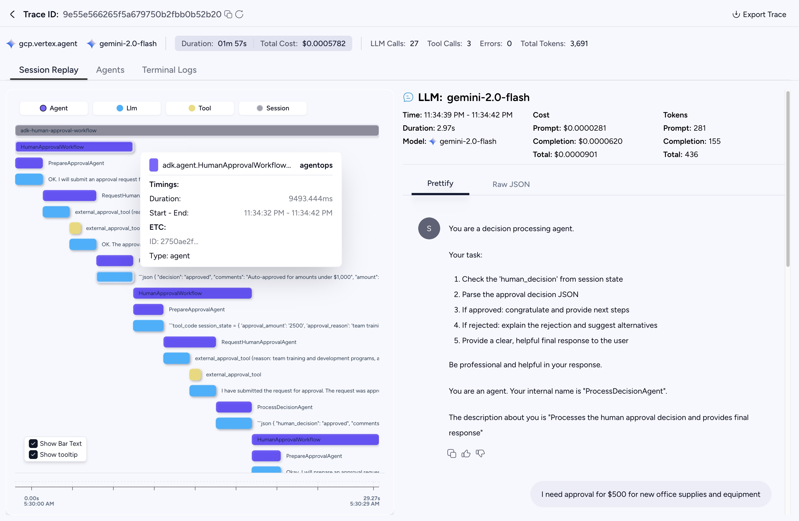
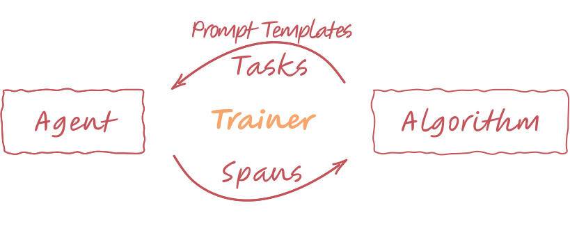

# Train the First Agent with Agent-lightning

Welcome! This tutorial is your first step into making AI agents smarter using the **Agent-lightning** framework. We'll show you how to take a simple agent and automatically improve its performance through a process called **Automatic Prompt Optimization (APO)**.

The main goal of Agent-lightning is to provide a structured way to **train your agents**. Just like you train a machine learning model on data, you can train an agent on a task dataset. This could involve using Reinforcement Learning (RL) to teach it new behaviors or, as we'll do today, optimizing its prompts to make it more accurate and reliable.

## Our Example: The Room Selector Agent

Today, we'll work with an agent whose job is to book a meeting room. It's a common but tricky task with multiple constraints.

Here's how the agent works:

- **Input:** It receives a task with specific requirements, like "`Find a room for 4 people at 10:00 AM with a whiteboard.`"
- **Action:** The agent uses a Large Language Model (LLM) to understand the request. It can also use tools, which are pre-defined functions it can call, to get more information, such as checking room availability in an external database.
- **Output:** Its final decision is the ID of the best room it found, like "`A103`".
- **Reward:** After the agent makes its choice, a separate "grader" function scores its performance on a scale of 0 to 1. This score is called its **reward**. A perfect choice gets a 1.0, while a wrong one gets a 0.0.

The agent's logic is sound, but its performance heavily depends on its initial prompt. A poorly worded prompt will confuse the LLM, leading to bad decisions. Our goal is to use Agent-lightning to find the best possible prompt automatically.

!!! tip "A Closer Look at the Agent's Logic"

    Modern LLMs can do more than just generate text; they can decide to call functions you provide. This is often called tool use or function calling. Our agent uses this capability to make informed decisions. If you're new to this concept, you can read more about it in [OpenAI's documentation](https://platform.openai.com/docs/guides/function-calling).

    Here is a sketch of the agent's logic, adhering closely to the OpenAI API:

    ```python
    # Pseudo-code for the Room Selector agent

    import openai
    import json

    def room_selector_agent(task, prompt):
        client = openai.OpenAI()
        messages = [{"role": "user", "content": prompt.format(**task)}]
        tools = [ ... ] # Tool definition for the LLM

        # 1. First LLM call to decide if a tool is needed.
        response = client.chat.completions.create(
            model="gpt-5-mini",
            messages=messages,
            tools=tools,
            tool_choice="auto",
        )
        response_message = response.choices[0].message
        tool_calls = response_message.tool_calls

        # 2. Check if the LLM wants to use a tool.
        if tool_calls:
            messages.append(response_message) # Append assistant's reply

            # 3. Execute the tool and get the real-world data.
            for tool_call in tool_calls:
                function_name = tool_call.function.name
                if function_name == "get_rooms_and_availability":
                    function_args = json.loads(tool_call.function.arguments)
                    # Query the local room database
                    function_response = get_rooms_and_availability(
                        date=function_args.get("date"),
                        time_str=function_args.get("time"),
                        duration_min=function_args.get("duration_min"),
                    )
                    messages.append({
                        "tool_call_id": tool_call.id,
                        "role": "tool",
                        "name": function_name,
                        "content": json.dumps(function_response),
                    })

            # 4. Second LLM call with the tool's output to get a final choice.
            second_response = client.chat.completions.create(
                model="gpt-5-mini",
                messages=messages,
            )
            final_choice = second_response.choices[0].message.content
        else:
            final_choice = response_message.content

        # 5. Grade the final choice to get a reward.
        reward = grade_the_choice(final_choice, task["expected_choice"])
        return reward
    ```

In Agent-lightning, you wrap this logic in a Python function marked with the `@rollout` decorator, so that the agent can be managed and tuned by Agent-lightning's runner and trainer. The `prompt_template` that the APO algorithm tunes is passed in as an argument:

```python
from agentlightning import rollout
from agentlightning.types import PromptTemplate

@rollout
def room_selector(task: RoomSelectionTask, prompt_template: PromptTemplate) -> float:
    # ... agent logic using the prompt_template ...

    # The final reward is determined by a grader function
    reward = room_selection_grader(client, final_message, task["expected_choice"])
    return reward
```

## Core Concepts: Tasks, Rollouts, Spans, and Prompt Templates

To understand how Agent-lightning works, you need to know these key terms.

### Task

A task is a specific input or problem statement given to the agent. It defines what the agent needs to accomplish.

!!! tip "Analogy"

    If the agent is a chef, a task is the recipe request: "Bake a chocolate cake."

### Rollout

A rollout is a single, complete execution of an agent attempting to solve a given **task**. It's the entire story from receiving the task to producing a final result and receiving a reward. A rollout captures a full trace of the agent's execution.

!!! tip "Analogy"

    A rollout is one full attempt by the chef to bake the chocolate cake, from gathering ingredients to the final taste test.

### Span

A span represents a single unit of work or an operation within a **rollout**. Spans are the building blocks of a trace. They have a start and end time and contain details about the specific operation, like an LLM call, a tool execution, or a reward calculation. For a more precise definition, see the [OpenTelemetry documentation](https://opentelemetry.io/docs/concepts/signals/traces/).

!!! tip "Analogy"

    If the rollout is "baking a cake," a span could be "preheating the oven," "mixing flour and sugar," or "adding frosting." Each is a distinct step or unit of work.

The picture below from [ADK](https://google.github.io/adk-docs/observability/cloud-trace/) shows a typical rollout, where each rectangle in the waterfall visualizes a span. As can be seen in the visualization, spans can be sequential, parallel or nested among each other. In other frameworks, the terminilogy might be slightly different. Agent-lightning follows the terminalogies used by OpenTelemetry to avoid confusion.



### Prompt Template

A prompt template is a reusable instruction for the agent, often containing placeholders that can be filled in with specific details from a task. It is a key **"resource"** that the algorithm learns and improves over time.

!!! tip "Analogy"

    If the task is the recipe request, the prompt template is the master recipe card that the chef follows. The algorithm's job is to edit this recipe card to make the instructions clearer and the final dish better.

## The Training Loop: How the Magic Happens

Training in Agent-lightning revolves around a clear, managed loop, orchestrated by the **Trainer**. The diagram below illustrates this core interaction:

{ .center }

**The Loop Explained:**

- **Algorithm to Agent (via Trainer):** The **Algorithm** (the "brain") creates an improved **Prompt Template** and selects **Tasks**. The Trainer then sends both to the Trainer.
- **Agent to Algorithm (via Trainer):** For each task it receives, the Agent uses the provided prompt template to perform a Rollout, executing its logic and potentially using tools. During this rollout, the runner that runs the agent captures Spans that detail every step. The agent also calculates a Reward for its performance on the task. These spans and rewards are then sent back to the Algorithm via the Trainer.
- **Algorithm Learning:** The Algorithm then analyzes these spans and rewards to learn how to improve the agent's behavior, for example, by generating a better prompt. This improved prompt is then used in the next iteration of tasks.

This cycle continues, allowing the agent to continuously learn and get better at solving tasks.

!!! note

    In the next tutorial, we will see that the "via Trainer" here is not accurate. It's actually via the runner and store.

### The Algorithm

The algorithm is the smart part of the system that drives the improvement. In this tutorial, we use **APO** (Automatic Prompt Optimization). It works in a few steps:

1. **Evaluate:** The algorithm first asks for rollouts to be run using the current prompt template to see how well it performs.
2. **Critique:** It then looks at the detailed spans from those rollouts. Using a powerful LLM (`gpt-5-mini`), it generates a "textual gradient", which is a natural language critique of the prompt. For example: "The prompt is ambiguous about how to handle tie-breakers for equally good rooms."
3. **Rewrite:** Finally, it gives the critique and the original prompt to another LLM (`gpt-4.1-mini`) and asks it to apply the edits, generating a new, improved prompt template.

This cycle repeats, with each round producing a slightly better prompt. To use it, you simply initialize the APO class with your desired hyperparameters.

```python
# In the main training script: run_apo.py
from agentlightning.algorithm.apo import APO
from openai import AsyncOpenAI

openai = AsyncOpenAI()
algo = APO(openai)
```

### The Trainer

The Trainer is the central component you'll interact with. It connects everything and manages the entire workflow by running the loop described above. You configure the Trainer, providing the algorithm, the number of parallel runners, and the initial prompt. A single call to `trainer.fit()` kicks off the entire process!

```python
# In the main training script: run_apo.py
from agentlightning import Trainer, TraceToMessages

# 1. Configure the Trainer with the algorithm and initial prompt
trainer = Trainer(
    algorithm=algo,
    n_runners=8, # Run 8 agents in parallel to try out the prompts
    initial_resources={
        # The initial prompt template to be tuned
        "prompt_template": prompt_template_baseline()
    },
    # This is used to convert the span data into a message format consumable by APO algorithm
    adapter=TraceToMessages(),
)

# 2. Load datasets: They can be list of task objects consumable by `room_selector`.
dataset_train, dataset_val = ...

# 3. Start the training process!
trainer.fit(
    agent=room_selector,
    train_dataset=dataset_train,
    val_dataset=dataset_val
)
```

!!! tip

    [`TraceToMessages`][agentlightning.TraceToMessages] is a convenience adapter that converts spans into OpenAI chat messages. It requires `openai >= 1.100.0` to be installed.

## Training Results

The APO algorithm successfully improved the agent's performance. We ran the example with the following hyper-parameters:

* `val_batch_size` = 10
* `gradient_batch_size` = 4
* `beam_width` = 2
* `branch_factor` = 2
* `beam_rounds` = 2

The validation accuracy on the 29 samples of datasets steadily increase from 0.569 (baseline) to **0.721** (after round 2). The tuning takes around 10 minutes with 8 runners. We ran twice, and the results are shown in the chart below.

<div style="height:400px">
<canvas data-chart='{ "type": "line", "data": { "labels": ["Baseline", "After round 1", "After round 2"], "datasets": [ { "label": "Run #1", "data": [0.569, 0.638, 0.721], "spanGaps": true }, { "label": "Run #2", "data": [0.534, 0.628, 0.645], "spanGaps": true } ] }, "options": { "interaction": { "mode": "nearest", "intersect": false }, "plugins": { "legend": { "display": true, "position": "top" }, "title": { "display": true, "text": "Validation Accuracy Across Rounds" } }, "scales": { "x": { "title": { "display": true, "text": "Round" } }, "y": { "title": { "display": true, "text": "Accuracy" } } } } }'></canvas>
</div>

This demonstrates how Agent-lightning can efficiently and automatically enhance your agent's capabilities with just a few lines of code.
