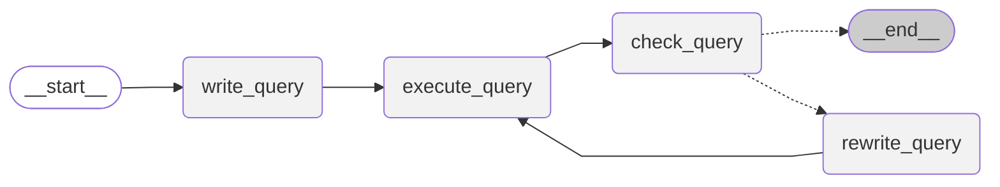

# SQL Agent with Agent Lightning

This walkthrough follows the Agent-lightning v0.2 Spider example and focuses on how the pieces fit together: a LangGraph-based SQL agent wrapped as a [`LitAgent`][agentlightning.LitAgent], the [`VERL`][agentlightning.algorithm.verl.VERL] reinforcement learning algorithm, and the Agent-lightning [`Trainer`][agentlightning.Trainer] that drives both training and debugging. The CLI in [`examples/spider/train_sql_agent.py`]({{ config.repo_url }}/tree/{{ config.extra.source_commit }}/examples/spider/train_sql_agent.py) is the full sample script. However, we recommend understanding the underlying components, which will help you adapt the workflow to your own agents.

## SQL Agent Implementation

Agent-lightning integrates smoothly with [Agent Framework](https://github.com/microsoft/agent-framework), [AutoGen](https://github.com/microsoft/autogen), [CrewAI](https://www.crewai.com/), [LangGraph](https://github.com/langchain-ai/langgraph), [OpenAI Agents SDK](https://github.com/openai/openai-agents-python) and other orchestration frameworks, or with hand-written Python logic. The Spider example uses LangGraph to express a cyclic workflow that mirrors how an analyst iterates on SQL. The graph below (rendered directly from [`sql_agent.py`]({{ config.repo_url }}/tree/{{ config.extra.source_commit }}/examples/spider/sql_agent.py)) shows how the agent drafts, executes, critiques, and rewrites queries until it is satisfied with the answer.



!!! note

    The graph above shows the workflow of the SQL agent. The agent goes through the following steps:

    1. **write_query**: Given a user's question and database schema, the agent makes an initial attempt to write a SQL query.
    2. **execute_query**: The generated query is run against the target database.
    3. **check_query**: The agent analyzes the original query and its execution result (or error) to check for mistakes. It uses a specific prompt (`CHECK_QUERY_PROMPT`) to determine if the query is correct.
    4. **rewrite_query**: If the `check_query` step finds errors, the agent enters this step. It uses the feedback from the previous step to generate a corrected SQL query. The process then loops back to `check_query` for re-evaluation.
    5. **END**: The loop terminates when `check_query` confirms the query is correct or the maximum number of turns (`max_turns`) is exceeded. One turn corresponds to a complete cycle of `write_query` (if first round), `execute_query`, `check_query`, and potentially `rewrite_query`.

For the setup of this tutorial, we use RL to optimise the `write_query` and `rewrite_query` turns. The `check_query` turn shares the same underlying weight-updating LLM, but the trace data generated from that turn is not used for learning.

## From LangGraph to LitAgent

The bridge between LangGraph and Agent-lightning is the `LitSQLAgent` class in [`sql_agent.py`]({{ config.repo_url }}/tree/{{ config.extra.source_commit }}/examples/spider/sql_agent.py). It subclasses [agl.LitAgent][agentlightning.LitAgent] so the runner can supply resources ([LLMs][agentlightning.LLM], etc.) for each rollout. The snippet below highlights the key responsibilities:

```python
class LitSQLAgent(agl.LitAgent[Dict[str, Any]]):
    def rollout(
        self,
        task: Dict[str, Any],
        resources: agl.NamedResources,
        rollout: agl.Rollout
    ) -> float | None:
        llm: agl.LLM = resources["main_llm"]
        agent = SQLAgent(
            "sqlite:///" + db_path,
            max_turns=self.max_turns,
            table_info_truncate=self.table_info_truncate,
            execution_truncate=self.execution_truncate,
            endpoint=llm.get_base_url(rollout.rollout_id, rollout.attempt.attempt_id),
            verl_replacement={"model": llm.model, **llm.sampling_parameters},
        ).graph()
        result = agent.invoke({"question": question}, {
            "callbacks": [self.tracer.get_langchain_handler()],
            "recursion_limit": 100,
        })
        reward = evaluate_query(result["query"], ground_truth, db_path, raise_on_error=False)
        return reward
```

TODO: add explanation for langchain handler here

- `resources["main_llm"]` is injected by the runner. Calling `get_base_url` retrieves the private OpenAI-compatible endpoint that VERL exposes for this rollout.
- The LangGraph agent is unchanged apart from receiving that endpoint and the evaluation schema. This keeps the authoring experience close to standard LangChain/LangGraph development.
- The rollout returns a sparse reward (`1.0` for execution match, else `0.0`) using the Spider evaluator bundled in `spider_eval`.

Keep the full file open while you read this tutorial—the comments and prompts in `sql_agent.py` explain how the LangGraph state machine is assembled.

## Configuring VERL for Reinforcement Learning

The reinforcement learning payload lives in `examples/spider/train_sql_agent.py` as a plain Python dictionary. It mirrors the shell arguments from the original v0.1 example but is easier to tweak programmatically:

```python
RL_TRAINING_CONFIG: Dict[str, Any] = {
    "algorithm": {"adv_estimator": "grpo", "use_kl_in_reward": False},
    "data": {
        "train_files": "data/train_spider.parquet",
        "val_files": "data/test_dev_500.parquet",
        "train_batch_size": 32,
        "max_prompt_length": 4096,
        "max_response_length": 2048,
        "truncation": "error",
    },
    "actor_rollout_ref": {
        "rollout": {"name": "vllm", "n": 4, "multi_turn": {"format": "hermes"}, ...},
        "actor": {"ppo_mini_batch_size": 32, "optim": {"lr": 1e-6}, ...},
        "ref": {"log_prob_micro_batch_size_per_gpu": 8, ...},
        "model": {"path": "Qwen/Qwen2.5-Coder-1.5B-Instruct", ...},
    },
    "trainer": {"n_gpus_per_node": 1, "test_freq": 32, "total_epochs": 2, ...},
}
```

- `actor_rollout_ref.rollout` controls the vLLM serving stack (tensor parallelism, GPU utilisation, conversation format).
- `actor` and `ref` are the PPO actor/reference models; both are configured for Qwen 1.5B in the default profile.
- `trainer` contains VERL-side metadata such as WandB settings. Adjust these fields if you export to a different experiment tracking system.

`config_train_fast`, `config_train_qwen`, and `config_train_llama` deep-copy this template and override a handful of fields (model path, epoch counts, evaluation set) to suit different runtime budgets.

## Orchestrating Training with `Trainer`

The `train` function in `train_sql_agent.py` shows the minimal components you need to launch an Agent-lightning experiment:

```python
def train(config: Dict[str, Any], active_agent: Optional[str]) -> None:
    agent = LitSQLAgent()
    algorithm = agl.VERL(config)
    trainer = agl.Trainer(
        n_runners=10,
        algorithm=algorithm,
        adapter={"agent_match": active_agent},
    )
    train_data = pd.read_parquet(config["data"]["train_files"]).to_dict("records")
    val_data = pd.read_parquet(config["data"]["val_files"]).to_dict("records")
    trainer.fit(agent, train_dataset=train_data, val_dataset=val_data)
```

- `agl.VERL(config)` spins up VERL and its OpenAI-compatible proxy. The Trainer will forward rollout requests to that endpoint automatically.
- `n_runners` governs how many concurrent rollouts hit the server. Start small, then scale up once Ray and vLLM are stable on your hardware.
- The adapter filters trajectories. Passing `--active-agent` on the CLI sets `agent_match`, ensuring VERL only ingests spans produced by the agent variant you want to optimise.
- Pandas converts each Parquet record into a Python dict, so the `LitAgent` receives the Spider fields (`question`, `query`, `db_id`, etc.) without additional schema glue.

The training script’s CLI simply selects which `config_train_*` helper to call. Inspect the file instead of copying snippets blindly—understanding how `Trainer`, `VERL`, and `LitSQLAgent` interact will make it easier to plug in your own agents.

## Dry-Run the Pipeline with `Trainer.dev`

Before committing hours of GPU time, dry-run the agent with `Trainer.dev()`. It swaps in the lightweight `Baseline` fast algorithm, enqueues up to ten tasks, and prints every span that the agent emits. Because it drives the same runner stack as full training, it is ideal for verifying schema access and LangGraph control flow.

```python
trainer.dev(
    agent,
    train_dataset=train_data[:10],
    val_dataset=val_data[:10],
)
```

Run this inside a Python session or adapt the script to include a `--dev` flag. Once the spans look healthy and rewards are non-zero, switch back to `trainer.fit(...)` for full RL training.

## Project Setup

### Dataset

The trainer expects three Parquet files inside `examples/spider/data`: `train_spider.parquet`, `test_dev_500.parquet`, and `test_dev.parquet`. Download the curated bundle provided alongside the repository:

```bash
cd examples/spider
pip install gdown  # included in the 'experiment' optional dependency
gdown --fuzzy https://drive.google.com/file/d/1oi9J1jZP9TyM35L85CL3qeGWl2jqlnL6/view
unzip -q spider-data.zip -d data
rm spider-data.zip
```

If you prefer to build the files yourself, fetch [Spider 1.0](https://yale-lily.github.io/spider) and run `python spider_eval/convert_dataset.py`. Set `VERL_SPIDER_DATA_DIR` if you store the dataset outside the default `data` directory.

### Dependencies

Create a clean environment, activate it, and install Agent-lightning with the extras required by this tutorial:

```bash
pip install -e ".[agent,experiment,trl,verl]"
```

The optional extras pull in LangChain/LangGraph (`agent`), dataset utilities and `gdown` (`experiment`), Transformers and TRL (`trl`), and VERL with vLLM (`verl`). Plan on using a GPU with at least 40 GB of memory for the full training profiles.

## Launch Training

From `examples/spider`, call the helper script with the profile that matches your runtime budget:

```bash
python train_sql_agent.py fast   # Smoke test / CI configuration
python train_sql_agent.py qwen   # Default Qwen-2.5-Coder-1.5B run
python train_sql_agent.py llama  # LLaMA-3.2-1B with llama3_json prompts
```

The script prints the derived `project_name` and `experiment_name`, instantiates `LitSQLAgent`, and launches `trainer.fit(...)`. Provide `--active-agent my_agent_variant` if you log multiple agent names and only want to train one of them. For the LLaMA profile, export an `HF_TOKEN` before running so vLLM can download the weights.

## Debugging the Agent without VERL

`sql_agent.py` also exposes a `debug_sql_agent()` helper that runs the LangGraph workflow against a local or hosted OpenAI-compatible endpoint. Set `OPENAI_API_BASE` and `OPENAI_API_KEY`, then run:

```bash
cd examples/spider
python sql_agent.py
```

This path skips VERL entirely, executes ten development samples, and prints the generated SQL alongside the reward. Use it to validate prompt formatting, schema truncation, and database connectivity before you introduce RL.

## Evaluation

<div style="height:400px">
<canvas data-chart='{"type": "line", "data": {"labels": [0.0, 16.0, 32.0, 48.0, 64.0, 80.0, 96.0, 112.0, 128.0, 144.0, 160.0, 176.0, 192.0, 208.0, 224.0, 240.0, 256.0, 272.0, 288.0, 304.0, 320.0, 336.0, 352.0, 368.0, 384.0, 400.0, 416.0, 432.0], "datasets": [{"label": "Training", "data": [0.4609375, 0.5041666666666667, 0.5790441176470589, 0.6015625, 0.6070772058823529, 0.6208333333333333, 0.6668198529411765, 0.66875, 0.6709558823529411, 0.6708333333333333, 0.6847426470588235, 0.6791666666666667, 0.6819852941176471, 0.690625, 0.7008272058823529, 0.7453125, 0.7398897058823529, 0.7119791666666667, 0.7224264705882353, 0.7114583333333333, 0.7431066176470589, 0.7427083333333333, 0.75, 0.7302083333333333, 0.7247242647058824, 0.7390625, 0.7463235294117647, 0.7376302083333334], "spanGaps": true}, {"label": "Validation", "data": [0.342, null, 0.594, null, 0.642, null, 0.66, null, 0.676, null, 0.676, null, 0.694, null, 0.712, null, 0.702, null, 0.678, null, 0.702, null, 0.702, null, 0.674, null, 0.734, 0.722], "spanGaps": true}]}, "options": {"interaction": {"mode": "nearest", "intersect": false}, "plugins": {"legend": {"display": true, "position": "top"}, "title": {"display": true, "text": "SQL Agent Training Result"}}, "scales": {"x": {"title": {"display": true, "text": "Step (aggregated)"}}, "y": {"title": {"display": true, "text": "Accuracy"}}}}}'></canvas>
</div>


Baseline evaluation results collected with Agent-lightning v0.1.1, `verl==0.5.0`, and `vllm==0.10.0` are available [in this write-up](https://medium.com/@yugez/training-ai-agents-to-write-and-self-correct-sql-with-reinforcement-learning-571ed31281ad). The v0.2 pipeline follows the same execution-match metric, so you can compare new experiments directly against those historical runs.
