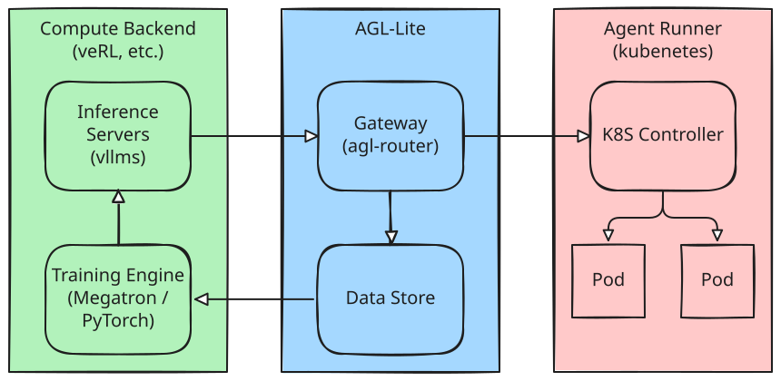

# agl-lite Architecture: From Agent Lightning to Minimal Workable Version

This document captures a comprehensive understanding of the original Agent Lightning architecture and maps out how each component is simplified, replaced, or removed in agl-lite.

---

## 1. Original Agent Lightning Architecture

### 1.1 Core Loop

Agent Lightning is built on three main components in a coordinated loop:

```
Algorithm ──enqueue_rollout──▶ LightningStore ──dequeue_rollout──▶ Runner
    ▲                              │                                  │
    │                         (spans, resources,                      │
    │                          attempts, workers)                     │
    │                              │                                  │
    └──query_spans + learn─────────┘◀──────add_span + update_attempt──┘
```

- **Algorithm**: The "brain" — decides tasks, learns from results, updates resources (model weights, prompts).
- **Runner**: The "worker" — executes rollouts, runs the agent, records spans.
- **LightningStore**: Central database + message queue — single source of truth.

### 1.2 Data Types

| Type | Description |
|------|-------------|
| **Rollout** | Unit of work. Lifecycle: `queuing → preparing → running → succeeded/failed/cancelled/requeuing` |
| **Attempt** | Single execution of a rollout. Supports retries: `preparing → running → succeeded/failed/timeout/unresponsive` |
| **Span** | Structured trace event (LLM call, tool invocation, reward). Ordered by monotonic `sequence_id` per attempt. Based on OpenTelemetry. |
| **Resource** | Versioned named bundles (prompt templates, model checkpoints, proxy URLs) |
| **Triplet** | `(prompt, response, reward)` — fundamental RL learning unit extracted from spans |
| **Worker** | Runner instance metadata (heartbeat, status, current assignment) |
| **Dataset** | Collection of incomplete rollouts (tasks) for the agent to process |

### 1.3 Supporting Components

| Component | Role | Key Dependencies |
|-----------|------|------------------|
| **Tracer** | Instruments agent code, captures OpenTelemetry spans, ships to Store | `opentelemetry-sdk`, `agentops` |
| **Adapter** | Transforms raw spans → algorithm-consumable formats (e.g., `TracerTraceToTriplet` → RL triplets) | OpenTelemetry span format |
| **LLM Proxy** | LiteLLM-based reverse proxy between agent and LLM backends; instruments server-side, manages model swaps, URL routing | `litellm`, `fastapi`, OpenTelemetry |
| **Trainer** | High-level orchestrator wiring all components | All of the above |
| **Hook** | User callbacks at lifecycle points (`on_rollout_start/end`, `on_trace_start/end`) | — |
| **ExecutionStrategy** | Controls how algorithm/runner bundles are placed (shared-memory vs. client-server) | `multiprocessing`, `asyncio` |
| **LitAgent** | Base class for user-defined agents. `rollout(task, resources, rollout) → RolloutRawResult` | — |

### 1.4 Store Architecture

Three layers:

1. **Collections Layer** — Low-level CRUD primitives (`Collection`, `Queue`, `KeyValue`). Backends: InMemory, MongoDB.
2. **Store Layer** — `CollectionBasedLightningStore` builds on collections with business logic (status transitions, watchdog health checks, retry policies).
3. **Wrappers** — `LightningStoreThreaded` (mutex thread safety), `LightningStoreServer/Client` (HTTP multi-process).

Key store responsibilities:
- Task queue (`enqueue_rollout` / `dequeue_rollout`)
- Rollout + attempt lifecycle management (status transitions, retries via watchdog)
- Span ingest + ordering (monotonic `sequence_id`)
- Resource versioning
- Worker telemetry

### 1.5 LLM Proxy Internals

The proxy is a LiteLLM-based FastAPI server with:
- **RolloutAttemptMiddleware**: Rewrites `/rollout/{rid}/attempt/{aid}/v1/chat/completions` → `/v1/chat/completions`, injects `x-rollout-id`, `x-attempt-id`, `x-sequence-id` headers.
- **StreamConversionMiddleware**: Converts streaming → non-streaming for better OTEL capture.
- **LightningSpanExporter**: Buffers OTEL spans, flushes subtrees to the store.
- **LightningOpenTelemetry**: LiteLLM callback that wires OTEL export.

### 1.6 Execution Strategies

- **SharedMemoryExecutionStrategy**: Algorithm + runners as threads in one process. Good for debugging.
- **ClientServerExecutionStrategy**: Algorithm process hosts `LightningStoreServer` (HTTP API). Runners connect via `LightningStoreClient`. Supports multi-process scaling.

### 1.7 VERL Integration (RL Example)

The VERL algorithm:
1. Launches a vLLM chat completion endpoint
2. Registers it in the LLM Proxy → Store as resource
3. Enqueues rollouts from dataset
4. Runners dequeue, execute agents against the proxy endpoint
5. Proxy + tracer capture spans → Store
6. Algorithm queries spans, adapter converts to triplets → FSDP training loop
7. Model weights updated → repeat

---

## 2. agl-lite Simplification Plan

### 2.1 What Changes

| # | Original | agl-lite Replacement | Rationale |
|---|----------|---------------------|-----------|
| 1 | **LiteLLM** proxy for LLM routing | **Self-owned request gateway** | Remove heavy dependency; simpler proxy that records traffic |
| 2 | **OpenTelemetry** stack (spans, tracers, exporters, instrumentation) | **Gateway records request-response pairs** during transfer | Eliminate OTEL complexity; the gateway *is* the instrumentation |
| 3 | **Span-based** trajectory format | **Sequence of events** (`model_request`, `reward`, + open user-defined types) | Much simpler data model; no span trees, no sequence_id allocation. Only two reserved types; everything else is opaque pass-through. |
| 4 | **In-process** execution strategies + watchdog retry | **Kubernetes** as default runner (`minikube` for single machine) | Offload scheduling, retry, timeout to K8s controller; deployment topology is flexible |

### 2.2 What Stays (Conceptually)

| Concept | agl-lite Form |
|---------|---------------|
| Algorithm ↔ Store ↔ Runner loop | Same decoupled architecture |
| Rollout / Attempt lifecycle | Simplified states (K8s manages retry/timeout) |
| Resource versioning | Same concept for prompts and config. Model endpoints moved to dedicated model server registry with version tracking. |
| Adapter pattern | Simplified — filters events by type (`model_request`, `reward`) instead of parsing OTEL spans |
| Agent abstraction | Language-agnostic: any program that consumes Gateway endpoint via environment variables (OAI-compatible `base_url`) |
| Store API | Simplified subset (event-based, no span sequence_id, no watchdog, no OTEL conversion) |

### 2.3 What Gets Removed

| Component | Reason |
|-----------|--------|
| `agentlightning.tracer.*` (AgentOps, OTEL, Weave tracers) | Gateway replaces all tracing |
| `agentlightning.instrumentation.*` (LiteLLM, vLLM, AgentOps hooks) | No longer needed |
| `agentlightning.llm_proxy` (LiteLLM-based proxy) | Replaced by self-owned gateway |
| `agentlightning.semconv` (OTEL semantic conventions) | No OTEL |
| `agentlightning.utils.otel`, `agentlightning.utils.otlp` | No OTEL |
| `LightningSpanExporter`, `LightningOpenTelemetry` | No OTEL |
| `SharedMemoryExecutionStrategy`, `ClientServerExecutionStrategy` | K8s replaces execution strategies |
| `LightningStoreServer` / `LightningStoreClient` | Store communication redesigned for K8s |
| `LightningStoreThreaded` | K8s pods are isolated; no shared-memory threading model |
| Watchdog (timeout/unresponsive detection in Store) | K8s liveness/readiness probes + controller |
| Span `sequence_id` allocation | No OTEL spans to order |
| `RolloutAttemptMiddleware` URL rewriting | Gateway handles routing natively |
| Legacy/compat code (`TrainerLegacy`, `RolloutLegacy`, `fit_v0`) | Clean slate |
| `LitAgent` base class, Python agent SDK | Agents are now language-agnostic containers; no base class needed |

---

## 3. agl-lite Target Architecture

### 3.1 High-Level Overview



The architecture is organized into three logical groups. **No strong assumption is made about their co-location** — they communicate only through well-defined APIs (HTTP/gRPC), so each group can live in the same K8s cluster, in separate clusters, or even across cloud boundaries.

- **Compute Backend** (green) — Inference Servers (vLLMs) and Training Engine (Megatron/PyTorch). This is a **prerequisite managed by the user**; agl-lite does not own or deploy it. The compute backend may be in the same K8s cluster as agent runner, in a separate but network-accessible cluster, or provided by a remote fine-tuning service. Training engine pushes updated weights to inference servers.
- **AGL-Lite** (blue) — A single service combining the Gateway (agl-router) and the Data Store. The Gateway sits between inference servers and agent runners, recording all request-response traffic into the Store. The Store feeds trajectory data back to the training engine. One endpoint, one deployment. AGL-Lite can be deployed in the same K8s cluster as the Agent Runner, or co-located with the Compute Backend — in either case it only needs to **expose its API** to the Agent Runner.
- **Agent Runner** (red) — Kubernetes-based. A K8S Controller manages agent Pods. Pods make LLM calls through the agl-lite Gateway. The runner only needs network access to the agl-lite Service endpoint; it does not need direct access to the Compute Backend.

### 3.2 Component Mapping

| agl-lite Component | Responsibility |
|--------------------|----------------|
| **agl-lite Service** | Single HTTP service combining Gateway (LLM reverse proxy with model-version-aware routing, event auto-capture) and Store (rollout queue, event storage, model server registry, resource versioning). One deployment, one endpoint. Can run as a K8s Service, a standalone process, or be co-located with the Compute Backend. |
| **Runner** | K8s Job or Deployment. Each pod runs one agent container. Only requires network access to the agl-lite Service endpoint. |
| **Algorithm** | The learning loop. Enqueues rollouts, queries trajectories, runs learning (RL, prompt tuning, etc.), updates resources. Typically co-located with the Compute Backend (training engine). Talks to the agl-lite Service API. |
| **Agent** | Any LLM-consuming program — written in any language or framework. The only contract is that it reads the Gateway endpoint from environment variables (e.g., `OPENAI_BASE_URL`, `ANTHROPIC_BASE_URL`) and makes standard API calls. Packaged into a container image. No base class or SDK required. |
| **K8s Controller** | Custom controller or operator managing rollout lifecycle: retry on pod failure, timeout via `activeDeadlineSeconds`, scaling runner pods. Lives in the same K8s cluster as the runner. Talks to the agl-lite Service API. |

### 3.3 Simplified Data Model

#### ID Generation and Flow

| ID | Generated by | Mechanism |
|----|-------------|-----------|
| `rollout_id` | **Store** | UUID, created when Algorithm calls `enqueue_rollout()`. Passed to the K8s controller, which injects it as an env var into the agent pod. |
| `attempt_id` | **K8s** (implicitly) | Every pod K8s creates has a unique `metadata.uid` (UUID). Exposed to the container via the [Downward API](https://kubernetes.io/docs/concepts/workloads/pods/downward-api/). On retry, K8s creates a new pod with a new UID — no custom ID generation needed. |

The K8s controller composes the Gateway URL from these IDs and injects it as the agent's `OPENAI_BASE_URL`:

```yaml
# Job template (simplified)
env:
  - name: ROLLOUT_ID
    value: "R1"                      # set by K8s controller from Store
  - name: POD_UID
    valueFrom:
      fieldRef:
        fieldPath: metadata.uid      # K8s generates a unique UID per pod
  - name: AGL_LITE_URL
    value: "http://agl-lite:8080"    # single service endpoint
  - name: OPENAI_BASE_URL
    value: "$(AGL_LITE_URL)/rollout/$(ROLLOUT_ID)/attempt/$(POD_UID)/v1"
```

The agent sees a normal OpenAI-compatible base URL and has **zero awareness of agl-lite**:
```
OPENAI_BASE_URL=http://agl-lite:8080/rollout/R1/attempt/a1b2c3d4-e5f6-7890/v1
```

#### Attempt as a data tag, not an entity

In the original Agent Lightning, `Attempt` was a full entity with its own status lifecycle (`preparing → running → succeeded/failed/timeout/unresponsive`), health checks, and watchdog management. In agl-lite, **attempt is not an entity in the Store** — it is purely a **partitioning tag** on request records, derived from the K8s pod UID. The Store does not track attempt status; K8s owns the pod lifecycle.

This means:
- No attempt table in the Store
- No attempt status transitions
- No attempt health checks or watchdog
- Records are simply tagged with `(rollout_id, attempt_id)` for clean separation

On retry, the data stays clean because each pod has a distinct UID:
```
Pod #1 (uid=aaa): rollout=R1, attempt=aaa → [req1, req2, req3] → pod crashes
Pod #2 (uid=bbb): rollout=R1, attempt=bbb → [req1', req2', req3', req4'] → succeeds
```

Store contents — no mixing, no ambiguity:
```
(R1, aaa, seq=1), (R1, aaa, seq=2), (R1, aaa, seq=3)         ← failed run
(R1, bbb, seq=1), (R1, bbb, seq=2), (R1, bbb, seq=3), (R1, bbb, seq=4)  ← success
```

Even in rare node-partition scenarios (two pods briefly running for the same rollout), each pod writes to its own `attempt_id` partition — data never collides.

The Algorithm queries the successful attempt's records for training. Failed attempt data remains available for debugging and observability.

#### Event-based Trajectory

agl-lite is a **data pipe**, not a schema enforcer. The trajectory is a sequence of **events**. Only two event types have well-known structure — `model_request` (which the Gateway must create) and `reward` (which the Algorithm must consume for training). Everything else is opaque pass-through: a dict with a `type` field, stored and delivered as-is. Users define their own event types and consume them in their own algorithms.

```python
class Event:
    """Single event in a trajectory. The universal unit of data in agl-lite."""
    event_id: str
    event_type: str             # "model_request", "reward", or any user-defined string
    rollout_id: str
    attempt_id: str             # = K8s pod UID
    timestamp: float
    data: Dict                  # event-type-specific payload (see below)
```

Events are stored in insertion order. No explicit `sequence` field — ordering is an emergent property of the storage backend:
- **In-memory**: list index (single-threaded asyncio guarantees temporal insertion order)
- **SQLite**: ROWID auto-increment (single writer, WAL mode)
- **PostgreSQL**: SERIAL/IDENTITY primary key

The API returns events in insertion order. Consumers use array position if they need an index.

**Reserved event types** (agl-lite understands these):

```python
# event_type = "model_request"
# Created automatically by the Gateway on every LLM call.
{
    "model": "gpt-4",
    "model_version": 42,            # training step of the serving model (from ModelServer registry)
    "request": {
        "messages": [...],          # OpenAI chat format (original, as sent by agent)
        "temperature": 0.7,
        # ... other parameters
    },
    "adjusted_params": {            # only present if param adjustment changed anything
        "added": {"max_tokens": 4096},
        "dropped": ["stream_options"],
    },
    "response": {                   # full OpenAI-format response
        "choices": [...],
        "usage": {"prompt_tokens": 100, "completion_tokens": 50, ...},
    },
    "latency_ms": 1234.5,
    "status": "ok",                 # "ok", "client_disconnected", "stream_error"
}

# event_type = "reward"
# Reported by the environment, evaluator, or runner.
{
    "value": 0.85,                  # scalar reward (required)
    "message": "all tests passed",  # optional human-readable explanation
}
```

**User-defined event types** (agl-lite stores and delivers, but does not interpret):

```python
# event_type = "tool_result" (user-defined example)
{"tool_name": "execute_code", "output": "hello\n", "exit_code": 0}

# event_type = "observation" (user-defined example)
{"content": "Task: Write a function that...", "source": "environment"}

# event_type = "my_custom_metric" (user-defined example)
{"score": 42, "details": {...}}
```

The Store stores all events identically — it does not validate `data` payloads beyond the common fields (`event_id`, `event_type`, `rollout_id`, `attempt_id`, `sequence`, `timestamp`, `data`).

#### Trajectory

```python
class Trajectory:
    """Complete trajectory for one rollout attempt — a sequence of events."""
    rollout_id: str
    attempt_id: str             # = K8s pod UID
    events: List[Event]         # ordered by sequence, mixed event types
```

All event types are stored in a single ordered list per `(rollout_id, attempt_id)`, preserving temporal ordering:

```
[0]  model_request   (agent calls LLM)
[1]  tool_result     (runner reports tool output)     ← user-defined type
[2]  model_request   (agent sends tool result to LLM)
[3]  action          (agent submits answer)           ← user-defined type
[4]  reward          (environment scores: 0.85)
```

<a name="concurrent-requests"></a>
**Note on concurrent requests**: Tool-use agents may fire multiple LLM calls in parallel. Each concurrent request is an independent stream through the gateway. Insertion order for concurrent completions is arbitrary (whichever coroutine resumes first in the event loop). This is a **storage ordering** for pagination and replay, not a causal ordering. Use `timestamp` for approximate causal information when needed.

#### How events are produced

| Source | Event types | Mechanism |
|--------|------------|-----------|
| **Gateway** | `model_request` | Auto-captured on every proxied LLM call. Agent is unaware. |
| **Runner / Environment** | `reward`, plus any user-defined types | Explicit HTTP POST to Gateway event endpoint (see Section 3.4). These are agl-lite-aware components. |
| **Agent** (optional) | Any user-defined types | If the agent *chooses* to report events, it can POST to an optional event URL (`AGL_EVENT_URL` env var). But this is never required. |

#### Rollout Record

```python
class RolloutStatus(str, Enum):
    QUEUING = "queuing"                 # in Store queue, no Job yet
    RUNNING = "running"                 # Job exists, execution in progress (including between retries)
    SUCCEEDED = "succeeded"             # terminal — one attempt completed successfully
    TERMINAL_FAILED = "terminal_failed" # terminal — all retries exhausted or deadline exceeded
    CANCELLED = "cancelled"             # terminal — user requested cancellation

class Rollout:
    rollout_id: str
    status: RolloutStatus
    cancel_requested: bool              # flag set by user, read by controller
    
    input: Dict                         # task description
    resources_id: Optional[str]         # resource version to use
    config: Dict                        # backoff limit, timeout, etc.
    
    # Set by controller during lifecycle
    job_name: Optional[str]             # K8s Job name (set on Job creation)
    succeeded_attempt_id: Optional[str] # pod UID of successful attempt (set on success)
    error_message: Optional[str]        # error info (set on terminal_failed)
    
    # Concurrency control
    version: int                        # optimistic locking — incremented on every update
    
    created_at: float
    updated_at: float
```

`cancel_requested` is a separate flag rather than a status because:
- User expresses **intent** (set flag) without knowing the current execution state
- Controller **executes** (deletes Job, updates status) in its own reconciliation loop
- No invalid status transition — the flag can be set whenever status is non-terminal

#### Rollout State Machine

```
queuing ──[controller creates Job]──────────→ running
   │                                            │  │
   │                                            │  ├──[Job Complete]──→ succeeded
   │                                            │  │                    (final)
   ├──[Job creation failed]──→ terminal_failed  │  │
   │                           (final)          │  ├──[Job Failed]───→ terminal_failed
   │                                            │  │                    (final)
   │                                            │  │
   ├──[cancel + no Job]─────→ cancelled         │  └──[cancel]───────→ cancelled
   │                          (final)           │                       (final)
   │                                            │
   └────────────────────────────────────────────┘
          (cancel_requested can be set while queuing or running)
```

**Valid transitions (Store-enforced):**

| From | To | Trigger |
|------|----|---------|
| `queuing` | `running` | Controller: Job created successfully |
| `queuing` | `terminal_failed` | Controller: Job creation failed (quota, invalid image, etc.) |
| `queuing` | `cancelled` | Controller: `cancel_requested` is true, no Job exists |
| `running` | `succeeded` | Controller: Job has `Complete` condition |
| `running` | `terminal_failed` | Controller: Job has `Failed` condition (BackoffLimitExceeded, DeadlineExceeded) |
| `running` | `cancelled` | Controller: `cancel_requested` is true, Job deleted |

**Store-enforced invariants:**
- `succeeded`, `terminal_failed`, `cancelled` are **final** — no transitions out, Store rejects any attempt
- `running → queuing` is **rejected** — no going backwards
- `cancel_requested` can only be set to `true` when status is `queuing` or `running`; setting it on a terminal rollout returns an error

#### Store API

```python
class Store:
    # Rollout management
    async def enqueue_rollout(input, resources_id, config) -> Rollout
    async def update_rollout(rollout_id, status, expected_version,
                             job_name=None, succeeded_attempt_id=None,
                             error_message=None) -> Rollout
        # Enforces: valid transition + optimistic locking (version check)
        # Raises: ConflictError (version mismatch), InvalidTransitionError
    async def cancel_rollout(rollout_id) -> Rollout
        # Sets cancel_requested=True. Rejects if already terminal.
    async def query_rollouts(ids=None, status_in=None, cancel_requested=None,
                             limit=None, offset=None) -> List[Rollout]
        # When ids provided, returns exactly those rollouts (batch fetch).
        # Other filters (status_in, etc.) can combine with ids or work standalone.
    
    # Event storage (insertion order = temporal order, no explicit sequence)
    async def add_event(event: Event) -> Event
    async def add_events(events: List[Event]) -> List[Event]
    async def query_events(rollout_id, attempt_id=None,
                           event_type=None, limit=None, offset=None) -> List[Event]
        # Returns events in insertion order.
        # attempt_id resolution when omitted:
        #   1. If rollout.succeeded_attempt_id is set → use it
        #   2. Otherwise → attempt with latest MIN(timestamp) from events
        #   3. No events exist → return []
    async def list_attempts(rollout_id) -> List[AttemptInfo]
        # Derived from events table, no separate attempt storage:
        #   SELECT DISTINCT attempt_id, MIN(timestamp) AS first_seen
        #   FROM events WHERE rollout_id = ?
        #   GROUP BY attempt_id ORDER BY first_seen

    # Resource management (prompts, config — not model endpoints)
    async def add_resources(resources) -> ResourcesUpdate
    async def get_latest_resources() -> Optional[ResourcesUpdate]
    
    # Data lifecycle
    async def archive_rollouts(rollout_ids, backend=None) -> ArchiveResult
        # 1. Reject if any rollout is non-terminal (400)
        # 2. If backend specified: persist rollout + events to backend
        # 3. Purge rollout records and all events from hot store
    
    # Model server management
    async def register_model(endpoint, version) -> ModelServer
    async def register_models(models: List) -> List[ModelServer]
    async def list_models() -> List[ModelServer]
    async def remove_model(model_id) -> None
    async def remove_all_models() -> None
```

> **Deployment note**: The agl-lite Service is a single HTTP server. It does not assume it runs inside the same K8s cluster as the runner — it only needs to be network-reachable from the Agent Runner, the K8s Controller, and the Algorithm.

### 3.4 Unified API Spec

The Gateway (LLM proxy) and Store (data management) are combined into a **single HTTP service**. All paths are served by one endpoint. This eliminates the network hop between Gateway and Store on the hot path (every LLM request), and simplifies deployment to one service.

#### Path layout

| Method(s) | Path pattern | Function | Consumer |
|---|---|---|---|
| `POST` | `/rollout/{rid}/attempt/{aid}/v1/...` | **LLM reverse proxy** — forwards to model server, auto-captures `model_request` events | Agent pods |
| `POST` | `/rollout/{rid}/attempt/{aid}/events` | **Event ingestion** — accepts reward and user-defined events | Agent pods, runner, environment |
| `POST` `GET` | `/api/rollouts` | **Rollout management** — enqueue, query (with batch ID support) | Algorithm, K8s controller |
| `GET` `PATCH` | `/api/rollouts/{rid}` | **Single rollout** — get, update (with optimistic locking) | K8s controller |
| `POST` | `/api/rollouts/{rid}/cancel` | **Cancel rollout** — set cancel_requested flag | Algorithm, user |
| `POST` | `/api/rollouts/archive` | **Data lifecycle** — archive and purge consumed rollouts (optional JSONL persistence) | Algorithm |
| `POST` `GET` `DELETE` | `/api/models` | **Model server management** — register, list, remove inference servers | Algorithm / Compute Backend |
| `DELETE` | `/api/models/{model_id}` | **Remove single model server** | Algorithm / Compute Backend |
| `GET` | `/api/events` | **Event query** — by rollout/attempt/type, with smart attempt_id default | Algorithm |
| `GET` | `/api/attempts/{rid}` | **List attempts** — derived from events table, ordered by first_seen | Algorithm |
| `POST` `GET` | `/api/resources` | **Resource management** — add, get latest (prompts, config) | Algorithm |
| `GET` | `/api/resources/{id}` | **Get resource snapshot** by ID | Algorithm |

#### LLM proxy paths (agent-facing, transparent)

**`POST /rollout/{rollout_id}/attempt/{attempt_id}/v1/chat/completions`**

The agent calls this as a normal OpenAI endpoint (via `OPENAI_BASE_URL`). The service:
1. Parses `rollout_id` and `attempt_id` from the path prefix
2. Applies **parameter adjustment** — add/drop/override request body fields (see below)
3. Selects a model server from the registry (round-robin or least-connections)
4. Strips the prefix, forwards `POST /v1/chat/completions` to the selected server
5. Captures the complete request + response as a `model_request` event, including the server's `model_version`
6. Returns the LLM response to the agent

**Parameter adjustment** is configured at gateway launch and does not change at runtime:

```yaml
# gateway config (loaded once at startup)
params:
  add:                          # added/overridden on every request
    temperature: 0.7
    max_tokens: 4096
  drop:                         # removed from every request
    - stream_options            # vLLM doesn't support this
    - logprobs                  # save compute
```

- `add` fields are merged into the request body (override if key exists)
- `drop` fields are removed from the request body
- Applied **before** forwarding to the model server, **after** event capture of the original request
- Use case: normalize requests for backends that don't support all OpenAI params (vLLM, TGI), enforce training-time sampling parameters (temperature, top_p)

> **Note**: The event records **both** the original request (what the agent sent) and the adjusted parameters, so the trajectory captures both intent and actual model input. The `model_request` event `data` includes `request` (original) and `adjusted_params` (only the fields that were added/dropped/overridden, if any).

The gateway handles both **non-streaming and streaming** requests transparently:

**Non-streaming** (`stream: false` or absent): Gateway forwards the request, receives the full JSON response, writes one `model_request` event, and returns the response to the agent.

**Streaming** (`stream: true`): Gateway tees the SSE stream — each chunk is forwarded to the agent immediately (preserving low-latency token delivery) while simultaneously buffered in memory. When the stream completes (`data: [DONE]`), the gateway assembles the full response from buffered chunks and writes one `model_request` event.

```
Agent ◄──chunk──chunk──chunk──[DONE]──◄ Gateway ◄──chunk──chunk──chunk──[DONE]──◄ Model Server
                                          │
                                     (buffer chunks)
                                          │
                                     stream complete
                                          │
                                          ▼
                                    write model_request event
                                    (full assembled response,
                                     model_version, latency)
```

**Edge cases in streaming:**
- **Client disconnect mid-stream**: Gateway continues reading from backend to capture complete data. Event written with `"status": "client_disconnected"`.
- **Backend error mid-stream**: Event written with partial response and `"status": "stream_error"`.
- **Sequence assignment**: Event appended to store at stream completion. Single-threaded asyncio guarantees temporal insertion order. Concurrent streams get ordered by whichever completes first.

**Memory**: Each concurrent stream buffers one response. A 128K-context response ≈ 500KB. 100 concurrent streams ≈ 50MB. Bounded and manageable.

**When no model servers are registered** (weight update in progress): returns **503 Service Unavailable** with `Retry-After` header. Standard OpenAI SDKs auto-retry on 503 with exponential backoff. The agent pod does not crash, so K8s Job retry count is unaffected. See [Model Server Management](#model-server-management) for the full weight update protocol.

Any path under `/rollout/{rid}/attempt/{aid}/v1/...` is proxied. The agent is unaware of agl-lite.

**`POST /rollout/{rollout_id}/attempt/{attempt_id}/events`**

Accepts explicit events (reward, user-defined types). Body:
```json
{"event_type": "reward", "data": {"value": 0.85, "message": "all tests passed"}}
```
The service assigns `event_id` and `timestamp`, appends to the event store in insertion order. Used by runners, environments, evaluators, and optionally by agents (via `AGL_EVENT_URL`).

#### Concurrency and scaling

The gateway is a single Python async process. The concurrency profile is excellent because the hot path (LLM proxy) is I/O-bound — each request waits seconds for LLM inference while the event loop serves other requests.

**Contention analysis:**

| Resource | Access pattern | Contention |
|----------|---------------|------------|
| Model server registry | Read every request, write once per weight update | Near zero (read-heavy, write-rare) |
| Event store per `(rid, aid)` | Append per event, naturally partitioned by pod | Near zero (different agents never touch the same partition) |
| Rollout records | Controller updates status, Algorithm enqueues | Low (not on hot path, optimistic locking) |

No locks needed on the hot path. Single-threaded asyncio serializes all writes naturally. The partition key `(rollout_id, attempt_id)` eliminates cross-agent contention entirely.

**Concurrency estimates (single instance):**

| Scale | Concurrent agents | Concurrent connections | Events/sec | Feasibility |
|-------|-------------------|----------------------|------------|-------------|
| Small | 50–100 | ~100 | ~5–10 | Trivial |
| Medium | 500–1,000 | ~1,000 | ~50–100 | Comfortable |
| Large | 2,000–5,000 | ~5,000 | ~200–500 | Fine with tuning (ulimit, memory) |
| Very large | 10,000+ | ~10,000+ | ~1,000+ | Approaching single-instance limit |

Assumptions: each agent makes sequential LLM calls averaging 5–20s, ~100KB memory per concurrent connection.

**Bottleneck is never the gateway** — it's the LLM inference servers. A single async Python process comfortably handles 5,000+ concurrent proxy connections. Most RL training runs use 64–512 concurrent agents, well within the comfortable range.

**Scaling beyond single instance** (future): stateless gateway instances behind a load balancer, with event ordering delegated to the DB backend (PostgreSQL SERIAL). See issue #005.

#### Bulk data transfer

The algorithm fetches trajectories for entire training batches (256–4096 rollouts). No batch endpoint needed — the algorithm fires concurrent `GET /api/events` calls via `asyncio.gather()`. With the single-process async gateway, concurrent requests are fast.

**Data size per batch:**

| Context size | Avg event | Events/rollout | Per rollout | 500 rollouts |
|---|---|---|---|---|
| Short (4K) | ~5KB | 10 | 50KB | 25MB |
| Medium (32K) | ~50KB | 10 | 500KB | 250MB |
| Long (128K) | ~500KB | 10 | 5MB | 2.5GB |

**Case A — agl-lite colocated with Algorithm** (both in compute backend) — **MVP deployment**:
Transfer is loopback. Even 2.5GB is ~2s. The only overhead is JSON serialization (~100MB/s in Python). **Not a bottleneck.** If serialization ever matters, switch to msgpack/protobuf (5–10x faster) — no architecture change needed. Shared memory is unnecessary: it would couple algorithm to the gateway process and break the API boundary for marginal gain.

**Case B — agl-lite with K8s runner, Algorithm remote** (cross-cluster/region) — **future**:
Raw transfer at 1 Gbps: 2.5GB = 20s per iteration. Two mitigations:

1. **HTTP gzip compression** (always-on): LLM text/JSON compresses 5–10x. 2.5GB → 250–500MB → 2–4s. One line of FastAPI middleware.
2. **Archive to shared storage**: For large batches, bypass the API entirely. The archive endpoint (`POST /api/rollouts/archive`) writes JSONL to shared storage (S3, NFS). Each side accesses storage locally:

```
Algorithm                     agl-lite (near K8s)          Shared Storage (S3/NFS)
   │                              │                              │
   │ POST /api/rollouts/archive   │                              │
   │ {ids: [...], backend:        │                              │
   │  {type:"jsonl",              │  ── write JSONL ──────────►  │
   │   path:"s3://bucket/..."}}   │     (fast, near K8s)         │
   │◄── 200 OK ──────────────────│                              │
   │                              │                              │
   │  ── read JSONL directly ──────────────────────────────────► │
   │     (fast, near compute)                                    │
```

The archive feature thus serves dual purpose: **data lifecycle** (purge hot store) and **bulk export** (efficient cross-boundary transfer). No additional API needed.

#### Store paths (management API)

**Rollout management:**

| Method | Path | Description |
|--------|------|-------------|
| `POST` | `/api/rollouts` | Enqueue rollout(s). Body: single `{input, config?}` or array. Returns `Rollout` or `List[Rollout]` with status `queuing`. |
| `GET` | `/api/rollouts` | Query rollouts. Params: `ids` (comma-separated for batch fetch), `status_in`, `cancel_requested`, `limit`, `offset`. Returns `List[Rollout]`. |
| `GET` | `/api/rollouts/{rollout_id}` | Get a single rollout by ID. Returns `Rollout`. |
| `PATCH` | `/api/rollouts/{rollout_id}` | Update rollout status. Body: `{status, expected_version, job_name?, succeeded_attempt_id?, error_message?}`. Enforces valid transitions + optimistic locking. Used by K8s controller. |
| `POST` | `/api/rollouts/{rollout_id}/cancel` | Set `cancel_requested=true`. Rejects if already terminal. Used by Algorithm or user. |

**Event / trajectory access:**

| Method | Path | Description |
|--------|------|-------------|
| `GET` | `/api/events` | Query events. Params: `rollout_id`, `attempt_id?`, `event_type?`, `limit?`, `offset?`. Returned in insertion order (temporal). When `attempt_id` is omitted: uses `succeeded_attempt_id` if rollout succeeded, otherwise the most recently created attempt (derived from events). |
| `GET` | `/api/attempts/{rollout_id}` | List attempts with timing. Derived from events table: `[{attempt_id, first_seen, last_seen, event_count}]` ordered by `first_seen`. No separate attempt storage. |

**Model server management:**

```python
class ModelServer:
    model_id: str           # auto-generated UUID
    endpoint: str           # e.g., "http://vllm-0:8000/v1"
    version: int            # training step (monotonically increasing)
    created_at: float
```

| Method | Path | Description |
|--------|------|-------------|
| `POST` | `/api/models` | Register model server(s). Body: single `{endpoint, version}` or array `[{endpoint, version}, ...]`. Returns `ModelServer` or `List[ModelServer]`. Gateway immediately starts routing to them. |
| `GET` | `/api/models` | List all registered model servers. |
| `DELETE` | `/api/models/{model_id}` | Remove a single server. In-flight requests to it complete normally; no new requests routed to it. |
| `DELETE` | `/api/models` | Remove **all** servers. Gateway enters unavailable state — returns 503 to all new LLM requests until a server is registered. |

#### Weight update protocol

The model server API enables clean weight updates for both synchronous and asynchronous RL:

```
                    Algorithm / Compute Backend                    agl-lite Gateway
                    ───────────────────────────                    ────────────────
 1. Training step complete.
 2. DELETE /api/models                        ──→   Routing table empty.
                                                    New LLM requests → 503 + Retry-After.
                                                    In-flight requests complete normally.
 3. Kill old inference servers.
 4. Launch new servers with updated weights.
 5. Wait for servers to be ready.
 6. POST /api/models                          ──→   Server registered with new version.
    {endpoint: "http://vllm:8000/v1",               Routing resumes.
     version: 43}                                   Retrying agents succeed on next attempt.
```

**During the unavailable window** (steps 2–6):
- Gateway returns `503 Service Unavailable` with `Retry-After: N` header (configurable, default 5s)
- OpenAI-compatible SDKs (Python, JS, etc.) auto-retry on 503 with exponential backoff
- The agent pod stays alive — no crash, no K8s Job retry consumed
- When routing resumes, the next SDK retry succeeds transparently

**Async RL implications**: In turn-level async RL, a single trajectory may span multiple weight updates. The gateway records `model_version` on every `model_request` event, so the algorithm knows which policy generated each response:

```
[0]  model_request  {model_version: 42, ...}   ← turn 1, policy v42
[1]  tool_result    {...}
[2]  model_request  {model_version: 42, ...}   ← turn 2, policy v42
[3]  tool_result    {...}
     ── weight update: v42 → v43 ──
[4]  model_request  {model_version: 43, ...}   ← turn 3, policy v43
[5]  reward         {value: 0.85}
```

This per-request version tracking is essential for:
- **Importance sampling**: correct policy gradient when training data comes from multiple policy versions
- **Off-policy correction**: adjusting gradients for stale data
- **Training data filtering**: discarding or down-weighting data from very old versions
- **Metrics**: tracking performance evolution across training steps

**Resource management** (prompts, config — not model endpoints):

| Method | Path | Description |
|--------|------|-------------|
| `POST` | `/api/resources` | Add a new resource snapshot. Body: `{resources}`. Returns `ResourcesUpdate` with generated ID. For prompt templates, evaluation configs, etc. |
| `GET` | `/api/resources/latest` | Get the latest resource snapshot. |
| `GET` | `/api/resources/{resources_id}` | Get a specific resource snapshot by ID. |

**Data lifecycle (archive and purge):**

| Method | Path | Description |
|--------|------|-------------|
| `POST` | `/api/rollouts/archive` | Archive and purge rollouts from hot store. Body: `{rollout_ids: [...], backend?: {type, ...}}`. See below. |

The algorithm decides when data is no longer needed in hot storage. After consuming a batch of trajectories for training, it calls `archive` to free memory:

```
Algorithm                              agl-lite Store
   │                                      │
   │  GET /api/events (batch queries)     │
   │◄─────────────────────────────────────│
   │  [compute gradients, update model]   │
   │                                      │
   │  POST /api/rollouts/archive          │
   │  {rollout_ids: [R1..R500],           │
   │   backend: {type:"jsonl",            │
   │             path:"/data/batch42.jsonl"}} │
   │─────────────────────────────────────►│  persist to file, then purge from store
   │  200 OK {archived: 500, purged: 500} │
   │◄─────────────────────────────────────│
```

**Request body:**
```json
{
    "rollout_ids": ["r1", "r2", "r3"],
    "backend": {                          // optional — omit to just discard
        "type": "jsonl",
        "path": "/data/trajectories/batch_042.jsonl"
    }
}
```

**What gets archived** (one JSONL line per rollout — self-contained, replayable):
```jsonl
{"rollout": {"rollout_id":"r1","status":"succeeded",...}, "events": [{...},{...},...]}
{"rollout": {"rollout_id":"r2","status":"succeeded",...}, "events": [{...},{...},...]}
```

**Backend options:**

| Type | Description |
|------|-------------|
| *(omitted)* | Discard — delete from store, data is gone |
| `jsonl` | Append rollouts + events to a local JSONL file (or mounted volume) |

Future backends (pluggable via `ArchiveBackend` interface): S3, remote database, etc.

**What gets purged from hot store:** all events for the specified rollouts (all attempts) and the rollout records themselves. Non-terminal rollouts in the list are rejected (400) — you cannot archive a running rollout.

**Storage growth estimate:**
- 1,000 rollouts × 10 events × 5KB/event = 50MB per training iteration
- With 128K contexts: individual events up to 500KB → plan accordingly
- Archive after each iteration to keep hot store bounded

### 3.5 K8s Controller

The K8s controller bridges the Store and K8s. It watches K8s Job status, creates Jobs for queued rollouts, handles cancellation, and syncs terminal status back to the Store. It is the **only component that writes rollout status transitions** (aside from `enqueue_rollout` which creates the initial `queuing` state and `cancel_rollout` which sets the `cancel_requested` flag).

#### K8s resources

| K8s Resource | agl-lite Role |
|-------------|---------------|
| **Deployment** | (Optional) agl-lite Service — if co-located with runner |
| **Job** | Individual rollout execution (one pod per rollout, or batched) |
| **Service** | Expose agl-lite Service to pods (or ExternalName/Ingress if remote) |
| **ConfigMap/Secret** | agl-lite Service endpoint URL, algorithm resources (prompts, model endpoints) |

#### Job naming and labeling

Jobs use deterministic names to prevent duplicates and enable crash recovery:

```yaml
metadata:
  name: agl-rollout-{rollout_id}       # deterministic — K8s rejects duplicates
  labels:
    agl-lite/rollout-id: {rollout_id}   # for label-based lookups
```

On creation failure due to `AlreadyExists`, the controller fetches the existing Job and proceeds.

#### Job template

```yaml
apiVersion: batch/v1
kind: Job
metadata:
  name: agl-rollout-R1
  labels:
    agl-lite/rollout-id: R1
spec:
  backoffLimit: 3                    # K8s retries up to 3 times
  activeDeadlineSeconds: 600         # timeout after 10 minutes
  ttlSecondsAfterFinished: 3600     # auto-cleanup 1h after completion (for debugging)
  template:
    spec:
      restartPolicy: Never
      containers:
        - name: agent
          image: user/my-agent:latest
          env:
            - name: ROLLOUT_ID
              value: "R1"
            - name: POD_UID
              valueFrom:
                fieldRef:
                  fieldPath: metadata.uid
            - name: AGL_LITE_URL                 # single endpoint for everything
              value: "http://agl-lite:8080"
            - name: OPENAI_BASE_URL
              value: "$(AGL_LITE_URL)/rollout/$(ROLLOUT_ID)/attempt/$(POD_UID)/v1"
            - name: AGL_EVENT_URL
              value: "$(AGL_LITE_URL)/rollout/$(ROLLOUT_ID)/attempt/$(POD_UID)/events"
```

On each retry, K8s creates a new pod with a new `metadata.uid`, so `OPENAI_BASE_URL` automatically points to a fresh attempt partition in the Gateway.

#### Controller main loop

The controller uses the standard K8s controller pattern — **watch + periodic reconciliation**:

```
┌──────────────────────────────────────────────────────────────────────┐
│                    Controller Main Loop                               │
│                                                                       │
│  1. WATCH: K8s Job events (label: agl-lite/rollout-id)               │
│     → on any Job status change, reconcile that rollout                │
│                                                                       │
│  2. POLL Store: query rollouts in "queuing" or with cancel_requested  │
│     → create Jobs for new queuing rollouts                            │
│     → process cancellations                                           │
│                                                                       │
│  3. PERIODIC FULL RECONCILE (every N seconds):                        │
│     → for each "queuing" rollout: ensure Job exists or create it      │
│     → for each "running" rollout: check Job status, sync if needed    │
│     → catches anything missed by watch/poll (crash recovery)          │
└──────────────────────────────────────────────────────────────────────┘
```

#### Reconcile logic (per rollout)

```python
def reconcile(rollout: Rollout):
    if rollout.status in (SUCCEEDED, TERMINAL_FAILED, CANCELLED):
        # Final state. Ensure K8s Job is cleaned up (idempotent).
        if rollout.job_name:
            k8s.delete_job_if_exists(rollout.job_name)
        return
    
    # ── Handle cancel first (takes priority) ──
    if rollout.cancel_requested:
        handle_cancel(rollout)
        return
    
    # ── Normal lifecycle ──
    if rollout.status == QUEUING:
        handle_queuing(rollout)
    elif rollout.status == RUNNING:
        handle_running(rollout)


def handle_cancel(rollout):
    """Process cancel_requested flag."""
    if rollout.status == QUEUING and rollout.job_name is None:
        # No Job exists. Straight to cancelled.
        store.update_rollout(rollout.rollout_id,
            status=CANCELLED,
            expected_version=rollout.version)
        return
    
    if rollout.job_name is None:
        # Running but no job_name? Shouldn't happen, but be safe.
        store.update_rollout(rollout.rollout_id,
            status=CANCELLED,
            expected_version=rollout.version)
        return
    
    job = k8s.get_job(rollout.job_name)
    
    if job is None:
        # Job already gone. Mark cancelled.
        store.update_rollout(rollout.rollout_id,
            status=CANCELLED,
            expected_version=rollout.version)
        return
    
    # Job exists. Check if it already succeeded before we delete.
    if job_has_condition(job, "Complete"):
        # Success already happened. Honor success over cancel.
        succeeded_pod_uid = find_succeeded_pod_uid(job)
        store.update_rollout(rollout.rollout_id,
            status=SUCCEEDED,
            succeeded_attempt_id=succeeded_pod_uid,
            expected_version=rollout.version)
        k8s.delete_job(rollout.job_name)
        return
    
    if job_has_condition(job, "Failed"):
        # Job already failed on its own. User wanted cancel — mark cancelled,
        # not terminal_failed. The intent was cancellation.
        store.update_rollout(rollout.rollout_id,
            status=CANCELLED,
            expected_version=rollout.version)
        k8s.delete_job(rollout.job_name)
        return
    
    # Job is still active. Delete it.
    # Foreground propagation: K8s deletes pods first, then Job.
    k8s.delete_job(rollout.job_name, propagation="Foreground")
    # Don't mark cancelled yet — Job is still terminating.
    # On next reconciliation, get_job returns None → mark cancelled.
    # This prevents a window where Store says "cancelled" but pods are
    # still running and writing events.


def handle_queuing(rollout):
    """Create K8s Job for a queuing rollout."""
    if rollout.job_name is not None:
        # Job was already created (controller crashed after creation
        # but before status update). Check its status.
        job = k8s.get_job(rollout.job_name)
        if job is not None:
            store.update_rollout(rollout.rollout_id,
                status=RUNNING, job_name=rollout.job_name,
                expected_version=rollout.version)
            return
        # Job name set but Job gone? Something went wrong.
        store.update_rollout(rollout.rollout_id,
            status=TERMINAL_FAILED,
            error_message="Job not found during recovery",
            expected_version=rollout.version)
        return
    
    job_name = f"agl-rollout-{rollout.rollout_id}"
    try:
        k8s.create_job(make_job_spec(rollout, job_name))
        store.update_rollout(rollout.rollout_id,
            status=RUNNING, job_name=job_name,
            expected_version=rollout.version)
    except K8sAlreadyExistsError:
        # Job exists (duplicate from previous attempt). Fetch and proceed.
        store.update_rollout(rollout.rollout_id,
            status=RUNNING, job_name=job_name,
            expected_version=rollout.version)
    except K8sError as e:
        store.update_rollout(rollout.rollout_id,
            status=TERMINAL_FAILED,
            error_message=f"Job creation failed: {e}",
            expected_version=rollout.version)


def handle_running(rollout):
    """Sync K8s Job status to Store for a running rollout."""
    job = k8s.get_job(rollout.job_name)
    
    if job is None:
        # Job disappeared (manually deleted, namespace cleanup).
        store.update_rollout(rollout.rollout_id,
            status=TERMINAL_FAILED,
            error_message="K8s Job not found",
            expected_version=rollout.version)
        return
    
    conditions = {c.type: c for c in (job.status.conditions or [])}
    
    if "Complete" in conditions:
        succeeded_pod_uid = find_succeeded_pod_uid(job)
        store.update_rollout(rollout.rollout_id,
            status=SUCCEEDED,
            succeeded_attempt_id=succeeded_pod_uid,
            expected_version=rollout.version)
    elif "Failed" in conditions:
        reason = conditions["Failed"].reason     # BackoffLimitExceeded, DeadlineExceeded
        message = conditions["Failed"].message
        store.update_rollout(rollout.rollout_id,
            status=TERMINAL_FAILED,
            error_message=f"{reason}: {message}",
            expected_version=rollout.version)
    # else: Job still active (running or between retries). No update needed.
```

All `update_rollout` calls use optimistic locking (`expected_version`). On `ConflictError`, the controller re-fetches the rollout and re-evaluates — another instance may have already handled it.

#### Edge cases

**Controller crash and recovery:**
On restart, periodic full reconciliation scans all non-terminal rollouts and syncs them with K8s Job status. This is idempotent — if a Job exists, its status is checked; if it's gone, the rollout is marked `terminal_failed`. The deterministic Job name (`agl-rollout-{rollout_id}`) ensures the controller can always find the Job for a rollout.

**Two controller instances (leader election gap):**
Both read `version=N`, both try to update the same rollout. One succeeds (`version→N+1`), the other gets `ConflictError`, re-fetches, sees the update was already done. Optimistic locking is the single serialization point.

**Store unavailable:**
The K8s controller pattern naturally handles this: if `update_rollout` fails due to Store being unreachable, the event is requeued with exponential backoff. The Job keeps running regardless of Store availability. When the Store comes back, the controller retries. No data loss — K8s Job status is the durable record.

**Job creation race (controller crash mid-creation):**
Controller creates Job, crashes before calling `update_rollout`. On restart, it finds a `queuing` rollout. It tries to create `agl-rollout-{rollout_id}` — K8s returns `AlreadyExists`. Controller catches this, sets status to `running`. Idempotent.

**Job deleted externally (`kubectl delete job`):**
Periodic reconciliation finds a `running` rollout whose Job no longer exists. Marks `terminal_failed` with error "K8s Job not found".

**Cancel + success race:**
User sets `cancel_requested=true`. Controller reconciles and checks Job status before deleting. If Job already has `Complete` condition, **success wins** — the work was done and trajectory data is captured. Controller marks `succeeded` and cleans up the Job. Cancel is effectively a no-op in this case.

**Cancel + failure race:**
If `cancel_requested=true` and Job has `Failed` condition, controller marks `cancelled` (not `terminal_failed`) — user's intent was to cancel, and the failure is consistent with that intent.

**Cancel during Job termination:**
After the controller calls `k8s.delete_job(propagation="Foreground")`, the Job enters a terminating state. Pods receive SIGTERM, then SIGKILL after grace period (default 30s). The controller does **not** mark `cancelled` until the Job is fully gone (`get_job` returns None). This prevents a window where the Store says `cancelled` but pods are still running and writing events to the Gateway.

**Node partition (two pods running):**
Data stays clean — each pod writes to its own `attempt_id` partition (see Section 3.3). The Job stays `active` throughout, so rollout remains `running`. Only when the Job reaches a terminal condition does the controller update the Store. If both pods succeed, K8s Job (`completions=1`) terminates after the first; `succeeded_attempt_id` records whichever pod K8s considers the completion.

**Algorithm queries stale status:**
Inherent in async systems. The controller syncs within seconds in normal operation. Algorithm polls `GET /api/rollouts?ids=...` until terminal.

**Rollout enqueued but controller is down:**
Rollouts stay `queuing`. When the controller comes back, periodic reconciliation picks them up and creates Jobs. No data loss, just delay.

### 3.6 Adapter Simplification (Example)

```python
class TrajectoryAdapter:
    """Convert trajectory events into algorithm-consumable format."""
    
    def adapt(self, trajectory: Trajectory) -> List[Triplet]:
        """Extract (prompt, response, reward) triplets from a trajectory."""
        model_events = [e for e in trajectory.events if e.event_type == "model_request"]
        reward_events = [e for e in trajectory.events if e.event_type == "reward"]
        total_reward = sum(r.data["value"] for r in reward_events) if reward_events else None
        
        return [Triplet(
            prompt=e.data["request"]["messages"],
            response=e.data["response"],
            reward=total_reward,
        ) for e in model_events]
```

The adapter only needs to understand `model_request` and `reward` — the two reserved types. User-defined event types (tool results, observations, custom metrics, etc.) are consumed by user-defined algorithm code, not the adapter.

> **This is an example adapter** using episode-level reward (total reward assigned to every step). Real RL algorithms use different reward assignment strategies: per-step rewards, discounted rewards, advantage-based, token-level, etc. Users should implement their own adapter for their algorithm's needs.

No OTEL span parsing, no parent-child tree reconstruction, no attribute unflattening.

---

## 4. API Change Summary: Agent Lightning → agl-lite

### 4.1 Original Agent Lightning API Surface

The original `LightningStore` has **25+ methods** across 6 domains:

**Rollout management (8 methods):**
`start_rollout`, `enqueue_rollout`, `enqueue_many_rollouts`, `dequeue_rollout`, `dequeue_many_rollouts`, `update_rollout`, `query_rollouts`, `get_rollout_by_id`, `wait_for_rollouts`

**Attempt management (4 methods):**
`start_attempt`, `update_attempt`, `query_attempts`, `get_latest_attempt`

**Span management (5 methods):**
`add_span`, `add_many_spans`, `add_otel_span`, `query_spans`, `get_next_span_sequence_id`, `get_many_span_sequence_ids`

**Resource management (4 methods):**
`add_resources`, `update_resources`, `query_resources`, `get_resources_by_id`, `get_latest_resources`

**Worker management (3 methods):**
`query_workers`, `get_worker_by_id`, `update_worker`

**Meta (3):**
`capabilities`, `statistics`, `otlp_traces_endpoint`

**LLM Proxy** is a separate FastAPI server with:
- `RolloutAttemptMiddleware` (URL rewriting `/rollout/{rid}/attempt/{aid}/v1/...` → `/v1/...` + header injection)
- `StreamConversionMiddleware` (stream → non-stream for OTEL capture)
- `MessageInspectionMiddleware`
- `LightningSpanExporter` (OTEL span batching + flush to Store)
- `LightningOpenTelemetry` (LiteLLM callback wiring)

### 4.2 agl-lite API Surface

A single HTTP service with **~19 endpoints** across 6 domains:

**LLM proxy (2 paths, agent-facing):**

| Path | Replaces |
|------|----------|
| `POST /rollout/{rid}/attempt/{aid}/v1/...` | `RolloutAttemptMiddleware` + `StreamConversionMiddleware` + `LightningSpanExporter` + LiteLLM proxy. One path does it all: proxy + auto-capture as event. Returns 503 during weight updates. |
| `POST /rollout/{rid}/attempt/{aid}/events` | *New.* Explicit event reporting (reward, user-defined). No original equivalent — rewards were extracted from OTEL spans. |

**Rollout management (5 endpoints):**

| Endpoint | Replaces |
|----------|----------|
| `POST /api/rollouts` | `enqueue_rollout`, `enqueue_many_rollouts` (batch via JSON array body) |
| `GET /api/rollouts` | `query_rollouts` + `wait_for_rollouts` (params: `ids` for batch fetch, `status_in`, `cancel_requested`, `limit`, `offset`). Waiting is client-side polling. |
| `GET /api/rollouts/{rid}` | `get_rollout_by_id` |
| `PATCH /api/rollouts/{rid}` | `update_rollout` (with optimistic locking via `expected_version`) |
| `POST /api/rollouts/{rid}/cancel` | *New.* Sets `cancel_requested` flag. Original used `update_rollout(status="cancelled")`. |

**Model server management (4 endpoints):**

| Endpoint | Replaces |
|----------|----------|
| `POST /api/models` | *New.* Register versioned inference server(s) — single or batch. Original stored model endpoints as generic resources. |
| `GET /api/models` | *New.* List registered servers. |
| `DELETE /api/models/{model_id}` | *New.* Remove one server from routing. |
| `DELETE /api/models` | *New.* Remove all servers (weight update window). Gateway returns 503 until new servers registered. |

**Event / trajectory (2 endpoints):**

| Endpoint | Replaces |
|----------|----------|
| `GET /api/events` | `query_spans` (events replace spans; filterable by `event_type`, `attempt_id`). When `attempt_id` omitted, defaults to succeeded attempt or latest. |
| `GET /api/attempts/{rid}` | `query_attempts` (derived from events table — no separate attempt storage) |

**Resource management (3 endpoints):**

| Endpoint | Replaces |
|----------|----------|
| `POST /api/resources` | `add_resources` (prompts, config — model endpoints moved to `/api/models`) |
| `GET /api/resources/latest` | `get_latest_resources` |
| `GET /api/resources/{id}` | `get_resources_by_id` |

**Data lifecycle (1 endpoint):**

| Endpoint | Replaces |
|----------|----------|
| `POST /api/rollouts/archive` | *New.* Algorithm-driven archive + purge. Replaces original's `eviction_threshold_bytes` / `safe_threshold_bytes` automatic eviction. Optional persistence to JSONL backend. |

### 4.3 What's Removed and Why

| Removed | Reason |
|---------|--------|
| `start_rollout` | No "start + first attempt" combo. K8s controller creates Jobs, pod UIDs are attempts. |
| `dequeue_rollout`, `dequeue_many_rollouts` | No work queue pull. K8s controller polls Store for `queuing` rollouts and creates Jobs. |
| `start_attempt`, `update_attempt`, `query_attempts` (as entity), `get_latest_attempt` | Attempt is a data tag (pod UID), not a managed entity. No attempt status machine. |
| `add_span`, `add_many_spans`, `add_otel_span` | Replaced by `model_request` events (auto-captured) and `/events` endpoint. |
| `get_next_span_sequence_id`, `get_many_span_sequence_ids` | No explicit sequence. Insertion order provides temporal ordering — guaranteed by single-threaded asyncio event loop + storage backend (list index / ROWID / SERIAL). |
| `query_workers`, `get_worker_by_id`, `update_worker` | K8s manages pod/worker lifecycle. No worker telemetry in agl-lite. |
| `wait_for_rollouts` | Client-side polling with `GET /api/rollouts?ids=...`. No server-side long-poll — avoids connection timeout issues and notification machinery. |
| `update_resources` (in-place mutation) | Resources are immutable snapshots. Post a new one instead. |
| `query_resources` (paginated search) | Simplified to `get latest` and `get by ID`. |
| `capabilities`, `statistics`, `otlp_traces_endpoint` | No OTEL, no capability negotiation. Stats can be added later if needed. |
| `RolloutAttemptMiddleware` | Path parsing is built into the unified service. |
| `StreamConversionMiddleware` | Original forced `stream=false` to backend and re-streamed as fake SSE (OTEL couldn't handle real streams). agl-lite tees real streams — chunks forwarded to agent immediately, buffered for event capture. No latency penalty. |
| `LightningSpanExporter` | No OTEL span batching. Events written directly to in-process Store. |
| `LightningOpenTelemetry` callback | No LiteLLM, no OTEL callbacks. |

### 4.4 What's New

| New | Reason |
|-----|--------|
| **Model server registry** (`/api/models`) | First-class inference server management with version tracking. Original stored model endpoints as opaque resource blobs. Enables training-aware routing, weight update coordination, and async RL. |
| **Algorithm-driven archive** (`/api/rollouts/archive`) | Explicit data lifecycle control. Algorithm archives consumed batches with optional persistence (JSONL, etc.). Replaces original's automatic byte-threshold eviction which risked deleting unconsumed data. |
| **Parameter adjustment** (`add_params`, `drop_params`) | Static gateway config to normalize requests for backends (vLLM, TGI). Original relied on LiteLLM's `litellm_params` per model. Gateway records both original and adjusted params in events. |
| **Weight update protocol** (DELETE all → 503 → POST new) | Clean coordination between training and inference. Gateway returns 503 during weight updates; SDKs auto-retry. No agent crashes, no K8s retry consumed. Emergent from CRUD — no special "update mode" API. |
| **`model_version` in `model_request` events** | Per-request policy version tracking. Essential for importance sampling, off-policy correction, and training data filtering in async RL. |
| `POST /rollout/{rid}/attempt/{aid}/events` | Explicit event ingestion (reward, user-defined types). Original had no direct event API — everything went through OTEL spans. |
| `POST /api/rollouts/{rid}/cancel` | Explicit cancel with `cancel_requested` flag. Cleaner than overloading `update_rollout(status="cancelled")`. |
| `cancel_requested` flag on Rollout | Separate intent from execution. Original used status directly. |
| `expected_version` on `PATCH /api/rollouts/{rid}` | Optimistic locking for safe concurrent updates. Original relied on in-process thread locks or single-writer patterns. |
| `succeeded_attempt_id` on Rollout | Directly links successful rollout to its trajectory data. Original required querying attempts to find the successful one. |
| Open event types (`event_type: str`) | Extensible without schema changes. Original was locked to OTEL span format. |
| Unified service (proxy + store) | Single deployment, in-process event capture on hot path. Original had separate LLM Proxy and Store Server. |
