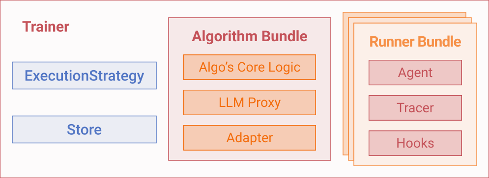

# Scaling out Algorithms and Rollouts

Agent-lightning splits training into an **algorithm bundle** and a **runner bundle** that exchange work through the [`LightningStore`][agentlightning.LightningStore]. This tutorial shows how to increase rollout throughput, place bundles across processes or machines, and keep the algorithm side scalable with external frameworks.

## Parallelizing Rollouts with [`Trainer`][agentlightning.Trainer]

Before we dive into the details of the bundles and execution strategies, let's first revisit how to parallelize rollouts with [`Trainer`][agentlightning.Trainer].

[`Trainer`][agentlightning.Trainer] is the quickest way to dial up parallelism. Even when `n_runners = 1`, calling [`Trainer.fit`][agentlightning.Trainer.fit] runs algorithms and runners in parallel. The algorithm enqueues rollouts; runners (parallelly) dequeue them and execute your [`LitAgent`][agentlightning.LitAgent], and the algorithm collect spans via its [`Adapter`][agentlightning.Adapter] before scheduling the next batch.

!!! tip

    One most important feature of [`Trainer`][agentlightning.Trainer] is the ability to abort things gracefully. For example, if you press `Ctrl+C` in the terminal, the algorithm will abort and the runners will stop executing. Or if the algorithm crashes, the runners will also stop executing.

Increase throughput by setting `n_runners` when constructing the trainer. The following example came from [train_calc_agent.py]({{ src("examples/calc_x/train_calc_agent.py") }}). Since backend LLMs usually use techniques like [continuous batching](https://docs.vllm.ai/en/latest/) to increase the throughput, you do not have to worry about overwhelming the backend with too many requests.

```python
import agentlightning as agl
from datasets import Dataset as HFDataset
from calc_agent import calc_agent

train_dataset = HFDataset.from_parquet("data/train.parquet").to_list()
val_dataset = HFDataset.from_parquet("data/test.parquet").to_list()

algorithm = agl.VERL(verl_config)

trainer = agl.Trainer(
    algorithm=algorithm,
    n_runners=8,  # launch eight rollout workers
    tracer=agl.OtelTracer(),
    adapter=agl.LlmProxyTraceToTriplet(),
)

trainer.fit(calc_agent, train_dataset=train_dataset, val_dataset=val_dataset)
```

In [`Trainer`][agentlightning.Trainer], there are multiple other initialization parameters that you can use to customize the training process. For example, you can use [`max_rollouts`][agentlightning.Trainer.max_rollouts] to keep smoke tests short. Pass a concrete [`LightningStore`][agentlightning.LightningStore] instance when you need persistence or want to share the queue across multiple scripts.

!!! tip

    Before scaling out, run [`Trainer.dev()`][agentlightning.Trainer.dev] with `n_runners=1` to verify the rollout logic and spans without burning GPU hours.

## Bundles and Execution Strategies

TBD: An short introduction of what is a bundle (what's the interface of it) and what is an execution strategy.



TBD: explain that trainer creates the bundles and execution strategy decides how to run them together.
Trainer creates an [`InMemoryLightningStore`][agentlightning.InMemoryLightningStore] if users don't provide one. [`InMemoryLightningStore`][agentlightning.InMemoryLightningStore] does not provide thread-safety and multiprocessing communications by default. It's the execution strategy who wraps the store in a thread-safe or multiprocessing-safe way. See [Understanding the Store](../deep-dive/store.md) for more details.


Execution strategies control where bundles live, how the store is wrapped, and how shutdown is coordinated. The trainer accepts a string alias, a configuration dict, or a pre-built strategy:

```python
import agentlightning as agl

algorithm = agl.Baseline()

# Short alias for shared-memory strategy (n_runners must be 1 because the runner lives on the main thread)
trainer = agl.Trainer(algorithm=algorithm, n_runners=1, strategy="shm")

# Dict with overrides; algorithm stays on the main thread so we can fan out runners
trainer = agl.Trainer(
    algorithm=algorithm,
    n_runners=8,
    strategy={"type": "shm", "main_thread": "algorithm", "managed_store": False},
)

# Pass an existing strategy instance – Trainer respects the strategy's own n_runners
strategy = agl.SharedMemoryExecutionStrategy(main_thread="algorithm", n_runners=4)
trainer = agl.Trainer(algorithm=algorithm, n_runners=8, strategy=strategy)
```

If you omit the strategy, the trainer defaults to `ClientServerExecutionStrategy(n_runners=n_runners)`. You can still re-specify the client-server strategy through aliases or configuration to tweak ports and other settings:

```python
trainer = agl.Trainer(
    algorithm=algorithm,
    n_runners=8,
    strategy={"type": "cs", "server_port": 9999},
)
```

Environment variables give you another layer of control. For example:

```python
import os

os.environ["AGL_SERVER_PORT"] = "10000"
os.environ["AGL_CURRENT_ROLE"] = "algorithm"
os.environ["AGL_MANAGED_STORE"] = "0"

trainer = agl.Trainer(algorithm=algorithm, n_runners=8, strategy="cs")
```

The resulting [`ClientServerExecutionStrategy`][agentlightning.ClientServerExecutionStrategy] picks up the port, role, and managed-store flag from the environment.


!!! tip

    The same configuration patterns apply to other trainer components. For example, `trainer = agl.Trainer(algorithm=algorithm, tracer=agl.OtelTracer())` wires in a custom tracer, while `trainer = agl.Trainer(algorithm=algorithm, adapter="agentlightning.adapter.TraceToMessages")` swaps in a different adapter. Passing a dict lets you tweak the init parameters of defaults without naming the class explicitly:

    ```python
    trainer = agl.Trainer(
        algorithm=algorithm,
        adapter={"agent_match": "plan_agent", "repair_hierarchy": False},
    )
    ```

## Client-server Architecture

The default [`ClientServerExecutionStrategy`][agentlightning.ClientServerExecutionStrategy] starts a [`LightningStoreServer`][agentlightning.LightningStoreServer] alongside the algorithm and spawns runner processes that talk to it through [`LightningStoreClient`][agentlightning.LightningStoreClient]. All runners share the HTTP endpoint, so the queue and spans stay consistent across processes or machines.

If you simply instantiate [`Trainer`][agentlightning.Trainer] (as above), it will send the algorithm bundle and runner bundle to [`ClientServerExecutionStrategy`][agentlightning.ClientServerExecutionStrategy], which will then:

1. Launch `N+1` processes: `N` runner processes and 1 algorithm process (one of them could live in the main process).
2. The algorithm process will wrap the received store from [`Trainer`][agentlightning.Trainer] and wrap it in a [`LightningStoreServer`][agentlightning.LightningStoreServer] and start serving it over HTTP.
3. The runner processes toss away the store and create a new store which is a client that connects to the algorithm process through [`LightningStoreClient`][agentlightning.LightningStoreClient] and start executing the runner bundle.
4. The strategy automatically escalates shutdown (cooperative stop → `SIGINT` → `terminate()` → `kill()`) so long-running runners do not linger.

You can override server placement or ports, and whether to automatically wrap the store through constructor arguments or environment variables:

```python
trainer = agl.Trainer(
    algorithm=algorithm,
    n_runners=4,
    strategy={
        "type": "cs",
        "server_host": "0.0.0.0",
        "server_port": 4747,
        "managed_store": False,
    },
)
```

Set `AGL_SERVER_HOST` and `AGL_SERVER_PORT` if you prefer environment-based configuration. You can also use `AGL_MANAGED_STORE` if you do not want the execution strategy to wrap the store for you. An example is shown in [Debugging with External Store][#debug-with-external-store].

The algorithms sometimes require heterogeneous computation resources, such as GPU accelerators, while the runners sometimes require a specific environment to run because many agent frameworks are fragile in their dependencies. A role-based launch pattern helps you place the algorithm on a dedicated machine with more GPU memory while runners can live within another machine with more flexible dependencies. This is possible via `AGL_CURRENT_ROLE="algorithm"` or `AGL_CURRENT_ROLE="runner"` environment variables. When running on different machines, you also need to set `AGL_SERVER_HOST` and `AGL_SERVER_PORT` to the IP address and port of the algorithm machine. You might recognize that this convention is very similar to `MASTER_ADDR` and `MASTER_PORT` in [PyTorch distributed training](https://docs.pytorch.org/docs/stable/notes/ddp.html).

### Shared-memory Strategy

[`SharedMemoryExecutionStrategy`][agentlightning.SharedMemoryExecutionStrategy] keeps everything inside one process. The runner runs on the main thread (by default) while each algorithm lives on a Python thread guarded by [`LightningStoreThreaded`][agentlightning.LightningStoreThreaded].

Use it when you want easier debugging with shared breakpoints and no serialization overhead or minimal startup time for unit tests. It's not a good choice for many algorithms that requires heavy model training because [`LightningStoreThreaded`][agentlightning.LightningStoreThreaded] does not work for multiprocessing. Using it in multi-processing algorithms will lead to undefined behaviors.

Sample configuration:

```python
trainer = agl.Trainer(
    algorithm=algorithm,
    strategy="shm",
)
```

You can further customize the init parameters of [`SharedMemoryExecutionStrategy`][agentlightning.SharedMemoryExecutionStrategy]. `main_thread="runner"`, the runner occupies the main thread and `n_runners` must be `1`. The strategy respects `AGL_MANAGED_STORE`; set it to `0` to opt out of the `LightningStoreThreaded` wrapper.

## Parallelizing Algorithms

Runner parallelism scales rollout throughput, but the algorithm loop remains a single-process look inside the execution strategy. We understand that many algorithms actually have parallelization built-in, but that's out of the parallelization scope of Agent-lightning.

Agent-lightning strive to make algorithms' own parallelization work well under our execution strategies. The biggest challenge turns out to come from the store. For example, [`VERL`][agentlightning.algorithm.verl.VERL], uses [Ray](https://www.ray.io/) launches [FSDP](https://docs.pytorch.org/tutorials/intermediate/FSDP_tutorial.html) and [vLLM](https://vllm.ai/) components internally. [`ClientServerExecutionStrategy`][agentlightning.ClientServerExecutionStrategy] has to make sure that the server is not simultaneously serving in multiple processes or Ray workers, and there is only one single authoritative source of truth for all subprocesses to connect to. For subprocesses, they will connect to store via a small [`LightningStoreClient`][agentlightning.LightningStoreClient] bundled within [`LightningStoreServer`][agentlightning.LightningStoreServer].

!!! tip

    The [birds' eye view][birds-eye-view-client-server-strategy] illustrates how adapters, proxies, and stores interact when the algorithm spawns additional workers. Use that diagram as a checklist when introducing new distributed components.
