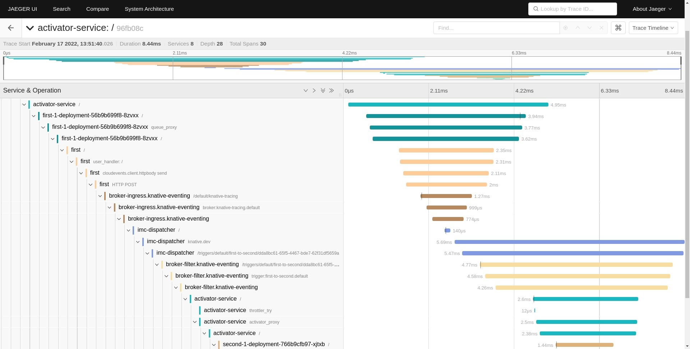

# Working with Traces

Tracing is the secret capability that lets Agent-lightning train almost any agent without rewriting its core logic. The idea was born in observability tooling inside LLMOps workflows and, in Agent-lightning, evolved into a first-class primitive inside the learning loop. Beyond helping you understand what happened inside a rollout, traces provide reward spans and other learning signals that power reinforcement learning and fine-tuning algorithms.



Agent-lightning stores every recorded operation as a [`Span`][agentlightning.Span] inside a [`LightningStore`][agentlightning.LightningStore]. The naming comes from the [OpenTelemetry spans](https://opentelemetry.io/docs/concepts/signals/traces/), shown in the screenshot above. A span can represent an LLM call, a tool invocation, a graph edge, an explicit reward emission, or an arbitrary Python code block. Spans form a tree where parent spans describe higher-level steps and children record the detailed work. The sections below walk through how spans are produced and how to interpret them once they reach the store.

## Writing Spans

Most [`Runner`][agentlightning.Runner] implementations wire a [`Tracer`][agentlightning.Tracer] into the agent’s lifecycle. The tracer is responsible for installing instrumentation, buffering OpenTelemetry spans, and committing them to the [`LightningStore`][agentlightning.LightningStore]. When a runner executes a rollout it allocates a store-backed tracing context:

```python
async with tracer.trace_context(
    name="my-rollout",
    store=store,
    rollout_id=rollout.rollout_id,
    attempt_id=attempt.attempt_id,
):
    await run_agent_logic()
```

The context manager then requests sequence numbers from the store, converts OpenTelemetry spans into [`Span`][agentlightning.Span] objects, and persists them in the middle or at the end of the attempt, depending on the tracer implementation. Agent-lightning ships two tracers out of the box; both rely on [OpenTelemetry Traces](https://opentelemetry.io/docs/concepts/signals/traces/) and ignore metrics or logs.

!!! tip "What's instrumentation?"

    In simple terms, *instrumentation* means adding "patches" or hooks inside your code so you can observe what it’s doing while it runs. Think of it like putting flight recorders in an airplane — instrumentation records key actions, inputs, outputs, and timings without changing how the code behaves. In Agent-lightning tracers, this instrumentation automatically creates spans (small, structured records of work) that show what each part of an agent did, how long it took, and how different steps connect together.

### AgentOps Tracer

[`AgentOpsTracer`][agentlightning.AgentOpsTracer] will be the default tracer when [`Trainer`][agentlightning.Trainer] is used but no tracer is explicitly specified. It bootstraps the [AgentOps SDK](https://www.agentops.ai/) locally, installs the supplied instrumentation hooks (LangChain, LangGraph, LiteLLM, FastAPI, and others) provided by [AgentOps Python SDK](https://github.com/AgentOps-AI/agentops), and forwards everything through a local OpenTelemetry [`TracerProvider`](https://opentelemetry.io/docs/specs/otel/trace/api/). The tracer never calls the hosted AgentOps service; instead it attaches the `LightningSpanProcessor` so spans are captured and shipped straight into the store.

Because it shares the AgentOps instrumentation surface, any framework supported by AgentOps automatically gains tracing in Agent-lightning. We layer additional hooks on top of AgentOps to capture features that the SDK misses today:

1. Certain providers emit extra metadata — for example [token identifiers returned by vLLM](../deep-dive/serving-llm.md) — that are not recorded by the stock SDK. We augment those spans with the missing payloads.
2. AgentOps constructs parent-child relationships best-effort, but mixed instrumentation (for example, LangGraph nodes alongside direct OpenAI calls) can leave segments disconnected. Our wrapper repairs those relationships when the hierarchy can be inferred from rollout context.
3. Some versions of downstream frameworks simply do not emit spans for critical events (LangGraph node names are a common example). The tracer installs lightweight shims so those spans appear consistently.

If a vendor integration behaves unexpectedly, combine the tracer with [Hooks](./debug.md) to inspect the raw spans, or implement a specialized tracer for the framework in question.

### OpenTelemetry Tracer

[`OtelTracer`][agentlightning.OtelTracer] is a minimal implementation that initializes a vanilla [`TracerProvider`](https://opentelemetry.io/docs/specs/otel/trace/api/) and gives you direct control over span creation through the standard `opentelemetry.trace` API. Use it when you already have explicit instrumentation in your agent, when the AgentOps SDK does not support your framework, or when you want to emit custom spans from business logic.

Inside the tracing context you can call `trace_api.get_tracer("my-agent")` and create spans exactly as you would in any OpenTelemetry application. The Lightning span processor attached by the tracer guarantees that every span is sequenced, converted, and written to the store, so emitted rewards ([`emit_reward`][agentlightning.emit_reward]) and other manual spans still show up in downstream adapters.

### LLM Proxy

Sometimes the runner cannot observe the agent directly — perhaps the agent is implemented in another language, runs on a remote machine, or interacts with a managed LLM endpoint. [`LLMProxy`][agentlightning.LLMProxy] bridges that gap by instrumenting the server side of LLM calls. The proxy wraps [LiteLLM](https://docs.litellm.ai/) and installs middleware that rewrites incoming requests such as `/rollout/{rid}/attempt/{aid}/v1/chat/completions`, injects `x-rollout-id`, `x-attempt-id`, and `x-sequence-id` headers, and forwards the request to the actual backend.

Each response produces OpenTelemetry spans through `LightningOpenTelemetry`, which in turn forwards them to the store using `LightningSpanExporter`. Because sequence identifiers are determined on the proxy, you retain a monotonically ordered trace even if the original agent code is unaware of Agent-lightning. This setup is invaluable when you want observability for SaaS-style agents or need to audit model usage across teams.

### Custom Tracer

If neither built-in tracer fits your environment, implement your own by subclassing [`Tracer`][agentlightning.Tracer]. Custom tracers must provide `trace_context`, `get_last_trace`, and (optionally) `get_langchain_handler`. The `trace_context` coroutine should install or activate whatever instrumentation you need, then yield a span processor that ultimately adds spans to the store. You can reuse the `LightningSpanProcessor` if you produce OpenTelemetry `ReadableSpan` objects, or call [`LightningStore.add_span`][agentlightning.LightningStore.add_span] directly if you generate [`Span`][agentlightning.Span] instances yourself.

Advanced tracers often run auxiliary services (for example, starting a telemetry daemon or attaching to a container runtime) inside `init_worker` and tear them down in `teardown_worker`. The [`ParallelWorkerBase`][agentlightning.ParallelWorkerBase] lifecycle that `Tracer` inherits from ensures those hooks are executed in every runner subprocess.

### Distributed Tracing

Agent-lightning enforces deterministic span ordering by assigning a monotonic [`sequence_id`][agentlightning.Span.sequence_id] to every span within an attempt. The `LightningSpanProcessor` automatically calls [`LightningStore.get_next_span_sequence_id`][agentlightning.LightningStore.get_next_span_sequence_id] before persisting a span, which removes clock skew and merges spans produced on different machines or threads. If you implement a custom tracer or exporter, make sure you obtain the sequence id from the store (or respect the one provided in headers by components such as [`LLMProxy`][agentlightning.LLMProxy]); otherwise adapters will struggle to reconstruct the execution tree.

## Reading Traces

Spans arrive asynchronously, originate from different processes, and form hierarchies rather than simple lists. That combination makes raw traces time-consuming to inspect, especially when you only care about specific signals such as rewards or tool outputs. Understanding how the store exposes traces and how adapters reshape them will save hours when debugging or training.

### Why traces can be difficult to read

The trace tree for a single rollout typically mixes multiple abstraction layers: a planner span may contain several LLM spans, each of which contains tool execution spans, which can themselves trigger nested agent invocations. On top of that, retries create new attempts that duplicate portions of the tree, and distributed runners may flush spans slightly out of order. Sorting by `sequence_id` restores the chronological view, but interpreting the tree requires additional context about parent-child relationships and rollout metadata.

When you only need a quick look, [`Tracer.get_last_trace`][agentlightning.Tracer.get_last_trace] returns the raw OpenTelemetry spans captured most recently. For historical analysis use the [`LightningStore.query_spans`][agentlightning.LightningStore.query_spans] API, which yields normalized [`Span`][agentlightning.Span] objects keyed by rollout id and attempt id. Combine those queries with [`LightningStore.query_rollouts`][agentlightning.LightningStore.query_rollouts] to align spans with rollout status, retries, and timing information.

### Adapter

[Adapters][agentlightning.Adapter] transform lists of spans into higher-level data structures that training algorithms can consume directly. Agent-lightning provides several adapters out of the box:

* [`TracerTraceToTriplet`][agentlightning.TracerTraceToTriplet] converts spans into `(prompt, response, reward)` triplets, which power reinforcement-learning algorithms such as [VERL](../algorithm-zoo/verl.md) and connect trace data to gradient updates.
* [`TraceToMessages`][agentlightning.TraceToMessages] rewrites spans into OpenAI chat message JSON suitable for supervised fine-tuning or eval harnesses.
* [`LlmProxyTraceToTriplet`][agentlightning.LlmProxyTraceToTriplet] mirrors the triplet adapter but understands spans emitted by the proxy.

Adapters are regular Python callables, so you can plug them into [`Trainer`][agentlightning.Trainer] via the `adapter` argument, or call them manually during exploration. If you need a bespoke format, subclass [`TraceAdapter`][agentlightning.TraceAdapter] (for store spans) or [`OtelTraceAdapter`][agentlightning.OtelTraceAdapter] (for raw OpenTelemetry spans) and implement `adapt`.

### Reading Rewards

Rewards are recorded as dedicated spans named [`agentlightning.reward`][agentlightning.SpanNames.REWARD]. Emitting a reward through [`emit_reward`][agentlightning.emit_reward] or the [`@reward` decorator][agentlightning.reward] ensures the value is stored in the span’s `attributes["reward"]`. To audit rewards, fetch spans from the store and use the helper utilities in `agentlightning.emitter`:

```python
from agentlightning.emitter import find_final_reward

spans = await store.query_spans(rollout_id)
reward = find_final_reward(spans)
print(f"Final reward: {reward}")
```

`find_reward_spans` returns every reward span so you can visualize intermediate shaping signals, while `find_final_reward` extracts the last non-null reward per attempt. Algorithms such as [`FastAlgorithm`][agentlightning.FastAlgorithm] already apply those helpers internally, but looking at the raw spans is often the fastest way to confirm that reward functions behave as expected.
