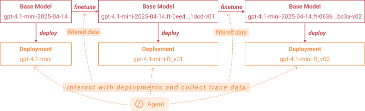

# Supervised Fine-tuning with Azure OpenAI

This example shows how to use Agent-lightning and Azure OpenAI deployments to collect agent traces and how to use the traces to continuously fine-tune the model and deploy the fine-tuned model.

## Prerequisites

Fill .env.example. The easiest way to get those is to find them in the URL to your Azure OpenAI resource.

you also need to `az login` to your Azure account, because creating deployments requires [Azure CLI](https://learn.microsoft.com/en-us/cli/azure/install-azure-cli).

Make sure you have created a `base_deployment` beforehand. F

## Included Files

TODO

## Basic usage

```python
from aoai_finetune import AzureOpenAIFinetune

finetune_algo = AzureOpenAIFinetune(
    base_deployment_name="gpt-4.1-mini",
    finetuned_deployment_name="gpt-4.1-mini-ft",
    base_model_name="gpt-4.1-mini-2025-04-14",
    finetune_every_n_rollouts=24,
    max_deployments=2,
    data_filter_ratio=0.6,
)
```

The base deployment name is the name of the deployment you have just created beforehand. During the coninuously fine-tuning process, the algorithm will create a series of new deployments with names starting with the finetuned deployment name, like `gpt-4.1-mini-ft_v01`, `gpt-4.1-mini-ft_v02`, etc. Older deployments (except the one that you created manually) will be deleted when the number of deployments exceeds the `max_deployments` limit.

The `base_model_name` is should be the base model ID that your deployment is based on. You can find that in the dialog of creating deployment you have just used. During each iteration, the Azure OpenAI fine-tuning job will base on the previous base model to fine-tune a new model, which is then used as the base model for the next iteration. Starting from the second iteration, the base model will then be used to deploy a new deployment for inference.

The process is shown in the following diagram:

<p align="center">
  
</p>

## Running the Example

// TODO: shortly introduce what's the capital agent. It's a dummy agent.

```bash
python train_capital_agent.py
```

This will train the capital agent using the fine-tuning algorithm.

you will see some logs like this. Different from other examples, with Azure OpenAI, the rollout time is relatively short. the main time cost is to wait for the fine-tuning job queue (it can take from several minutes to several hours depending on the load). Deploying a fine-tuned model is relatively fast, taking 2-3 minutes.

```log
10:13:02,624 Starting client-server execution with 2 runner(s) [role=both, main_process=algorithm]
10:13:02,639 Starting LightningStore server on localhost:4747
10:13:02,749 [AOAI FT 1/3] [Stage 1] Starting fine-tuning iteration with 24 tasks...
10:13:02,750 [AOAI FT 1/3] [Stage 2] Using model deployment: gpt-4.1-mini
10:13:03,428 [Worker 1] Started async rollouts (max: unlimited).
10:13:03,429 [Worker 0] Started async rollouts (max: unlimited).
10:13:05,279 [Worker 0 | Rollout ro-efab388d2f0e] Completed in 1.83s. Collected 4 span(s). Final reward: 1.0
10:13:05,454 [Worker 1 | Rollout ro-8ba08859ae85] Completed in 2.01s. Collected 4 span(s). Final reward: 1.0
[... 22 more rollouts omitted ...]
10:13:28,430 [AOAI FT 1/3] [Stage 3] Completed rollouts for 24 tasks.
10:13:28,431 [AOAI FT 1/3] Keeping 28 example(s) for fine-tuning after reward-based filtering.
10:13:28,431 [AOAI FT 1/3] [Stage 4] Prepared 28 training examples after filtering.
10:13:28,431 [AOAI FT 1/3] [Stage 5] Starting fine-tuning for model gpt-4.1-mini-2025-04-14...
10:13:29,854 [AOAI FT 1/3] Uploaded training file to Azure OpenAI (file_id=file-0fd6e72151094a0eb0306de7aae4883b).
10:13:41,216 [AOAI FT 1/3] Fine-tuning job ftjob-0ee45c42591b4f4a8bd4f49ef2301dcd created for base model gpt-4.1-mini-2025-04-14.
10:13:41,217 [AOAI FT 1/3] Waiting for fine-tuning job ftjob-0ee45c42591b4f4a8bd4f49ef2301dcd to complete.
12:29:11,444 [AOAI FT 1/3] Fine-tuning job ftjob-0ee45c42591b4f4a8bd4f49ef2301dcd succeeded with new model id gpt-4.1-mini-2025-04-14.ft-0ee45c42591b4f4a8bd4f49ef2301dcd-v01.
12:29:11,444 [AOAI FT 1/3] [Stage 6] Deploying fine-tuned model...
12:29:14,217 [AOAI FT 1/3] Waiting for deployment gpt-4.1-mini-ft_v01 to become ready.
12:29:15,458 [AOAI FT 1/3] Waiting for deployment to be ready. Current provisioning state of gpt-4.1-mini-ft_v01: Creating
[... 7 repetitive deployment status checks omitted ...]
12:32:53,773 [AOAI FT 1/3] Waiting for deployment to be ready. Current provisioning state of gpt-4.1-mini-ft_v01: Succeeded
12:32:53,773 [AOAI FT 1/3] Deployment gpt-4.1-mini-ft_v01 is ready with version 1.
12:32:53,774 [AOAI FT 1/3] [Stage 7] Evaluating on validation dataset...
[... 8 validation rollouts omitted ...]
12:33:03,979 [AOAI FT 1/3] [Stage 7] Evaluation completed. Average reward: 1.0000
12:33:03,979 [AOAI FT 2/3] [Stage 1] Starting fine-tuning iteration with 24 tasks...
12:33:03,979 [AOAI FT 2/3] [Stage 2] Using model deployment: gpt-4.1-mini-ft_v01
[... 24 rollouts omitted ...]
12:33:34,619 [AOAI FT 2/3] [Stage 3] Completed rollouts for 24 tasks.
12:33:34,620 [AOAI FT 2/3] [Stage 4] Prepared 27 training examples after filtering.
12:33:34,620 [AOAI FT 2/3] [Stage 5] Starting fine-tuning for model gpt-4.1-mini-2025-04-14.ft-0ee45c42591b4f4a8bd4f49ef2301dcd-v01...
12:35:12,694 [AOAI FT 2/3] Waiting for fine-tuning job ftjob-06366e441ee24a0ea242014fea8fbc3a to complete.
13:16:43,810 [AOAI FT 2/3] Fine-tuning job ftjob-06366e441ee24a0ea242014fea8fbc3a succeeded with new model id gpt-4.1-mini-2025-04-14.ft-06366e441ee24a0ea242014fea8fbc3a-v02.
13:16:43,810 [AOAI FT 2/3] [Stage 6] Deploying fine-tuned model...
13:16:46,263 [AOAI FT 2/3] Waiting for deployment gpt-4.1-mini-ft_v02 to become ready.
[... 5 repetitive deployment status checks omitted ...]
13:19:23,856 [AOAI FT 2/3] Waiting for deployment to be ready. Current provisioning state of gpt-4.1-mini-ft_v02: Succeeded
13:19:23,857 [AOAI FT 2/3] [Stage 7] Evaluating on validation dataset...
[... 8 validation rollouts omitted ...]
13:19:39,072 [AOAI FT 2/3] [Stage 7] Evaluation completed. Average reward: 1.0000
13:19:39,072 [AOAI FT 3/3] [Stage 1] Starting fine-tuning iteration with 24 tasks...
13:19:39,073 [AOAI FT 3/3] [Stage 2] Using model deployment: gpt-4.1-mini-ft_v02
[... 24 rollouts omitted ...]
13:20:04,721 [AOAI FT 3/3] [Stage 3] Completed rollouts for 24 tasks.
13:20:04,722 [AOAI FT 3/3] [Stage 4] Prepared 27 training examples after filtering.
13:20:04,722 [AOAI FT 3/3] [Stage 5] Starting fine-tuning for model gpt-4.1-mini-2025-04-14.ft-06366e441ee24a0ea242014fea8fbc3a-v02...
13:20:17,013 [AOAI FT 3/3] Waiting for fine-tuning job ftjob-2651d3183a4b40679d4c3fc886940c0c to complete.
14:02:47,241 [AOAI FT 3/3] Fine-tuning job ftjob-2651d3183a4b40679d4c3fc886940c0c succeeded with new model id gpt-4.1-mini-2025-04-14.ft-2651d3183a4b40679d4c3fc886940c0c-v03.
14:02:47,242 [AOAI FT 3/3] [Stage 6] Deploying fine-tuned model...
14:02:47,242 [AOAI FT 3/3] Maximum number of deployments reached (2). Cleaning up old deployments.
14:02:47,242 [AOAI FT 3/3] Deleting old deployment gpt-4.1-mini-ft_v01.
14:02:48,925 [AOAI FT 3/3] Deployment gpt-4.1-mini-ft_v01 deleted successfully.
14:02:51,168 [AOAI FT 3/3] Waiting for deployment gpt-4.1-mini-ft_v03 to become ready.
[... 7 repetitive deployment status checks omitted ...]
14:06:30,300 [AOAI FT 3/3] Waiting for deployment to be ready. Current provisioning state of gpt-4.1-mini-ft_v03: Succeeded
14:06:30,301 [AOAI FT 3/3] [Stage 7] Evaluating on validation dataset...
[... 8 validation rollouts omitted ...]
14:06:45,506 [AOAI FT 3/3] [Stage 7] Evaluation completed. Average reward: 1.0000
14:06:45,506 Stopping server...
14:06:45,657 Server stopped.
```
