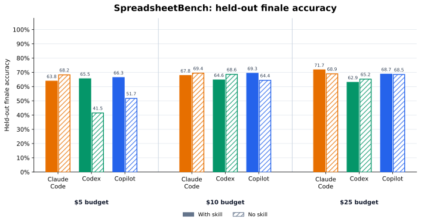
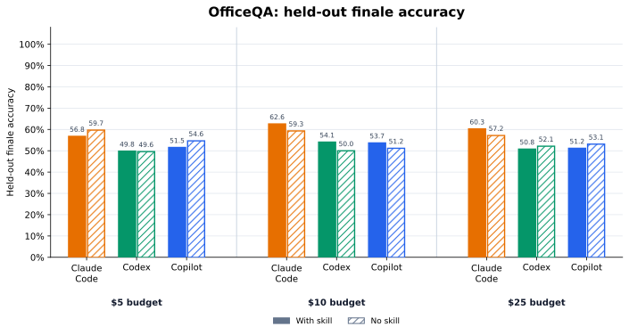
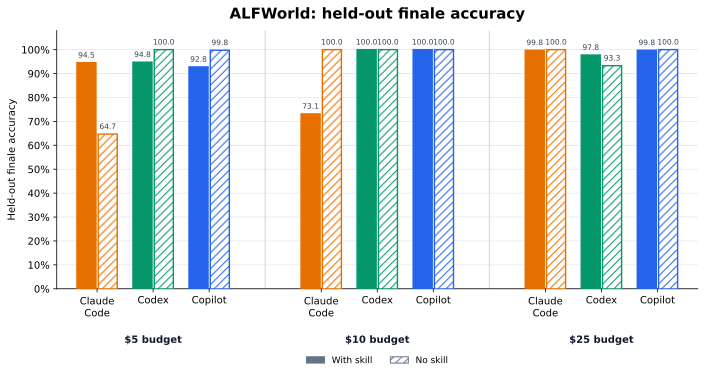
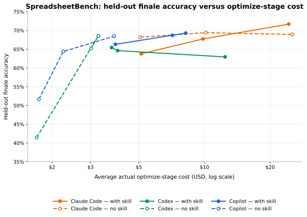
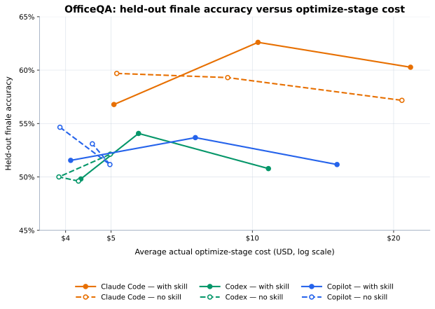
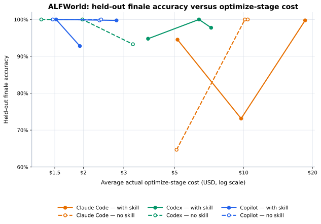

# Agent Skills

Skills in the [Agent Skills](https://agentskills.io) format (`<name>/SKILL.md`), installable into any compatible agent.

## Agent Lightning

Turns your coding agent into an **agent optimizer**: given an editable agent and a benchmark to hillclimb on, it improves the agent's accuracy, cost, and latency through focused, individually-measured edits — keeping only what moves the frontier. It was measured against a no-skill control under a fair, leakage-free protocol.

You provide the environment; the skill does the optimizing. Before invoking it, have ready: a working copy of the agent (keep the original pristine), labeled examples, a frozen eval command, and an objective + budget.

### Installation

Install the skill from this repository for Claude Code, Codex, or GitHub Copilot:

```bash
gh skill install microsoft/agent-lightning agent-lightning --agent claude-code
gh skill install microsoft/agent-lightning agent-lightning --agent codex
gh skill install microsoft/agent-lightning agent-lightning --agent github-copilot
```

Claude Code users can alternatively install the packaged plugin from the community marketplace:

```text
/plugin marketplace add anthropics/claude-plugins-community
/plugin install agent-lightning@claude-community
```

The `skills/agent-lightning/` directory is both the canonical Agent Skills package and the Claude Code plugin root, so both publication paths use the same `SKILL.md` without a copied or symlinked wrapper.

### Results

**Main finding:** Coding-agent harnesses are already strong optimizers. The clearest opportunity is improving consistency while preserving their high average performance, rather than expecting large score gains.

SkillOpt and the other non-agentic results are taken from the [SkillOpt paper](https://github.com/microsoft/SkillOpt) (Table 1); our agentic rows use the same splits and average all optimizers, budgets, and replicates.

| Method | Spreadsheet (%) | OfficeQA (%) | ALFWorld (%) |
| :--- | ---: | ---: | ---: |
| No skill | 36.1 | 22.1 | 73.1 |
| Human skill | 42.9 | 45.9 | 56.7 |
| LLM skill | 36.8 | 36.6 | 65.7 |
| Trace2Skill | 40.7 | 20.9 | 82.8 |
| TextGrad | 38.2 | 30.0 | 70.9 |
| GEPA | 42.5 | 45.3 | 81.3 |
| SkillOpt | 47.5 | 48.8 | 85.8 |
| Agentic optimizer average, no skill | 62.9 | 54.1 | **95.3** |
| **Agentic optimizer average, Agent Lightning** | **66.7** | **54.5** | 94.7 |

#### Accuracy by budget and optimizer

Each benchmark is split into the \$5, \$10, and \$25 nominal budgets. Within each budget, every optimizer's with-skill and no-skill held-out finale accuracies are shown side by side. Solid bars use the skill; hatched bars are no-skill controls.







#### Accuracy versus optimize-stage cost

Each line connects the \$5, \$10, and \$25 nominal budgets in that order. The x-axis is average actual optimize-stage cost on a log scale, including optimizer calls and train/self-evaluation but excluding held-out finale generation.







#### \$5 budget snapshot

| Benchmark (train/test) | Result | Accuracy (%) | Actual total cost |
| :--- | :--- | ---: | ---: |
| SpreadsheetBench (120/280) | Before optimizer | 25.66 ± 2.65 | \$1.51 ± 0.04 |
|  | Claude Code with skill | 63.79 ± 5.24 | **\$7.58 ± 0.90** |
|  | Claude Code without skill | **68.23 ± 0.55** | \$7.59 ± 0.95 |
|  | Codex with skill | **65.47 ± 4.59** | \$5.41 ± 0.17 |
|  | Codex without skill | 41.49 ± 24.28 | **\$3.44 ± 1.78** |
|  | Copilot with skill | **66.31 ± 2.05** | \$5.55 ± 0.69 |
|  | Copilot without skill | 51.68 ± 20.82 | **\$3.40 ± 1.06** |
| OfficeQA (50/172) | Before optimizer | 31.78 ± 1.21 | \$2.78 ± 0.06 |
|  | Claude Code with skill | 56.78 ± 3.87 | \$10.42 ± 1.59 |
|  | Claude Code without skill | **59.69 ± 4.88** | **\$9.82 ± 1.72** |
|  | Codex with skill | **49.81 ± 2.98** | **\$7.69 ± 0.21** |
|  | Codex without skill | 49.61 ± 0.67 | \$8.03 ± 0.34 |
|  | Copilot with skill | 51.55 ± 3.74 | **\$7.79 ± 0.91** |
|  | Copilot without skill | **54.65 ± 2.01** | \$8.09 ± 1.28 |
| ALFWorld (3553/134) | Before optimizer | 58.71 ± 1.56 | \$5.78 ± 0.17 |
|  | Claude Code with skill | **94.53 ± 4.56** | \$7.37 ± 1.81 |
|  | Claude Code without skill | 64.68 ± 56.09 | **\$6.30 ± 2.03** |
|  | Codex with skill | 94.78 ± 7.12 | \$3.82 ± 1.21 |
|  | Codex without skill | **100.00 ± 0.00** | **\$1.31 ± 0.56** |
|  | Copilot with skill | 92.79 ± 12.49 | **\$1.94 ± 0.80** |
|  | Copilot without skill | **99.75 ± 0.43** | \$2.37 ± 0.63 |

#### \$10 budget snapshot

| Benchmark (train/test) | Result | Accuracy (%) | Actual total cost |
| :--- | :--- | ---: | ---: |
| SpreadsheetBench (120/280) | Before optimizer | 25.66 ± 2.65 | \$1.51 ± 0.04 |
|  | Claude Code with skill | 67.75 ± 2.40 | **\$11.86 ± 0.33** |
|  | Claude Code without skill | **69.42 ± 4.32** | \$12.26 ± 0.25 |
|  | Codex with skill | 64.63 ± 0.75 | \$5.58 ± 0.86 |
|  | Codex without skill | **68.59 ± 1.16** | **\$4.98 ± 0.47** |
|  | Copilot with skill | **69.30 ± 4.32** | \$10.29 ± 1.49 |
|  | Copilot without skill | 64.39 ± 2.88 | **\$3.87 ± 0.34** |
| OfficeQA (50/172) | Before optimizer | 31.78 ± 1.21 | \$2.78 ± 0.06 |
|  | Claude Code with skill | **62.60 ± 3.74** | \$16.16 ± 1.02 |
|  | Claude Code without skill | 59.30 ± 1.74 | **\$14.55 ± 2.43** |
|  | Codex with skill | **54.07 ± 1.16** | \$9.67 ± 1.69 |
|  | Codex without skill | 50.00 ± 0.58 | **\$7.64 ± 0.58** |
|  | Copilot with skill | **53.68 ± 0.89** | \$11.01 ± 1.14 |
|  | Copilot without skill | 51.16 ± 4.07 | **\$8.05 ± 2.98** |
| ALFWorld (3553/134) | Before optimizer | 58.71 ± 1.56 | \$5.78 ± 0.17 |
|  | Claude Code with skill | 73.13 ± 46.53 | **\$10.55 ± 1.64** |
|  | Claude Code without skill | **100.00 ± 0.00** | \$11.08 ± 1.55 |
|  | Codex with skill | 100.00 ± 0.00 | \$6.38 ± 3.14 |
|  | Codex without skill | 100.00 ± 0.00 | **\$1.98 ± 1.41** |
|  | Copilot with skill | 100.00 ± 0.00 | **\$1.52 ± 1.05** |
|  | Copilot without skill | 100.00 ± 0.00 | \$2.39 ± 2.23 |

#### \$25 budget snapshot

| Benchmark (train/test) | Result | Accuracy (%) | Actual total cost |
| :--- | :--- | ---: | ---: |
| SpreadsheetBench (120/280) | Before optimizer | 25.66 ± 2.65 | \$1.51 ± 0.04 |
|  | Claude Code with skill | **71.70 ± 7.11** | \$32.46 ± 5.46 |
|  | Claude Code without skill | 68.94 ± 1.98 | **\$30.60 ± 5.64** |
|  | Codex with skill | 62.95 ± 2.52 | \$14.19 ± 2.29 |
|  | Codex without skill | **65.23 ± 2.40** | **\$4.86 ± 0.60** |
|  | Copilot with skill | **68.71 ± 3.12** | \$10.61 ± 6.64 |
|  | Copilot without skill | 68.47 ± 3.60 | **\$5.54 ± 1.06** |
| OfficeQA (50/172) | Before optimizer | 31.78 ± 1.21 | \$2.78 ± 0.06 |
|  | Claude Code with skill | **60.27 ± 4.70** | **\$27.05 ± 1.62** |
|  | Claude Code without skill | 57.17 ± 2.98 | \$32.64 ± 12.01 |
|  | Codex with skill | 50.78 ± 2.87 | \$14.09 ± 1.10 |
|  | Codex without skill | **52.13 ± 0.34** | **\$8.81 ± 1.67** |
|  | Copilot with skill | 51.16 ± 1.74 | \$19.29 ± 6.23 |
|  | Copilot without skill | **53.10 ± 0.34** | **\$8.94 ± 0.33** |
| ALFWorld (3553/134) | Before optimizer | 58.71 ± 1.56 | \$5.78 ± 0.17 |
|  | Claude Code with skill | 99.75 ± 0.43 | \$20.14 ± 8.47 |
|  | Claude Code without skill | **100.00 ± 0.00** | **\$10.44 ± 1.61** |
|  | Codex with skill | **97.76 ± 3.88** | \$8.13 ± 4.42 |
|  | Codex without skill | 93.28 ± 9.76 | **\$3.64 ± 0.30** |
|  | Copilot with skill | 99.75 ± 0.43 | \$2.79 ± 1.78 |
|  | Copilot without skill | **100.00 ± 0.00** | **\$1.47 ± 0.43** |
