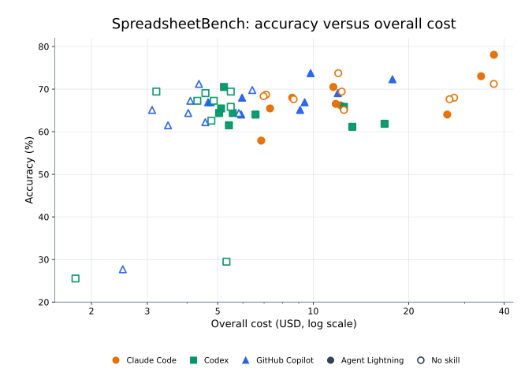
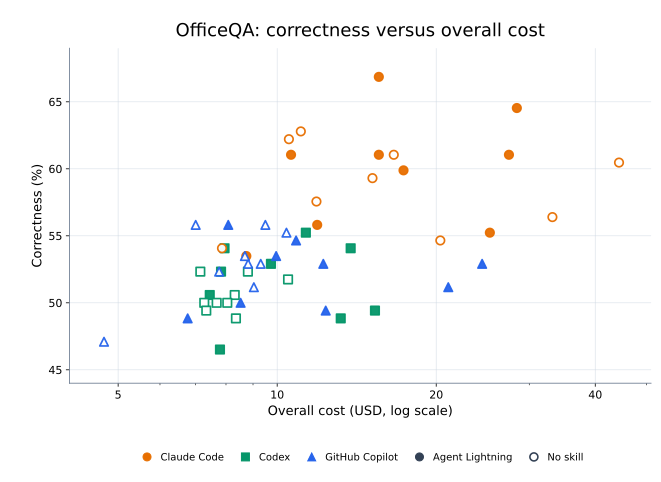
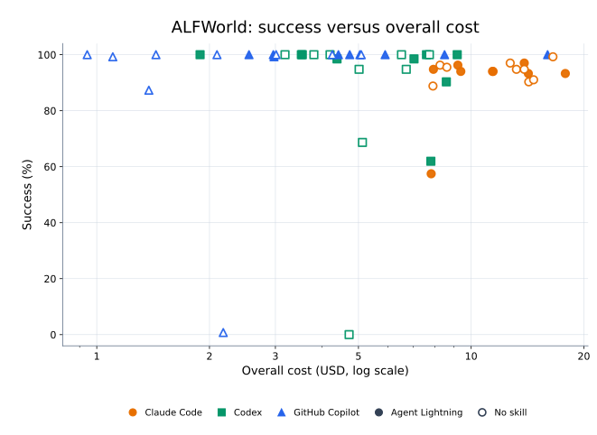
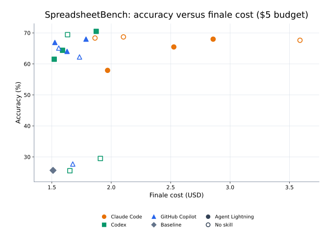
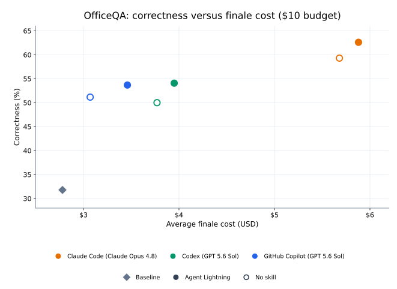
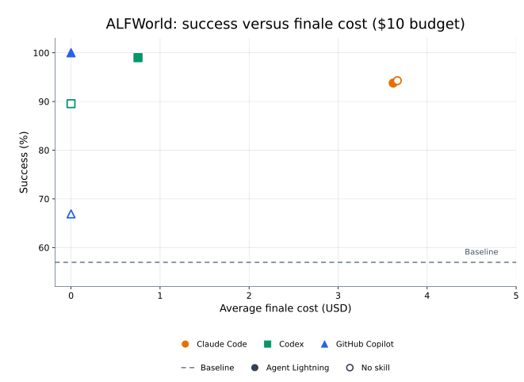

# Agent Lightning Skill

**Agent Lightning helps a coding agent improve another AI agent.** Give the coding agent an editable agent and a benchmark. It can then test changes to prompts, tools, workflows, models, and other settings. The goal is to improve quality, cost, speed, or reliability without breaking how the agent is used.

### Installation

Install the skill from this repository for Claude Code, Codex, or GitHub Copilot:

```bash
gh skill install microsoft/agent-lightning agent-lightning --agent claude-code
gh skill install microsoft/agent-lightning agent-lightning --agent codex
gh skill install microsoft/agent-lightning agent-lightning --agent github-copilot
```

The skill files are in [`skills/agent-lightning/`](agent-lightning/). This directory is also the Claude Code plugin root. The skill package and plugin use the same `SKILL.md`.

### How it works

Coding agents such as Claude Code, Codex, and GitHub Copilot can already optimize agents. They can inspect the code, make changes, run the benchmark, and learn from failures. Even without Agent Lightning, they can improve an agent with a prompt such as:

> I've got an agent in this workspace — and it's underperforming on our benchmark. Can you raise its benchmark score while keeping any increase in per-run cost minimal — buy score cheaply, and only pay more when it clearly earns its keep?

Agent Lightning gives them a clearer process. It suggests useful changes, explains how to read noisy results, and tells them to measure each change. It also separates the one-time cost of optimization from the cost of running the final agent.

We asked each coding agent to improve three underperforming agents, one for each benchmark. The agents being improved used GPT-5.4-mini. Claude Code used Opus 4.8 to optimize them. Codex and GitHub Copilot used GPT-5.6-Sol. The last two rows below average the three coding agents, all budget groups, and all repeated runs. The other rows come from Table 1 of the [SkillOpt paper](https://github.com/microsoft/SkillOpt) and use the same benchmark splits.

In the last two rows, the value in parentheses is the improvement over the starting agent, measured in percentage points.

| Method | SpreadsheetBench accuracy (%) | OfficeQA correctness (%) | ALFWorld success (%) |
| :--- | ---: | ---: | ---: |
| No skill | 36.1 | 22.1 | 73.1 |
| Human skill | 42.9 | 45.9 | 56.7 |
| LLM skill | 36.8 | 36.6 | 65.7 |
| Trace2Skill | 40.7 | 20.9 | 82.8 |
| TextGrad | 38.2 | 30.0 | 70.9 |
| GEPA | 42.5 | 45.3 | 81.3 |
| SkillOpt | 47.5 | 48.8 | 85.8 |
| Coding agents, without Agent Lightning (average) | 62.9 (+37.3) | 54.1 (+22.3) | 88.6 (+31.6) |
| **Coding agents, with Agent Lightning (average)** | **66.7 (+41.1)** | **54.5 (+22.7)** | **94.9 (+37.9)** |

### Performance breakdowns

#### Overall cost

To test limited budgets, we gave each optimizer \$5, \$10, or \$25 in API credits. Calls made during optimization by both the coding agent and the agent it was improving counted toward the budget. We ran every combination of benchmark, coding agent, budget, and skill setting three times.

Each point below averages three runs for one coding agent, budget, and skill setting. The x-axis shows the average total cost on a logarithmic scale. The y-axis shows the average final score on held-out data. Color and shape identify the coding agent. Filled markers use Agent Lightning; hollow markers show runs without it. The legend does not show the budget. Total cost includes optimizer calls, training and self-evaluation calls, and the final held-out evaluation. It does not include evaluations of the original, unchanged agent.







#### Finale cost

The optimizer can change settings such as the model or reasoning effort. This may improve the score but make the agent more expensive to run. Finale cost is the agent's LLM cost during the final held-out evaluation.

These charts use the budgets where Agent Lightning had the largest overall advantage: \$5 for SpreadsheetBench and \$10 for OfficeQA and ALFWorld. Each point is one run, not an average of three runs. The x-axis shows the run's finale cost, and the y-axis shows its held-out score. In ALFWorld, the optimizer can write a rule-based controller that handles the different scenarios in the benchmark. The final agent can then complete the evaluation without calling an LLM, so its finale cost can be \$0. We move overlapping zero-cost points slightly so that every run remains visible. Each chart also shows the result for the original, unchanged agent.






